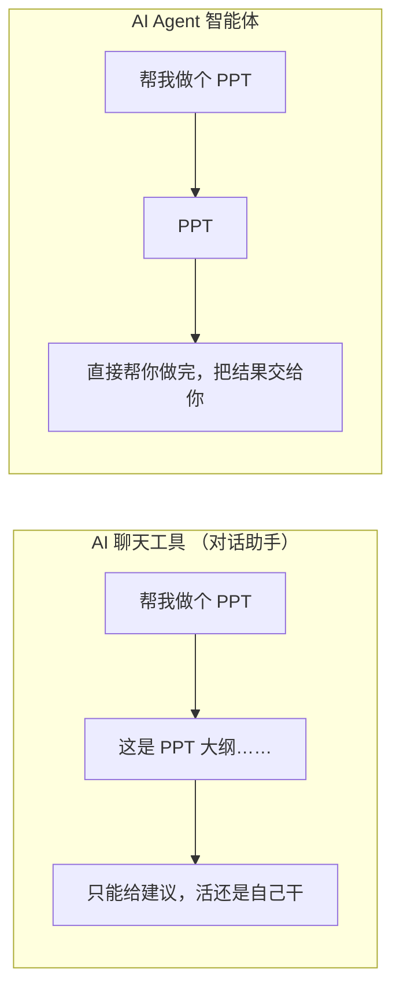
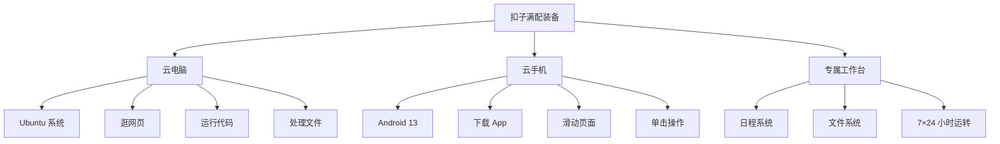
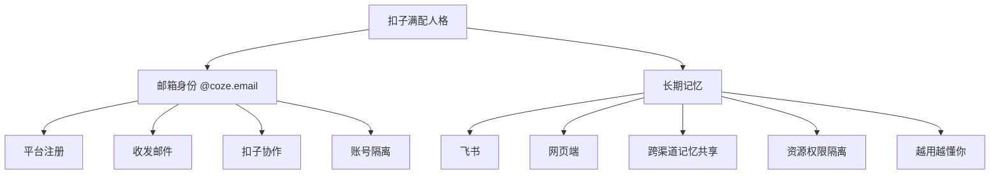
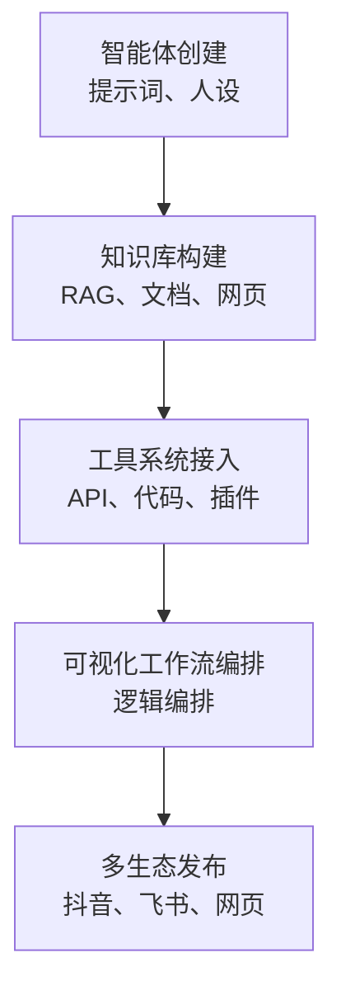

---
# 传统AI的局限

你有没有过这样的体验：

	- 问 AI 写一份方案，它给你洋洋洒洒几千字；
	- 问 AI 做数据分析，它给你一套方法论。

但等你回过神来，发现真正要动手做的——找模板、填内容、调格式、发邮件等等，还得自己来。
这就是大多数人在 AI 时代面临的尴尬：

	工具很强大，但你依然是那个最忙的人。

过去两年，我们都曾体验过AI的强大：

	它能写诗、能编程，能通过律师资格考试。

但回到日常工作中，你会面临尴尬的现实：

	- 这些AI更像站在旁边指点的“军师”，而不是能真正下场干活的“士兵”。
	- 它只能给你“应该怎么做”的建议，却不能代替你“真的去做”。
	- 它被困在对话框里，没有手脚去操作软件，
	- 无法记住你的习惯，没有身份在真实世界里“行动”，
	- 每一次对话都是重新开始，每一次协作都止步于思想层面。

我们先聊聊传统 AI 为什么帮不了你真正干活，再介绍扣子是如何打破这个困局的。

学完这一课，你就会明白：

	为什么扣子不只是一个聊天机器人，而是你真正的“数字搭档”。

---
## 为什么传统 AI 帮不了你真正干活

也许你用过很多 AI 工具，但它们有一个共同的局限：

	- 再聪明，也只能待在对话框里。
	- 你说什么，它回什么，然后……就没有然后了。

### 传统 AI 的三大局限

让我们先剖析一下传统 AI 工具的局限，理解了这些，你才能明白为什么需要一个新的工具。

#### 局限一：只能聊，不能做

传统 AI 本质上是“高级版的搜索引擎”：

	- 你问问题，它给答案；
	- 你让它帮忙，它给建议。

但是，建议不等于行动。

举例来说，你想让 AI 帮你做一份介绍公司的 PPT。

传统 AI 能做什么？它能：

	- 给你拟定一个大纲
	- 帮你写文案

但具体到：

	- 打开 PPT 软件
	- 选择模板
	- 填充内容
	- 调整排版

这些都得你自己动手。

这就是“工具”和“执行者”的区别。

	传统 AI 告诉你“应该怎么做”，但它自己不会真的去做。

#### 局限二：聊完就忘，没有记忆

你今天跟 AI 说：

	“我的公司名字叫容睿家居，主营业务是家居百货日用品。”

明天再开一个对话，它就完全不知道你是谁了，你的：

	- 项目背景
	- 沟通习惯
	- 个人偏好

每次都要重新介绍。

这不是 AI 的 bug，而是设计上的取舍：

	传统对话 AI 默认每次交互都是独立的，它不会主动记住你和你的需求。

但真实的工作不是这样的：

	你需要一个了解你、记住你、越“合作”越默契的帮手，而不是每次都要从零开始的陌生人。

#### 局限三：没有身份，无法在真实世界行动

当你想让 AI 帮你注册一个平台账号，它会告诉你：“很抱歉，我无法完成这个操作。”

当你想让它帮你发一封邮件，它只能给你一个邮件模板，你自己复制、粘贴再发送出去。

原因很简单：传统 AI 没有“身份”，它：

	- 无法登录网站
	- 无法操作软件
	- 无法收发邮件
	- 只能在你给它的对话框里打转。

这 3 个局限环环相扣：

	- 不能做，所以只是参谋；
	- 没有记忆，所以每次都要重来；
	- 没有身份，所以永远困在屏幕里。

AI 聊天工具（对话小助手）与 AI Agent（智能体）的区别如下图所示。



**AI Agent vs. 对话助手**

---

### 你需要的不是聊天机器人，是能干活的数字搭档

也许你会说：

	这些局限有那么重要吗？我用 AI 查资料、写文案，挺好用的啊。

没错，如果你只需要一个“超级搜索引擎”，传统 AI 完全够用。
但如果你想让 AI 真正帮你分担工作，你就需要它：

	不只是“会说话”，还要“会做事”。

想象一下，你有一个数字员工，它可以：

	1. 帮你打开软件、操作电脑、执行具体任务；
	2. 记住你的工作习惯、项目进度、合作方偏好；
	3. 用自己的身份帮你注册平台、收发邮件、完成任务。

这样的 AI，就不再是“聊天机器人”，而是一个真正的“数字搭档”。

扣子，就是这样一个数字搭档！

---

# 扣子所带来的革新

传统 AI 为什么有前文所述的三大局限？核心原因在于它们缺少 3 样东西：“身体”“大脑”“意识”。

- “身体”让 AI 能够执行操作；
- “大脑”让 AI 能够记住和学习；
- “意识”让 AI 能够自主运转。

扣子的全新升级，正是围绕这 3 样东西展开的。

---

## 革新一：AI 有了“身体”——云电脑与云手机

传统 AI 为什么只能聊天？

	因为它没有手脚，无法操作真实的软件和网站。

扣子给 AI 配备了完整的“身体”，如下图所示。



**扣子满配装备示意图**

#### （1）云电脑

一台运行 Ubuntu 系统的云端电脑，带有：

	- 浏览器
	- 文件系统
	- 终端

扣子可以在里面：

	- 浏览网页
	- 运行代码
	- 处理文件
	- 拥有真正的桌面级生产力

你可以理解为，扣子拥有了一台 7×24 小时不关机、不休眠的电脑，随时待命。

#### （2）云手机

一台运行 Android 13 系统的云端手机，配置为：

	- 2 核 CPU
	- 6GB 内存
	- 45GB 存储空间

扣子可以在这台手机上：

	- 下载 App
	- 滑动页面
	- 单击操作
	- 就像真人一样使用手机应用

#### （3）专属工作台

完整的日程系统和文件系统。

扣子可以：

	- 在工作台里创建定时任务；
	- 在后台 7×24 小时运转；
	- 产出的数据、图表、报告等会自动保存到文件系统。

有了完整的“身体”：

	扣子不再被困在对话框里，而是能像人一样操作电脑和手机，真正帮你执行任务。

---

## 革新二：AI 有了“大脑”——记忆与邮箱身份

有了“身体”，还需要“大脑”。扣子的“大脑”让它能记住你的信息、拥有自己的身份。

#### （1）长期记忆系统

扣子会记住你的工作习惯和细微偏好。

	- 你在飞书上随口提的需求，网页端的扣子也记得；
	- 不同渠道的对话独立，但记忆共享。

这意味着你不需要每次都重复背景介绍，扣子越用越懂你。

> [!info] 将扣子接入飞书与微信
> 扣子不仅能在网页端、桌面客户端和手机App使用，还能接入你日程高频使用的办公和社交平台——飞书和微信，这意味着你可以：
> 1. 在飞书群里@扣子Agent，让它帮忙整理会议纪要；
> 2. 在微信聊天框直接给扣子Agent派任务，不用切换到App。
> 
> 无论在哪个平台对话，扣子都记得你们之前的聊天内容（跨渠道记忆）。

>[!warning] 注意事项
>1. 权限隔离与记忆共享的平衡——虽然各渠道记忆互通（你说的话在各平台都记得），但Session（会话）权限严格隔离，这意味着：
>	√ 你在微信私聊里让扣子Agent帮你订机票，在网页端它是记得这个任务的；
>	× 但你在微信群里的聊天内容，不会泄露到私聊或其他渠道（严格按Session隔离）。
>2. 取消授权≠删除记忆——取消某个渠道的授权，只是让扣子不能再通过该平台联系你，但你们的历史对话和记忆仍然保留在其它渠道中。
#### （2）独立邮箱身份

每个扣子会给用户分配一个 `@coze.email` 专属邮箱。

这不仅是邮箱，更是一张“数字社会身份证”，扣子可以用它：

	- 注册第三方平台
	- 与其他扣子互发邮件协作

资源权限与你的个人账号隔离，更安全、便捷。

有了“大脑”，扣子不再是“用完就忘”的工具，而是你越“合作”越默契的伙伴，如下图所示。



**扣子满配人格示意图**

---

## 革新三：AI 有了“意识”——日程自主与后台运转

有了“身体”和“大脑”，AI 还需要“意识”，即能够自主决策、自动运转的能力。

#### （1）日程自主

你可以在对话中让扣子创建定时任务，例如：

	- “每天早上 9 点给我发一份昨日的销售数据报表。”
	- “每周五下午 3 点提醒我提交周报。”

扣子会按时执行，完全不需要你盯着。

#### （2）后台运转

扣子可以在后台 7×24 小时不间断运行。

	- 你睡觉时，它在整理数据；
	- 你开会时，它在生成报告；
	- 你通勤时，它已经把任务完成了。

这就是“数字搭档”的意义：

	它不是响应式的工具，而是主动帮你推进工作的伙伴。

#### （3）技能生态

扣子还配备了丰富的技能商店，目前已有大量技能上线，
适用于**视频创作**、**编程**、法律、金融、自媒体、教育、**电商**等行业的从业者。

例如：

	- 给扣子装上法律技能，它就能帮你做法律咨询、合同审查、类案检索；
	- 给扣子装上金融技能，它就能像行业分析师一样帮你解读市场行情。

三大革新环环相扣：

	- “身体”让 AI 能执行；
	- “大脑”让 AI 能记住；
	- “意识”让 AI 能自主。

这才是一个真正能帮你干活的“数字搭档”。

---
# 扣子智能体构建平台：功能、能力与应用

## 平台定位与设计理念

扣子（Coze）是字节跳动推出的一体化智能体构建平台，其核心目标是：

	为开发者与普通用户提供一个低门槛、可视化、可扩展的智能体开发与运行环境。

用户无须具备深厚的编程能力，即可快速创建并部署具备：

	- 任务执行
	- 工具调用
	- 知识连接
	- 多生态发布

以上所有这些能力的智能体应用。

与传统基于模型调用的对话式系统不同：

	扣子强调从“语言模型”向“可行动智能体”的演进，实现从内容生成到任务执行的闭环。

平台整体结构包括以下五大核心模块：

	- 智能体创建：提示词、人设、行为边界配置。
	- 知识库构建：支持 RAG、文档、网页等知识接入。
	- 工具系统接入：支持 API、代码、插件等外部能力调用。
	- 可视化工作流编排：通过流程节点进行逻辑编排。
	- 多生态发布：支持抖音、飞书、网页等多平台部署。

**扣子平台的整体结构图**


在平台定位上，扣子不仅面向个人创作者和企业开发者，也面向需要快速构建业务自动化流程、客服知识库系统、内容分发系统、企业机器人集成等场景的用户。

通过对自然语言交互、插件扩展能力以及可视化编排的深度整合，扣子为智能体产业提供了更高层级的抽象，降低了智能体应用开发的技术门槛，并显著缩短了从原型到落地的周期。

### 平台核心理念

#### 1. 自然语言即编程

用户无须编写代码，即可通过自然语言描述需求或编写提示词，定义智能体的：

	- 角色定位
	- 任务边界
	- 交互方式

从而实现智能体行为逻辑的快速构建。

这一理念对应提示工程范式，使非技术人员也能够参与智能体开发。

#### 2. 插件化工具调用

平台支持内置工具与自定义扩展工具，包括：

	- API 调用
	- 数据库访问
	- 函数执行
	- 联网查询等

从而扩展智能体的行动范围。

借助插件化工具调用，智能体：

	- 不仅能够生成文本；
	- 还能够执行真实操作。

成为可与外部系统协同工作的“行动智能体”。

#### 3. 统一工作流引擎

平台提供可视化流程编辑界面，用于构建：

	- 多步骤
	- 多条件
	- 多工具协同

的复杂任务智能体。

用户可以：

	- 通过节点与连接关系定义任务逻辑
	- 实现可视化的自动化流程编排
	- 提升系统的可理解性与可维护性

#### 4. 多生态发布

构建完成的智能体可直接发布到：

	- 扣子应用商店
	- 飞书
	- 抖音
	- 巨量引擎

等平台，也可通过 API 嵌入第三方系统。

这使智能体具备跨平台分发能力与产品级部署能力，形成从开发到应用落地的完整生态闭环。

基于上述理念，扣子平台在智能体构建流程中实现了高度集成化和模块化，它将：

	- 自然语言定义行为
	- 插件化扩展能力
	- 可视化逻辑编排

三者有机结合，构建出一种面向未来智能体应用的统一开发模式。

这种模式：

	- 不仅降低了智能体开发成本；
	- 也为复杂业务场景中的自动化系统提供了可扩展、可维护与可持续演化的技术路径。

---

## 扣子的核心功能模块

### 智能体创建

扣子提供完整的智能体定义界面，使开发者无须编写代码即可构建具备人格特征与行为逻辑的智能体。该模块通过将结构化表单与自然语言结合，实现智能体的“人格初始化”。

核心功能包括：

	- 人设配置：包括身份定位、角色职责、语言语气等，用于形成持续一致的交互体验。
	- 系统提示词：用于限定推理框架、知识边界及任务逻辑，确保智能体在长期使用中保持行为稳定。
	- 行为约束与边界条件：包括禁止操作、敏感权限限制、合规性要求，使任务执行具有可控性。
	- 输出格式与风格规范：支持结构化输出，例如 JSON、表格等，也支持内容风格统一，便于系统对接。

从智能体架构的角度看：

	该模块相当于智能体系统的策略初始化，决定了智能体的推理方式与输出习惯。

### 知识库

知识库模块为智能体提供检索增强能力，使其能够引用外部知识并进行上下文相关推理。

扣子支持的知识源输入格式包括：

	- PDF、Word、PPT、EPUB 等文档；
	- 产品手册、SOP、FAQ 等结构化资料；
	- Markdown 文档、技术说明文件；
	- URL 与网页抓取内容；
	- Excel、CSV 等数据表格。

系统会自动进行文档解析、结构化提取、内容清洗与向量化索引构建，使智能体具备以下能力：

	- 精准的专业领域问答能力；
	- 基于文档的摘要、比对与论证能力；
	- 结合企业内部资料的自定义业务问题回答能力。

通过知识库，智能体能够突破模型本身的知识边界，实现企业级知识问答与任务执行。

### 智能体技能：工具与插件系统

工具系统是扣子从“语言模型”（Language Model）向“可行动体”（Action Agent）演进的关键。

平台提供丰富的内建工具，同时支持开发者扩展自定义工具。典型工具能力包括：

- **联网搜索**：实时获取公开网络数据、新闻、百科与动态信息。
- **调用 API**：支持通过 REST API、Webhook 等方式与外部系统交互，可实现查询、写入、下单、推送消息等功能。
- **执行代码**：直接运行 Python 或 JavaScript，用于计算、数据处理、模型推理或图形生成。
- **数据库读写**：支持 SQL 查询及企业数据系统对接。
- **图像类工具**：支持 OCR、表格识别、PDF 解析、图像分类等。
- **第三方插件**：如天气、翻译、知识库工具、客服系统等。

借助工具系统，智能体能够执行操作性任务，形成从“能回答”到“能行动”的能力跃迁。

### 工作流

工作流是扣子的核心竞争力之一，它通过可视化流程图：

	将复杂任务拆解为可复用、可编排的自动化链条，使开发者在无须代码的情况下实现复杂任务自动化。

工作流支持以下功能：

- **多步骤任务编排**：将任务拆解为连续执行的步骤节点。
- **条件分支**：包括 Else 与 Switch，用于构建复杂决策逻辑。
- **多工具串联**：将多个工具按顺序或规则连通，实现完整业务流程。
- **循环与迭代**：支持对列表、数据集进行重复计算。
- **输入输出节点**：明确工作流的输入参数与最终输出，便于系统调用。

从智能体架构的角度看：

	工作流本质上相当于一套可视化的自动化编排引擎。

它适用于自动化办公、业务流程调度、批量数据处理等场景。

### 发布与生态集成

智能体构建完成后，可在多生态场景中一键部署，实现跨平台可用和产品级落地。

发布渠道包括：

- **扣子商店**：便于公开分发，触达终端用户。
- **飞书机器人与工作台**：支持企业工作流自动处理。
- **抖音搜索、评论与直播助手**：应用于内容创作、客服、直播运营。
- **巨量引擎广告生态**：面向广告投放、客户咨询与智能营销场景。
- **外部网站与 API**：作为业务系统的智能模块直接调用。

丰富的生态让智能体：

	从“可开发”走向“可运行、可分发、可商业化”，形成“开发—编排—部署—运营”的完整闭环。

---

## 使用扣子能实现哪些类型的智能体

扣子通过“知识库 + 工具系统 + 工作流引擎 + 多生态发布”的组合能力，使智能体从单纯的**对话问答系统**，扩展为可**执行任务**、**生成内容**、**驱动业务流程**与**提供真实服务**的多类型应用形态。

根据核心能力侧重点不同，基于扣子构建的智能体大致可划分为以下五类：

### 知识型智能体

知识型智能体以**知识获取**和**知识利用**为核心，通过**向量化检索**与**内容理解**实现特定领域知识的问答与推理。

适用场景包括：

	- 产品问答与售前咨询；
	- 医疗、法律、教育等专业咨询场景；
	- 文档问答与学术论文检索；
	- 企业内部 FAQ 自动化与知识管理。

此类智能体通常依赖以下技术：

	- 知识库构建，例如 PDF、网页、手册等；
	- 检索增强生成（RAG）；
	- 提示词工程。

知识型智能体能够将静态文档转化为可交互的知识系统，实现对企业内部资料、产品说明书、培训文档等信息的动态访问，从而**提升知识获取效率与服务质量**。

### 工具型智能体

工具型智能体不仅能够提供内容回答，还能够主动调用外部能力执行真实操作，形成“输出即行动”的闭环。

智能体可以执行以下操作：

	- 查询数据库或 CRM 系统；
	- 发送 Webhook 触发业务流程；
	- 执行 Python 程序进行数据分析或计算；
	- 调用外部服务 API，例如翻译、物流、订单系统等。

适用场景包括：

	- 自动化办公，例如报表生成、审批提醒；
	- 数据处理与清洗；
	- 业务运营管理；
	- 企业内部系统联动。

工具型智能体本质上是“可执行任务的智能代理”，具备替代人工完成重复性操作的能力，能够**显著提升效率**，**减少人工干预成本**。

### 创意型智能体

创意型智能体以内容生成与创意表达为核心，适用于以下生成类任务：

	- 文案、脚本、宣传内容创作；
	- 短视频分镜脚本生成；
	- PPT、设计稿、活动策划方案生成；
	- 绘图、绘本、海报自动生成。

这类智能体通常与模型能力结合，例如：

	- 文本生成模型，例如豆包；
	- 图像生成工具，例如 Stable Diffusion、DALL·E；
	- 视频生成工具。

创意型智能体为内容创作者提供了高效的生产工具，实现从“灵感构思”到“初稿输出”的一体化支持，特别适合**内容电商**、**短视频团队**、广告策划与教育内容制作等场景。

### 工作流型智能体

工作流型智能体强调流程执行与任务编排，能够自动完成包含多个步骤的复杂业务流程。

典型流程包括：

	- 合同审核 → 条款提取 → 风险标注 → 修改建议生成；
	- 飞书审批 → 表格读取 → 数据合并 → 自动生成报告；
	- 直播间评论监控 → 意图分类 → 自动回复 → 标签统计。

这类智能体通过可视化工作流实现以下功能：

	- 多工具串联
	- 条件判断与逻辑分支
	- 数据流转换与多步骤执行

工作流型智能体的运行方式更接近企业级自动化机器人，能够**替代人工执行结构化流程**，具有较高的落地价值。

### 服务型智能体

服务型智能体面向真实用户使用场景，直接参与面向公众或客户的交互服务。

典型应用包括：

	- 客服助理与售后支持；
	- 课程讲解、培训指导、健康咨询助手；
	- 营销投放咨询、选品助手；
	- 小程序或网站内置 AI 模块。

此类智能体通常需要具备以下特点：

	- 稳定性；
	- 响应一致性；
	- 可控性，即行为可预期；
	- 安全与合规性，特别是在医疗、金融等领域。

服务型智能体的核心目标是提供可持续使用的智能服务能力，**提升用户体验与服务效率**。

---
## 使用扣子编程开发你的第一个智能体

扣子最大的特点在于：

	通过图形化界面实现智能体创建，让初学者无须编写代码即可完成可用AI应用的搭建。

### 进入创建页面

依次按照如下步骤，以自然语言提示的方式创建你的智能体：
1. 登录[扣子编程](https://code.coze.cn/home)后，单击页面左侧的”创建“按钮，即可进入项目创建界面。
2. 在页面顶部选择目标工作空间，然后在左侧导航栏中单击**新建项目**。
3. 在**低代码模式**区域，单击**智能体开发**。
4. 输入智能体名称和功能介绍，然后单击**图标**旁边的**生成**图标，自动生成一个头像。  
    你也可以切换到 **AI 创建**，通过自然语言描述你的智能体创建需求，扣子根据你的描述自动创建一个专属于你的智能体。详细请参考[通过AI创建智能体](https://docs.coze.cn/guides/assistant_coze#d11d798b)。
5. 单击**确认**。  

这一步相当于为智能体设定其基础人格与对话风格。

### 编辑与增强智能体

创建智能体后，你会直接进入智能体编排页面，该页面从布局上可分为三个区域：

- **左侧**：人设与回复逻辑区域

- **中间**：编排（能力配置与知识管理）区域

- **右侧**：预览与调试区域

理解这三个区域的功能，是初学者成功创建智能体的关键。

---
#### 人设与回复逻辑区域

此区域用于定义智能体”是谁“，以及”如何说话“，它持续影响智能体在所有会话中的回复效果。
其主要由以下三部位构成：

- **角色**：描述智能体的身份定位，用户需要用自然语言告诉智能体它扮演什么角色、具备哪些知识、用什么方式交互；

- **互动与表达**：以条目形式给出可执行行为，如回答用户提问、结合人物背景展开叙述等，条目越具体，智能体的表现越稳定；

- **限制**：明确不能做的事情，如不得跳出角色、不得使用网络用语、不得虚构内容等，该部分是保证智能体风格一致的关键。

建议在人设与回复逻辑区域中：

- 指定模型的角色
- 设计回复的语言风格
- 限制模型的回答范围

从而让对话更符合用户预期。

总的来说，人设与回复逻辑区域帮助智能体建立”人格框架“，是大多数智能体能力表现的基础。

---
#### 想要获得额外的能力？

如果模型能力可以基本覆盖智能体的功能，则只需要为智能体编写提示词即可。

但是如果你为智能体设计的功能无法仅通过模型能力完成，
则需要为智能体添加技能，以拓展它的能力边界：

- 例如文本类模型不具备理解多模态内容的能力，如果智能体使用了文本类模型，则需要绑定多模态的插件才能理解或总结 PPT、图片等多模态内容；
- 此外，模型的训练数据是互联网上的公开数据，模型通常不具备垂直领域的专业知识，如果智能体涉及智能问答场景，你还需要为其添加专属的知识库，解决模型专业领域知识不足的问题。

当我们需要为智能体赋予超越模型自身以外的功能时，就需要用到编排区域了。
#### 编排区域

此区域用于配置智能体的功能，以及设置智能体”能做什么“，其主要由以下部分组成：

- **模型设置**：用于选择不同能力与速度的模型。

- **技能**：用于扩展智能体的功能，它能使智能体访问特定的外部资源。用户可以从插件商店选取适合的插件作为智能体的技能。通常，添加的插件越多，智能体的能力就越强。需要注意，在添加多个插件时应尽量让插件覆盖不同的功能领域，避免能力重叠；同时，可在提示词的”限制“模块内明确说明各插件的触发条件，以确保智能体在合适的场景下被正确调用。

- **工作流**：用于将智能体的多个能力模块（如模型推理、技能调用、知识检索与结果生成）按照固定逻辑进行编排，形成可重复、可控制的任务执行流程。通过工作流，可以实现多步骤推理、条件分支与自动化协作，适合处理结构化或复杂任务。

- **知识**：用于为智能体提供可在运行时检索的外部知识来源，如文本、表格、图片等结构化与非结构化资料。需要注意的是，模型本身已具备通用背景知识，此处的“知识”主要用于补充与具体业务或场景高度相关的专有知识。这里可以启用扣子知识库，并设置为自动调用。

- **记忆**：包含变量、数据库与长期记忆模块。开启“长期记忆”功能可让智能体在多轮对话中保持上下文风格一致，是提升用户体验的重要手段。

- **文件盒子**：用于集中管理对话过程中上传或生成的文件，如文本、图片与数据文件。智能体可在需要时引用或读取其中的内容，适用于资料型问答、文档分析与多轮任务协作。

- **开场白**：用于定义智能体与用户进行对话时的首轮提示语，通常用于塑造智能体的人设、语气风格与交互氛围。合理的开场白可显著提升用户的沉浸感与持续交互意愿。

- **用户问题建议**：为用户提供预设的示例问题或引导性提问，帮助用户快速理解智能体的能力边界与使用方式，降低首次使用门槛。

- **快捷指令**：用于定义可一键触发的高频操作或固定指令，适合将复杂提示词封装为简洁入口，从而提升交互效率与一致性。

- **背景图片与音视频**：用于配置智能体界面的视觉或多媒体元素，以增强产品的视觉表现力和品牌一致性，常用于展示型或陪伴型智能体场景。

- **用户输入方式**：用于设置用户与智能体的交互形式，如打字输入、语音输入等。不同输入方式适配不同使用场景与用户习惯。

总的来说，编排区域主要决定智能体的“工具箱”里装哪些“工具”，以及智能体拥有知识的深度。
该区域是智能体从对话走向应用的关键。

> [!info] 指示智能体按照规定的方式使用插件功能
> 修改人设与回复逻辑，指示智能体应当在什么情况下使用你指定的插件完成任务。
> 具体操作为，在人设与回复逻辑区域的合适位置，输入 `{`，引用你要指定的插件。
> 否则，智能体可能不会按照预期调用该工具。

---
#### 预览与调试区域

预览与调试区域展示智能体的实时对话表现。

用户可在此区域检验：

- 人设是否生效。
- 语气是否统一。
- 插件是否被正确调用。
- 限制是否有遗漏。

调试智能体的技巧包括：

- 通过不断“修改—测试—再修改”，智能体的表现将逐步贴合用户要求。
- 通过提出更多类型的问题，来检查输出风格的稳定性。
- 如出现不符合设定的内容，则可返回人设与回复逻辑区域进行补充。
- 若回答不够丰富，则可在“互动与表达”模块中补充条目。

整体而言，扣子界面结构清晰，左侧定义人格，中间配置能力，右侧实时呈现效果。
用户只需逐步编辑界面中各模块，即可创建出个性化、可使用、可扩展的智能体。

此阶段将从只具备基础对话能力的智能体升级为可行动、可定制、可持续适应的应用智能体。

---
### 通过模板快速创建智能体

模板是[扣子编程](https://code.coze.cn/home)平台中公开配置的低代码智能体、工作流、图像流等资源，复制模板后，你会拥有一个与模板配置完全一样的低代码智能体，并将其改造为更适合自己的应用。

复制一个智能体模板的具体操作步骤为：
1. [单击此处](https://www.coze.cn/template)访问扣子编程模板库。
2. 单击左侧的类别标签，查找模板资源。  
    - 在模板库中找到你感兴趣的智能体模板，点击该模板。
3. 在对话页面，体验该智能体功能。
4. 单击**复制**按钮。
5. 设置智能体的名称和所在的工作空间，并单击确定。
	- 如果你没有加入任何工作空间，则智能体默认复制到个人空间中。
6. 将智能体模板复制到工作空间之后，就可以对智能体进行定制化修改和改造，让智能体更符合你的个人需求与真实场景。
	- 例如修改智能体的人设与编排逻辑、为智能体添加插件、工作流、数据库等配置，并在预览与调试区域通过对话调试效果。

完成调试后，可以单击发布将智能体发布到各种渠道中，以实现在终端应用中使用此智能体。

---
### 发布智能体

将智能体一键发布至多个平台，以使用户在熟悉的入口直接使用智能体，从而降低接入门槛。

扣子支持的平台如下：

- 扣子商店
- 飞书机器人与工作台
- 抖音搜索、评论与直播助手
- 外部网站与API

发布后，真实用户即可调用智能体，这体现了扣子在快速落地与工程化部署方面的优势。

---
## 添加云手机和云电脑

扣子拥有自己的设备：云手机和云电脑。
这是专供扣子使用的云端设备，相当于为扣子配备的工作设备。

只需要在对话中下达指令，扣子会像人类一样操作设备完成各类任务：

	例如，刷抖音、看今日头条等。

仅在需要决策、输入关键信息时提示你接管。

这解决了无设备 Agent 无法执行手机端或浏览器端专属操作的问题，让扣子连接真实世界。

<div align=center>扣子云手机和云电脑的参数和典型使用场景</div>

| 设备类型 | 设备配置                                   | 核心功能                                                                                                      | 典型使用场景                            |
| ---- | -------------------------------------- | --------------------------------------------------------------------------------------------------------- | --------------------------------- |
| 云手机  | Android 13；2 核 CPU 以上；6GB 内存；45GB 存储空间 | 手机 App 下载、登录、操作，包括社交、本地生活、娱乐等                                                                             | 小红书查笔记；大众点评找餐厅；携程订酒店；抖音回私信        |
| 云电脑  | Ubuntu 系统（标准版）                         | 编程开发：写代码、运行脚本、管理环境等；浏览器自动化：打开网页、截图、填写表单、提取页面数据等；文件处理：读写文件、创建目录、解压缩等；系统操作：安装软件、执行命令行任务；数据分析：运行数据分析脚本、生成报告等 | 填写问卷；自动化测试；网页截图；执行 Python 脚本；制作网页 |

### 1. 安全使用准则

安全使用准则包括账号隔离、安全下载和信息保护。

#### （1）账号隔离

建议为扣子注册专属 App 或网页账号，避免使用个人私人账号，防止因自动化操作被平台判定为机器人而导致封号。

#### （2）安全下载

- **云手机**：仅通过自带应用商店下载 App，禁止安装非正规来源程序。
- **云电脑**：仅通过官方渠道获取软件或脚本，禁止运行来源不明的插件、附件，或访问非法站点。

#### （3）信息保护

避免在云设备中存储敏感信息，例如身份证号、银行卡信息等，防止泄露。

### 2. 添加条件

要让扣子拥有云手机和云电脑，需要符合一定的开通条件。

#### （1）套餐限制

支持以下套餐：

- 个人高阶版
- 个人旗舰版
- 企业标准版
- 企业旗舰版

#### （2）数量限制

每个用户最多拥有：

- 1 台云手机
- 1 台云电脑

也就是说，每个用户最多可拥有 2 台设备。

### 3. 网页端操作步骤

从网页端添加云手机和云电脑的具体步骤如下。

1. 打开扣子“设备管理”页面。
2. 在页面右上角单击“添加设备”按钮。
3. 在“设备类型”处选择“云手机”或“云电脑”。
4. 在“设备名称”处输入设备名称。
5. 单击“确认创建”按钮。

### 4. 手机端操作步骤

从手机端添加云手机和云电脑的具体步骤如下。

1. 登录扣子 App。
2. 点击左侧导航栏中的“设备”。
3. 在页面右上角点击“+”。
4. 在“设备类型”处选择“云手机”或“云电脑”。
5. 在“设备名称”处输入设备名称。
6. 点击“确认创建”按钮。

---

# 开启第一个任务

准备工作完成后，可以开始体验扣子的核心能力：让它真正帮你干活。

## 让扣子帮你做一页 PPT

### 1. 场景描述

现在通过一个简单案例，体验扣子是如何工作的。

假设你想让扣子制作一页关于“2026 年 Q1 工作回顾”的 PPT，并要求 PPT 突出以下 3 个要点：

	1. 完成销售额 120 万元；
	2. 新增客户 20 家；
	3. 团队扩展至 15 人。

风格要求为：简洁、专业的商务风格。


### 2. 实现步骤

#### （1）向扣子提出需求

在对话框中输入以下内容：

```text
帮我做一页 PPT，主题是“2026 年 Q1 工作回顾”。

内容要点：
1. 完成销售额 120 万元。
2. 新增客户 20 家。
3. 团队扩展至 15 人。

风格：简洁专业的商务风格。

完成后把文件发给我。
```

#### （2）等待扣子确认需求

扣子收到指令后，会先查找相关技能，例如制作 PPT 的技能。

如果没有完全匹配的技能，扣子会先加载具备一定关联性的技能，然后启动任务。

#### （3）扣子在后台制作 PPT

扣子会在云端打开 PPT 制作工具，按照你的要求生成页面。

这个过程在后台进行，不需要一直盯着屏幕，你可以继续做其他事情。

#### （4）接收完成的 PPT

扣子完成任务后，会在页面上通知你。你可以直接在页面上查看，也可以下载文件。

#### （5）将完成的文档转发给连接的平台

你还可以让扣子将完成的文档转发给已连接的平台，例如飞书或微信。

### 3. 效果呈现

扣子生成的 PPT 可以包含以下内容：

- 标题：2026 年 Q1 工作回顾
- 销售额：120 万元
- 客户拓展：新增客户 20 家
- 团队规模：15 人
- 总结语：Q1 季度总结，稳健增长

>[!info] 关于提示词的小贴士
>你的任务需求描述越具体，扣子做得越准确。你可以指定：
>- 风格
>- 配色
>- 内容布局
>- 展示重点
>- 输出格式
>- 发送渠道
>
>如果对结果不满意，可以告诉扣子哪里需要调整，它会重新生成。


### PPT 文件的导出方式

扣子生成的 PPT 在扣子平台内可以直接预览，也可以选择不同方式导出。

常见导出方式包括：

1. **图文分层，可拖曳编辑**
   - 适合后续继续修改内容、排版或设计元素。

2. **图文不分层，高还原度**
   - 适合需要保持视觉效果一致、直接发送或展示的场景。

---
## 理解扣子的工作方式：后台异步执行与任务完成通知

在与扣子Agent交互的过程中，你可能注意到一个细节：

	扣子会说“在跑了”。

那么，扣子是如何完成任务的？

这涉及扣子和传统 AI 的关键区别：**后台异步执行**。

### 1. 什么是后台异步执行

简单来说，当你向扣子下达指令后，它不会占用对话框并阻塞等待，你也不需要停留在页面等候。

任务会直接转入后台执行，在此期间，你完全可以去处理其他工作。
即使直接关闭页面，也不影响任务执行，扣子会在后台自主完成任务。

任务完成后，扣子会通过你当前使用的渠道向你发送通知，包括：

- 网页端
- App
- 飞书
- 微信

通知中会告知你任务已完成，并附上对应的执行结果。

### 2. 这个模式的好处是什么

#### （1）无须原地等待

传统 AI 生成内容时，你通常需要保持页面开启，盯着进度条等待结果。

但扣子不需要你一直等待，你可以先去处理其他工作。

#### （2）支持处理复杂长任务

有些任务耗时较长，例如：

- 生成一份报告可能需要 10 分钟。
- 制作一个视频可能需要 30 分钟。

如果每项任务都需要你守在页面等待，就无法高效推进工作。

扣子的后台执行模式，可以让你同时推进多个任务。

#### （3）可以随时查看任务进度

如果你想了解当前任务的执行情况，只需在对话框询问：

```text
任务进展到哪一步了？
```

扣子就会告知你当前的任务状态。

### 3. 任务状态怎么看

单击页面右上角的“后台任务详情”按钮，即可调出扣子的后台任务列表。

你可以在这里查看所有正在进行中的任务。

如果当前没有进行中的任务，也可以在这里创建后台任务。


---
# 课后总结

总体而言，扣子能够支持从知识服务到业务自动化、从内容创作到真实用户服务的多类型智能体构建，形成覆盖个人创作者与企业应用的完整应用谱系。

其核心价值体现在以下方面：

- 通过自然语言与提示词降低智能体开发门槛。
- 通过知识库与 RAG 增强专业知识问答能力。
- 通过工具和插件系统扩展智能体的行动能力。
- 通过可视化工作流实现复杂业务流程自动化。
- 通过多生态发布能力推动智能体从开发走向实际应用。

因此，扣子不仅是一个智能体创建工具，更是一个集开发、编排、部署与运营于一体的智能体构建平台，它向我们展示了智能体构建的“低代码路径”：

- 读者无须编写任何程序，即可通过提示词、知识库、工具和可视化工作流构建可落地的智能体应用，这是进入智能体领域最友好的入口。

然而，智能体技术的真正价值在于系统级实现，包括：

- 可控的链式推理。
- 模型上下文协议。
- 多智能体协作。
- 模型路由与上下文管理。
- 自定义执行器。
- 与后端系统的深度集成。

这些能力超出了扣子这类低代码平台能够提供的范围，因此需要工程化、程序化的实现方式。
基于 LangChain、LangGraph、AutoGen、CrewAI 等框架，从低代码阶段到纯代码阶段，构建可在真实系统中长期运行、可扩展、可审计的专业级智能体。

