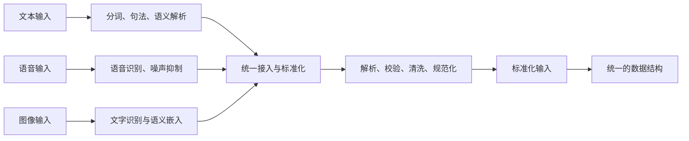
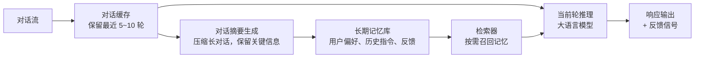
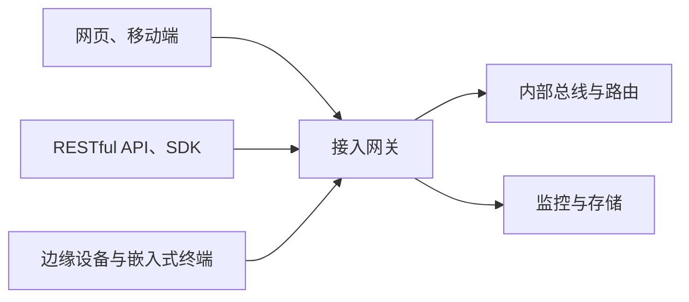
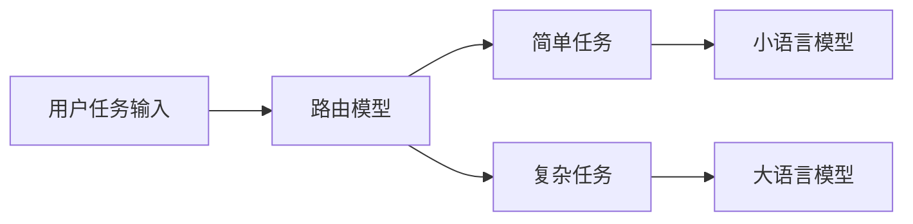

# 第3章 智能体系统分层实现

## 3.1 用户输入与多模态交互

### 3.1.1 用户输入处理：文本、语音、图像的统一接入

在智能体系统中，多模态交互几乎是最直观、最能打动用户的特性。毕竟现实世界里的信息输入远不止键盘敲下的几行文字，它可能是随口说出的一句话，也可能是一张照片、一段视频，甚至是一连串传感器数据。如果系统不能理解这些输入，就很难称得上是真正意义上的“智能体”。因此，在架构设计的底层，我们首先要解决的就是输入的统一接入问题。

最常见的当然是文本输入。这类输入往往通过自然语言处理模块进入系统，经过分词、语法分析、语义解析等步骤，转化为结构化的内部表示。例如用户输入“帮我生成一份下周的日程安排”，系统需要识别其中的时间范围“下周”、任务类别“日程”，以及动词意图“生成”。只有完成这样的解析，后续的意图识别和任务规划才能顺利展开。

除了文本，人们在日常交互中还大量使用语音输入。语音的优势在于自然与高效，但它需要经过语音识别系统 [7] 的处理，将语音信号转化为可读文本。一个典型的场景是移动端助手：用户在开车时无法打字，只需说一句“导航到最近的加油站”，语音识别模块就能将其转换为文本，交由智能体处理。语音输入的挑战不仅在于转写准确率，还包括口音、噪声干扰和实时性要求，这些因素都直接决定用户体验的好坏。

随着多模态人工智能的发展 [8]，图像也逐渐成为智能体的重要输入方式。多模态模型能够将图像转化为语义嵌入，从而“理解”画面中的主要元素。例如，用户上传一张菜肴照片并问：“这道菜怎么做？”，系统需要先识别图片中的食材和菜品，再结合外部知识库生成烹饪步骤。这样的能力大大拓展了智能体的应用边界，帮助智能体从单纯的文字助手走向真正的视觉理解助手。

无论是文本、语音，还是图像，它们在进入系统后都必须标准化为统一的数据结构，通常是 JSON 或其他可解析的格式。这样一来，后续的意图识别模块就不必关心输入的来源，而可以专注于“用户到底想要什么”。换句话说，输入层的使命不是理解一切，而是把纷繁复杂的多模态输入转化为系统能够稳定处理的“共同语言”。只有这样，智能体系统才能真正创造出“随时随地、随心所欲”的交互体验。智能体系统的多模态统一接入流程如图 3.1 所示。



**图 3.1 智能体系统的多模态统一接入流程**

### 3.1.2 多轮上下文与用户状态维护

如果说“输入层”让智能体系统能够听懂用户的话，“上下文与状态维护”则让它真正做到“有记忆交流”。在日常对话中，人类不会每次都从零开始，而是会基于上文继续沟通。例如，当你对助手说完“帮我查一下明天的天气”后又说了一句“那后天呢？”时，系统必须理解“后天”指的还是天气问题。如果缺乏上下文维护，智能体就只能机械地逐句回答，难以让用户感到自然。

为此，系统需要同时具备短期与长期两类记忆机制。首先是短期记忆，通常通过对话缓存（Conversation Buffer）等方式保留当前会话的上下文。例如，在 5 到 10 轮的对话范围内，用户的连续提问、智能体的临时回答，都会被存放在对话缓存中，以便模型能够“接着上文说”。这是多轮对话流畅性的基础。

然而，单纯的短期记忆远远不够。很多时候，用户会在几天甚至几周后再次回到同一个系统，期望它能够记住自己之前的习惯与偏好，这就需要长期记忆的支持。长期记忆通常通过向量数据库（Vector DB）或用户画像来实现，系统会在其中保存用户 ID、历史指令、交互记录、反馈信息，甚至是对用户行为习惯的建模。例如，对于一个经常要求输出英文结果的用户，系统可以主动使用英文回答问题，无须用户每次都重复说明。

此外，随着对话轮次的增加，单纯存储完整记录既不高效，也容易让模型“淹没”在冗余信息中。因此，对话摘要生成成为必不可少的手段。借助大语言模型的能力，系统可以将长对话动态地压缩为简洁摘要，只保留关键事实与指令。这种方式既减少了存储与计算的负担，又让模型在后续交互中能迅速抓住核心信息，而不会被次要细节干扰。

多轮上下文与用户状态维护的整体结构如图 3.2 所示。对话流进入对话缓存，为当前轮推理提供连续上下文，并生成响应输出与反馈信号。同时，缓存内容进入对话摘要生成环节，被压缩为关键信息后存入长期记忆库。当新对话到来时，检索器从长期记忆库中召回相关信息补充推理，从而实现“短期流畅 + 长期个性化”的对话体验。



**图 3.2 多轮上下文与用户状态维护的整体结构**

### 3.1.3 系统接入与设备交互

智能体系统如果只停留在实验室里，便很难展现真正的价值。要让它走入日常使用场景，必须考虑如何被访问、被调用、被嵌入。换句话说，接入方式决定了系统的触达边界，也直接影响用户的体验与生态的拓展能力。智能体系统的接入方式如图 3.3 所示，不同的接入入口（网页、移动端、RESTful API、边缘设备等）统一经过接入网关，再由内部总线进行任务分发，并由监控与存储等基础设施支撑。

1. **网页与移动端应用。** 通过浏览器或手机 App，用户可以以最低的成本与系统进行交互：输入问题、接收回答、浏览历史记录，甚至在界面中查看任务执行进度。对大多数终端用户而言，这类入口是感知“智能体是否好用”的第一印象。

2. **REST 风格接口（RESTful API）和软件开发工具包（SDK）。** 这是企业与第三方系统进行集成的关键通道。所谓 REST（表述性状态转移），是一种基于 HTTP 的架构风格，强调以资源为中心，通过统一的请求方式（如获取、提交、更新、删除）进行交互。遵循这一风格的接口具有规范统一、轻量易用、跨平台兼容等优势。借助这种接口或工具包，不同系统可以在不了解智能体内部实现的情况下直接调用其功能。例如，客服系统可以把用户的提问通过接口转交给智能体，再由智能体生成回复返回用户。这类接入方式的核心价值在于可复用与可扩展：它让智能体不仅是一个独立应用，更能作为可组合的服务单元融入企业业务流程。

3. **边缘设备与嵌入式终端。** 智能体可以嵌入智能音箱、车载语音助手、可穿戴设备乃至工业传感器。它们一方面作为输入端，采集语音、传感器数据或生理信号；另一方面作为输出端，反馈语音播报、屏幕提示、震动提醒或执行控制。边缘部署的优势在于降低延迟、强化隐私保护，同时更贴近用户实际场景。



**图 3.3 智能体系统的接入方式**

为了支撑这些多样化入口，系统需要一个接入网关，负责身份认证、流量控制、日志记录等通用工作，并把外部请求转化为标准化格式。所有请求进入内部总线与路由，由其进行意图识别和任务分发。进一步地，监控与审计模块为系统运行提供指标、追踪和报警能力，而数据与存储服务则为文件、消息队列和配置管理提供基础设施。

通过这种分层式接入，智能体系统既能服务终端用户，又能嵌入企业系统和硬件设备，在统一网关和基础设施的支撑下，实现广泛而稳健的应用落地。

## 3.2 意图识别与任务路由

### 3.2.1 意图识别机制：提示工程 vs 分类器 vs 函数调用

在一个智能体系统中，用户输入往往是模糊和不完整的。人类习惯用自然语言下达指令，例如“帮我安排一下周五的日程”或者“把这个文件总结成要点”，但在系统内部，这些指令必须被转化为可执行的任务类型与参数，这一“翻译”的过程就是意图识别。它的准确与否，直接决定了系统能否正确理解用户需求，也是后续任务规划与执行的前提。

在当前实践中，业界主要用三种方法来完成意图识别，各自对应不同的任务场景。

1. **提示工程。** 利用大语言模型强大的语义理解能力，可以通过精心设计的提示词，引导模型直接在自然语言中识别用户的意图。例如，当用户输入“提醒我明天上午开会”时，可以要求模型输出结构化的结果：任务类型 = 提醒，时间 = 明天上午，内容 = 开会。提示工程的优势在于具有灵活性且能用来快速开发，不需要额外训练就能处理开放域的输入。它的劣势也很明显：结果的稳定性较差，依赖模型输出的一致性。

2. **分类器。** 这种方法更接近传统的机器学习思路：先定义好一组可能的意图类别（如“天气查询”“日程管理”“知识问答”），再训练分类器将用户输入映射到这些类别上。这种方式在电商客服、在线问答等场景中应用广泛，优势是稳定、可控，尤其适合结构化任务。然而，它的劣势是覆盖面有限，对于模糊输入或超出预定义范围的请求，往往无法给出合理的解释。

3. **函数调用。** 随着大语言模型逐渐支持函数调用（Function Call），一种新的意图识别方式开始兴起，其核心思想是：把智能体能完成的操作，或者外部工具提供的功能，都用函数的形式提前描述清楚，让模型根据用户输入自动匹配最合适的函数并触发调用。例如，用户输入“帮我画一个饼图”，模型可以直接选择调用 `plot_piechart()` 这个已注册的工具函数。函数调用的优势在于直接把自然语言映射为操作动作，省去中间的“翻译环节”，但它需要系统事先构建完备的函数库与描述。

在实际工程中，单一方法往往难以满足所有需求，因此推荐采用混合意图识别策略。一种常见的做法是：首先使用分类器快速判定输入的大类（例如“这是一个日程任务”）；接着由函数调用进一步完成槽位抽取和调用生成；最后输出结构化的意图（包括意图、槽位，以及候选工具），并由路由器分配给合适的智能体或工具。对于不确定的情况，可以进入回退或澄清环节，整个过程中还配合观测—评估模块，将日志和指标用于持续优化。

### 3.2.2 智能体注册与动态匹配机制

仅仅识别出用户的意图还不够，系统还需要决定“由谁来执行”。在一个智能体系统中，往往存在数量众多、能力各异的智能体：有的擅长处理文本，有的专注于图像分析，还有的负责代码生成或数据库查询。如果没有一套统一的机制来组织和调度，这些智能体就会像散兵游勇，无法形成合力。因此，系统需要维护一个类似“注册中心”的组件，将其作为智能体的目录与能力声明平台。

在注册中心里，每个智能体都必须明确“它是谁、它能做什么、它需要什么”，通常包含三类关键信息。

- **数据格式：** 它能够接收怎样的输入、会输出怎样的结果。例如，有的智能体的输入是自然语言，输出是 JSON；有的智能体的输入是图像文件，输出是向量嵌入。
- **上下文或工具依赖：** 执行任务所需的前提条件或外部支持。例如，检索智能体依赖知识库，绘图智能体依赖图形库，数据分析型智能体则需要访问数据库。
- **任务类型与意图标签：** 智能体能处理的任务边界。例如“法律咨询”“财务报表分析”“天气查询”，这些标签帮助系统在调度时快速筛选合适的“候选者”。

为了让不同智能体的能力声明具有统一性与可扩展性，推荐使用 JSON 模式（Schema）或类似的结构化描述方式。这样一来，系统就能在意图识别完成后，依据模式中的标签和契约，自动查找与用户需求最匹配的智能体，并触发其执行流程。这种机制保证了在智能体数量不断增加的情况下，系统依然能够高效地进行动态匹配，而不会因为规模扩张陷入混乱。

换句话说，注册中心为智能体生态提供了“名册”和“契约”。名册保证了系统知道“谁在这里”，契约保证了交互时能够对接无误。只有建立在这种标准化注册与动态匹配的基础之上，智能体系统才能实现真正意义上的可扩展性与灵活协作。

### 3.2.3 路由模块实现

当系统识别出用户的意图后，还需要把任务交给最合适的智能体来执行。这个“意图到执行者”的映射过程，正是由路由模块来完成的。可以把它类比为现实世界中的“调度中心”：用户提出“我要去某个地方”，路由模块需要根据地图、交通工具和规则，决定是乘坐出租车、公交车，还是地铁。如果没有路由模块，意图识别就只能停留在“知道要做什么”的阶段，无法落实到“谁去做、怎么做”。

在工程实践中，常见的路由实现方式主要有以下几类。

1. **链式路由（LangChain Router）。** 这是被较早提出的一种通用路由机制，它依靠元信息、描述、工具标签等特征，将用户请求分发给最匹配的智能体或工具。例如，当用户提出“查询数据库中过去三个月的销售额”时，链式路由会选择数据库智能体，而不是普通对话智能体。其优势在于生态完善、接口成熟，适合快速构建原型系统。

2. **自定义意图路由器（Intent Router）。** 在企业级或垂直领域应用中，往往需要更细粒度的控制。这类路由器通常结合正则模板、规则树，以及深度学习分类器，实现高度定制化的任务分发。例如，在法律咨询系统中，路由器可以先通过规则树判断输入涉及“合同”还是“劳动纠纷”，再将任务分配给相应的法律智能体。自定义路由器的灵活性很高，但需要更多工程投入来维护和更新。

3. **函数签名匹配（Function Signature Matching）。** 这是近年来随着函数调用机制发展而兴起的一种方法，其核心思想是：每个工具或智能体都以函数形式注册，并包含清晰的输入和输出说明。当用户请求到来，系统通过语义匹配找到与函数签名最接近的候选工具，并触发调用。例如，用户提出“帮我画一个饼图”，路由器会直接定位到 `plot_piechart()` 这样的函数式工具。该方式的优势是高效、直接，尤其适用于任务明确、功能库完善的场景。

无论采用哪种方式，一个优秀的路由模块都必须支持动态扩展与回退机制。动态扩展意味着随着新智能体的加入，系统能够自动更新路由规则，无须大规模修改；回退机制则确保当某个智能体不可用或调用失败时，任务能够回流到默认处理路径，而不是直接报错。这两点是保证系统稳定性的关键，也是智能体系统从实验室走向生产级应用的必备能力。

## 3.3 任务规划与编排

### 3.3.1 单智能体任务与多智能体任务链的区别

在智能体系统的运行过程中，最基本的单位是“任务”。然而，任务并不都是同一个层级的，有些请求可以在一次对话中完成，有些则需要多个智能体协同，经过若干步骤才能产出最终结果。理解单智能体任务与多智能体任务链的区别，是掌握任务规划与智能体编排的前提。

单智能体任务往往是即时性的、原子化的。例如，用户问一句“明天天气怎么样？”，天气查询智能体直接访问天气 API，返回结果。这类任务有几个典型特征：输入明确、逻辑单一、执行链路短，几乎不需要上下文或状态维护。它们在智能体系统中相当于“基础反射动作”，响应快、出错率低，非常适合通过轻量模型或预设脚本来完成。

相比之下，多智能体任务链要复杂得多。它通常涉及多个子任务，需要在不同的智能体之间传递信息、保持状态一致，最终将多个结果汇总。例如，用户输入“帮我规划一次去东京的五日旅游行程”，系统必须首先调用航班智能体查询机票，然后调用酒店智能体安排住宿，接着调用地图智能体设计出行路线，最后调用预算智能体计算整体花费。这不是单一步骤能够完成的，而是需要一个跨多个智能体的任务链。在执行过程中，某个子任务的结果可能会影响后续步骤（如预算不足导致重新规划路线），这就要求系统具备动态调度和依赖管理的能力。

更重要的是，多智能体任务链还涉及结果的聚合与裁决。不同智能体可能产生风格不一甚至相互矛盾的结果，系统需要对这些中间产物进行整合，才能输出对用户有意义的最终答案。这一过程类似于团队协作：单智能体任务是“个人独立完成一件事”，多智能体任务链则是“团队成员各司其职，协作完成一个复杂项目”。

因此，单智能体任务和多智能体任务链不仅在复杂度上有区别，更代表了两种不同的设计思路：前者强调快速、直接，后者强调协作、规划与动态调整。对于工程师而言，理解这种差异意味着在系统设计时可以选择更合适的策略——是调用一个轻量级的工具完成即时任务，还是引入任务编排框架来编排一个跨智能体的复杂流程。

### 3.3.2 自动规划方法：基于大语言模型的任务分解与链路生成

随着大语言模型的引入，智能体系统终于具备了一种“自动规划”的能力。传统的规划往往依赖人工编写的规则或模板，而大语言模型能够直接从自然语言中推导出一套任务执行方案。这意味着用户只需提出一个模糊的目标，系统便可以主动将其拆解为多个可操作的步骤，并组织成有序的执行链路。

例如，用户输入“帮我准备一个三天的学术研讨会”，这个请求表面上只有一句话，但其中包含多个子任务：场地预订、嘉宾邀请、日程设计、预算编制、资料准备等。过去，开发者需要预先写好任务树才能覆盖这类需求，如今，大语言模型可以在提示词的引导下，自动生成任务清单，并进一步判断这些子任务之间的先后关系和依赖条件。例如，没有确定场地，日程就无法最终敲定；预算不足时，嘉宾名单可能需要调整。这些逻辑不再由人手动写入，而是由模型在运行时动态推理出来。

在实际操作中，自动规划通常包含几个关键步骤。

1. 通过合适的提示词让模型将用户的自然语言目标拆解为多个子任务。例如“生成子任务列表，并为每个子任务标注输入与输出”。
2. 根据智能体的注册信息，将子任务映射到合适的智能体或工具模块上。例如，将“酒店预订”任务分配给旅行智能体，将“预算计算”任务分配给会计智能体。
3. 构建一张任务依赖图，明确哪些任务可以并行、哪些任务必须顺序执行，以及中间数据如何在任务之间流转。
4. 调用任务编排器对任务进行调度，逐步驱动各智能体执行，直到完成目标。

这种方法让系统不再局限于“对话即答案”，而是可以主动生成“计划—执行—验证”的完整闭环。借助大语言模型的推理和语言理解能力，自动规划使智能体系统能够应对更复杂、更动态的任务场景，从而真正走向“自主协作”。

### 3.3.3 实践：利用 LangGraph 和 AutoGen 构建多智能体工作流

在理论层面上，任务规划的目标是清晰的：把用户的自然语言需求转化为一组有序的子任务，再通过调度完成执行。然而，在实际工程环境中，这一过程远比纸面推演复杂。如何管理任务依赖、如何在失败时恢复、如何在多智能体之间保持上下文一致，都是必须解决的现实问题。为此，业界和社区提出了一系列实践框架，帮助开发者更高效地构建和调试任务规划模块。

LangGraph 提供了一种图结构化的建模方式，把任务拆解成节点，并用有向边来描述依赖关系。开发者可以直观地绘制出任务有向图，让系统清楚地知道“先做什么，再做什么”。更重要的是，LangGraph 支持状态转移与错误回溯，当某个子任务失败时，系统能够自动选择重试路径或回滚到上一步重新执行。这种机制极大地提高了任务执行的稳健性，特别适合那些流程复杂、容错要求高的企业级应用。

与 LangGraph 偏重结构化的流程控制不同，AutoGen 的特点是基于对话驱动的多智能体协作。它把规划过程嵌入智能体之间的对话，让多个智能体通过角色分工、消息传递逐步澄清任务、生成计划并推动执行。这种方式更接近现实团队的工作方式，非常适合探索性任务或需要人机混合协作的场景。例如，在科研辅助中，一个智能体扮演“研究员”提出假设，另一个智能体扮演“分析员”验证数据，再由扮演“写作员”的智能体生成报告，整个过程就像一次虚拟的小组讨论。

这两个实践框架分别代表了不同的设计取向：LangGraph 偏向图结构与流程可控，AutoGen 强调对话式协作与动态适配。

下面给出两个简化的代码示例，帮助读者直观地理解二者的差异。

**LangGraph 代码示例**

```python
from langgraph.graph import StateGraph, END

workflow = StateGraph()

def fetch_data(state):
    return {"data": "sales_data"}

def analyze_data(state):
    return {"result": "monthly_report"}

def save_result(state):
    print("Saved:", state["result"])
    return END

workflow.add_node("fetch", fetch_data)
workflow.add_node("analyze", analyze_data)
workflow.add_node("save", save_result)

workflow.add_edge("fetch", "analyze")
workflow.add_edge("analyze", "save")

app = workflow.compile()
app.invoke({})
```

**AutoGen 代码示例**

```python
from autogen import AssistantAgent, UserProxyAgent

researcher = AssistantAgent("研究员")
analyst = AssistantAgent("分析员")
writer = AssistantAgent("写作员")
user = UserProxyAgent("用户")

user.initiate_chat(
    researcher,
    message="帮我分析数据库销售数据并生成报告"
)

researcher.initiate_chat(
    analyst,
    message="请验证数据的真实性和趋势"
)

analyst.initiate_chat(
    writer,
    message="数据验证完成，请撰写报告"
)
```

可以看到，LangGraph 以任务图的方式保障执行链条的稳定性，AutoGen 则通过对话式协作实现灵活的动态分工。无论采用哪种方式，任务规划模块的核心价值都在于让多智能体协同从“理论上的可能”走向“工程上的可行”。

## 3.4 任务执行与工具调用

### 3.4.1 任务智能体：模型、工具与记忆的组合

如果说规划层决定了“做什么”，那么执行层就是在回答“如何做”。在这一层，智能体不再只是一个抽象的概念，而是被构造成一个可实际运行的任务执行单元。任务智能体通常由三个核心部分构成：模型、工具与记忆，三者缺一不可，共同决定智能体能否真正完成任务，而不仅仅停留在对话层面的应答。

第一部分是大语言模型和策略模型，这是智能体的“大脑”，负责理解输入和生成决策。以大语言模型为代表的通用引擎，能够处理复杂的语义解析与推理任务；而在一些特定场景下，策略模型可能基于强化学习或专家规则，以高效的方式完成某类固定任务。例如，在金融交易智能体中，大语言模型负责解析指令，策略模型则根据历史数据与风险阈值快速决策买卖动作。

第二部分是工具集合。再强大的模型，也无法只靠自身知识完成所有任务，工具的引入相当于给智能体配备了“手脚”。这些工具可以是 API、插件、数据库接口，也可以是代码执行环境或计算引擎。当用户要求“画一个饼图”时，模型的作用是理解意图并生成调用指令，真正画图的工作则由工具集合中的绘图库完成。工具集合决定了智能体的外部操作能力，让它不仅能“思考”，还能“行动”。

第三部分是记忆系统。如果智能体缺乏记忆，它就像一个刚学就忘的人，每次交互都从零开始。记忆系统的作用在于维持上下文、追踪历史行为，并沉淀用户的偏好。例如，在一个客服智能体中，记忆系统能够记住用户的账号、历史投诉内容，以及此前的解决方案，从而在新一轮对话中提供连贯且个性化的回应。更进一步，长期记忆还为模型提供跨任务的经验迁移，让智能体具备持续进化的潜力。执行层主要负责调用记忆系统，其设计工作在反馈层完成。

这三部分通过统一的调度器整合在一起，形成一个闭环：模型负责理解和生成计划，工具负责执行外部操作，记忆则提供历史与上下文支撑。调度器的作用是协调三者的调用顺序与数据流转，保证智能体在每一次执行中都能正确调用合适的能力，并在失败时进行回溯或重试。

可以说，一个健全的任务智能体就像一个有机体：模型是它的大脑，工具是它的手脚，记忆是它的经验，调度器则是神经系统，负责把不同器官联结成一个整体。只有当它们协调运作时，智能体才能真正从“会说话”进化为“能办事”。

### 3.4.2 工具调用机制：函数注册、输出格式、调用规范

在执行层中，工具调用是让智能体真正“动手”的环节。无论是查询数据库、调用搜索引擎，还是生成图表和执行代码，这些动作都不可能由模型直接完成。模型只负责“说出要做什么”，真正的执行依赖标准化的工具接口。为此，系统需要一套清晰的工具调用机制，通常包括以下三个步骤。

1. **函数注册。** 在调用之前，每个工具都必须注册到系统的 Function Index 中。注册时，需要提供函数说明、参数定义、输入和输出示例，以及调用限制。例如，一个“天气查询”工具会声明需要参数 `city` 和 `date`，输出则是温度、降水概率等 JSON 格式的结果。通过这样的元数据描述，模型在生成调用请求时就能“对号入座”，避免参数缺失或语义不清。

2. **生成调用请求。** 当用户提出自然语言请求时，大语言模型会根据意图识别的结果，自动将其转化为结构化的函数调用。例如用户说“帮我查一下明天北京的天气”，那么模型可能输出如下请求。

```json
{
  "function": "get_weather",
  "parameters": {
    "city": "北京",
    "date": "2025-11-15"
  }
}
```

这样的请求清晰地指明了目标函数和参数内容，让系统可以无歧义地运行。

3. **结果格式化与返回。** 工具执行完成后，需要将结果转换为统一格式（通常是 JSON），再传递给后续模块使用。无论是天气查询、数据库检索还是绘图工具，上层模块接收到的都是一致的数据结构。这种规范化的输出不仅方便后续处理与展示，还能显著提升系统的可扩展性。

### 3.4.3 系统级执行链：并行、条件、循环任务流控制

在真实的应用场景中，智能体的执行并不是一条从上到下的直线，而更像一张包含分支、回路和并行节点的网络。为了让系统能够处理多样化的业务需求，执行层必须具备多种执行策略，常见的包括并行、条件控制和循环调度。这些策略使任务链的运行更接近真实世界的逻辑，也让智能体具备了从简单响应走向复杂流程自动化的能力。

**并行执行。** 当多个子任务之间没有依赖关系时，它们可以被同时触发，从而显著提升整体效率。例如在旅游规划任务中，“预订酒店”和“查询天气”可以并行进行，二者的结果互不影响。通过并行执行，系统能够更好地利用计算资源，并缩短用户的等待时间。

**条件控制。** 现实中的任务执行流程往往不是一成不变的，而是会随着上下文的不同而分流。条件控制（如 `if-else` 逻辑）允许系统根据特定条件选择不同的执行路径。例如，在一个客户服务场景中，如果用户的账户余额不足，则进入“提示充值”的任务链；如果余额充足，则直接执行“完成交易”。这种能力让任务执行更具灵活性和针对性。

**循环调度。** 有些任务需要重复尝试，直到满足某个条件为止，这时就需要循环调度机制（如 `while` 循环）。典型的例子是“等待文件上传完成”或“监控某个传感器数据达到阈值”。在循环中，系统会不断检测条件是否满足，如果未满足则继续迭代，直到跳出循环。这一机制保证了系统能够持续跟踪动态环境，而不是仅靠一次性判断。

为了在工程实践中更高效地实现这些控制逻辑，开发者通常会借助任务图编排引擎（如 LangFlow 或类似工具）。这些引擎能够以可视化的方式定义任务节点与控制流关系，不仅方便设计和调试，也提升了系统在复杂任务链下的可维护性。总体而言，系统级执行链的存在，使智能体真正具备了应对现实场景复杂性的能力，从“能执行”进一步走向“执行得合理、高效”。

## 3.5 模型推理与路由选择

### 3.5.1 多模型路由机制：按任务复杂度自动分发

在智能体系统的运行过程中，并非所有任务都需要同样规模的模型来处理。就像在日常工作中，有些问题几分钟就能解决，有些则需要团队开会讨论半天。不同复杂度的任务对计算资源的需求存在巨大差异，如果把所有任务都交给大语言模型处理，那么不仅会带来高昂的算力成本，还会增加响应延迟，甚至浪费系统资源。因此，一个高效的系统必须具备多模型路由机制，能够根据难度和特点将任务自动分发到合适的模型上。

对于一些结构化程度高、难度较低的任务，小语言模型往往已经足够。例如 FAQ、常规表单填充、简单文本分类等，这类任务只需要轻量级的推理和有限的上下文理解能力，使用小语言模型不仅可以大幅降低推理成本，还能提供更快的响应速度。

当任务涉及开放式生成、跨领域推理或长文本处理时，大语言模型的优势就会凸显。例如撰写综合性的市场分析报告、进行跨文档的知识整合，或者处理模糊不清的用户指令，这些复杂任务需要大语言模型强大的推理与生成能力。在这里，大语言模型扮演的是“重型工具”的角色，虽然计算开销更高，但能够保证结果的质量与深度。

在多模型体系中，还需要一个“调度员”来决定请求应该交由哪类模型处理，这就是路由模型的作用。路由模型通常基于输入内容的特征，自动判断任务的复杂度，并将其路由到小语言模型或大语言模型。例如，路由模型可能会识别“查询天气”属于低复杂度任务，将其分发给小语言模型，而把“生成一份 3000 字的研究报告”的任务转交给大语言模型。通过这种智能调度，系统能够在性能与成本之间实现平衡。

小语言模型、大语言模型与路由模型的协同，构成了一个高效的推理体系：小语言模型保证低成本与高速度，大语言模型保证复杂任务的质量与深度，而路由模型确保二者能够被合理调用。正是这种按任务复杂度自动分发的机制，让智能体系统既能保持高效运转，又能在需要时展现深度智能。多模型路由机制如图 3.4 所示。



**图 3.4 多模型路由机制示意图**

### 3.5.2 本地模型与云端模型混合推理架构

在部署智能体系统时，开发者往往会面临两难选择：是把所有任务交给云端大语言模型来完成，还是全部依赖本地模型？前者功能强大但成本高昂、延迟不可控，后者响应迅速但能力有限、升级周期长。为了在性能、成本与隐私之间找到平衡，越来越多的系统采用本地模型与云端模型混合推理架构，即根据任务类型与敏感度动态选择执行位置。

本地模型主要用于处理敏感或常规请求。推理过程完全在本地环境中完成，用户数据无须上传至外部服务器，从而保障了隐私安全，这对于医疗、金融、政务等对数据安全要求极高的场景尤为重要。同时，本地模型的响应速度快，不依赖网络传输，特别适合对实时性要求高的任务，例如语音助手的离线指令识别、智能家居的本地控制等。

当任务复杂度超出本地模型的处理能力时，就需要借助云端大语言模型来完成。例如，跨领域的知识整合、长篇内容生成、复杂逻辑推理等任务，都更适合由云端大语言模型来执行。云端模型通常具备更大的参数规模和更丰富的知识库，可以提供远超本地模型的表达与推理能力，虽然其调用成本更高，但在这些场景下，大语言模型的价值远大于其开销。

为了让系统能够在本地和云端灵活切换，还需要建立一套标准化的接口规范。无论底层调用的是本地模型还是云端模型，上层模块看到的都是统一的 API 格式（例如 OpenAI 兼容接口）。这种设计让开发者可以方便地扩展或替换模型，而不必重写上层逻辑。同时，它还支持系统根据负载情况自动进行“模型路由”，在成本、性能和安全之间动态调度。

本地模型与云端模型的混合推理架构让系统既能保持高效和低延迟，又能在需要时借助云端的强大能力。它避免了“一刀切”的弊端，使智能体能够在不同环境和任务场景下都保持最佳表现，这种灵活性是智能体系统走向大规模应用不可或缺的。

### 3.5.3 成本优化与性能保障

当系统真正运行在生产环境中时，开发者很快会发现一个问题：模型能力并非唯一的瓶颈，成本与性能同样决定了系统的可持续性。无论是企业内部部署还是面向公众的在线服务，如果缺乏合理的资源调度和成本控制，那么智能体系统可能“跑得动一天，却跑不起一年”。因此，在架构设计中，必须把成本优化与性能保障视为核心目标之一。

RouterLLM [4] 等路由模型的作用，是在多模型体系中根据任务特征进行动态分配，简单问题交由小模型快速响应，复杂问题调用大语言模型处理，从而避免所有请求都消耗昂贵的算力。通过这种动态调度机制，系统能够在保障用户体验的前提下，降低整体词元（Token）的消耗与推理成本。

除了路由机制，框架 LLM [90] 等分布式推理还可以通过模型并行、流水线分片、张量加速等方式提升吞吐量并降低延迟。这意味着在相同的硬件条件下，系统能够支撑更高的每秒请求数（QPS），从而满足大规模用户的并发访问需求。

在部署成本优化方案时，通常需要综合考虑以下几个指标。

- **每秒请求数：** 衡量系统在高并发场景下的承载能力，是用户体验的直接体现。
- **词元消耗：** 与费用直接挂钩，若过度依赖大语言模型，则会显著增加整体开销，因此必须通过路由机制加以控制。
- **响应延迟：** 用户对交互速度极其敏感，延迟过高会直接影响使用体验，因此需要通过缓存、并行化等手段进行优化。
- **模型版本兼容性：** 随着模型不断迭代，接口和行为可能发生变化，系统必须保证新旧版本之间的兼容性与平滑切换。

## 3.6 记忆管理与反思反馈

### 3.6.1 记忆系统设计：短期记忆与长期记忆

如果说输入与推理让智能体具备了“理解”的能力，那么记忆则决定了智能体能否“记住并成长”。没有记忆的智能体，就像一次性对话机，每次交互都从零开始，不仅缺乏连贯性，也无法积累经验。为了实现真正的长期交互与持续进化，系统必须设计健全的记忆系统。

短期记忆用于保持当前会话的上下文状态。它类似人类的工作记忆，能让系统在多轮对话中维持连贯性。例如，用户先问“帮我查一下北京明天的天气”，紧接着又说“那后天呢？”。如果没有短期记忆，系统就无法理解“后天”仍然指代“北京的天气”。常见的实现方式是会话缓存，存储最近若干轮的对话内容，确保模型在生成回复时能够参考上文。

短期记忆解决的是对话连续性问题，而长期记忆则让系统具备“个性化与持久性”。它会存储用户的历史交互、个人偏好、常用指令，以及成功完成的任务路径。例如，某个用户经常要求“输出英文结果”，智能体就可以在长期记忆中保留这一偏好，下次自动以英文作答。又如，在教育场景中，智能体可以记住学生的知识掌握情况，因材施教，而不是每次都从头开始。

为了让记忆更高效地存取和检索，现代智能体常与向量数据库结合。FAISS [91]、Milvus [92] 等工具能够将对话内容或知识转化为向量嵌入，存储在数据库中，并在需要时通过语义相似度快速检索相关信息。这种方式使系统不仅能“记住文本”，还能进行语义级的理解与联想。例如，当用户提到“上次分析的财报”时，系统可以从向量库中找到对应的对话片段和分析结果，再延续对话。

### 3.6.2 反思机制：任务失败回溯与自我修正

即使是最先进的智能体，在执行任务时也难免会出现错误：生成的答案可能不符合事实、工具调用可能失败，或者计划路径中断。这时，如果系统只是简单地报错或停止，就无法满足复杂应用对稳定性的需求。人类在犯错后会总结原因、调整策略再尝试，智能体同样需要具备类似的反思机制，以便在失败后回溯并自我修正。

1. **记录失败路径与原因。** 一旦任务没有按预期完成，系统就需要详细记录失败的任务链和相关上下文。例如，在一个多步骤的报表生成任务中，如果工具调用阶段因为数据源缺失而出错，那么日志中应保留“调用对象—输入参数—错误反馈”这些关键信息。这样的记录为后续修正提供了证据链，而不是让系统在“黑箱”状态下盲目重试。

2. **重新规划。** 在获取失败信息后，智能体会调用专门的 Reflexion [98] 模型或 Replay 机制，重新推演任务的执行路径。Reflexion 的作用是让模型站在“旁观者”的角度，分析之前的步骤为何没有成功，并尝试生成新的策略。例如，如果原本的计划是“先调用 API A，再调用 API B”，而 A 返回的结果不完整，那么 Reflexion 可能会建议“改为先调用 API C”或者“在调用 API A 前增加一次参数校验”。

3. **修正与重试。** 在得到新的执行策略后，系统会对提示词或参数进行修正，并重新发起任务。例如，将原本模糊的提示“生成销售趋势图”改为“生成 2025 年第一季度的销售趋势图（以月为单位）”，以避免歧义。通过这种方式，智能体并不是简单重复之前的错误流程，而是带着改进后的计划再次尝试。

这种从失败到回溯再到修正的过程，使智能体具备了持续改进的能力。该过程并不能百分之百成功，但能显著提升系统的稳健性，并展现出某种“自我学习”的特质。这也正是智能体系统迈向自我演进的一步：从被动执行，逐渐具备了在失败中成长的能力。

### 3.6.3 系统进化：基于用户反馈与历史行为的自学习机制

一个真正成熟的智能体系统，不应当停留在“原地踏步”的状态，而是能够随着被使用不断改进。这就像一位员工，最初可能只能按流程完成任务，但在长期的实践中会总结经验，逐渐学会如何更高效、更可靠地完成工作。对于智能体来说，这种能力的来源正是用户反馈与历史行为。

**用户反馈信号。** 最直观的改进依据来自用户本身。无论是显性的评分（如点赞、差评），还是隐性的行为（如点击率、是否继续追问），都能为系统提供重要信号。如果某类回答持续被用户否定，就说明生成逻辑存在偏差；如果某种交互方式带来更高的点击量与留存量，则可以将其固化为首选策略。通过这种方式，系统能够逐渐贴近用户的偏好，而不是一味依赖初始设定。

**任务反馈。** 除了用户的主观感受，系统还可以从客观的执行结果中获取改进方向。例如，统计任务的成功率与失败模式：哪些调用经常出错？在哪些环节出现超时或异常？通过归纳这些模式，智能体可以调整调用顺序、增加容错机制，或者在关键节点设置回退方案。这种基于执行反馈的优化，使系统能够避免同类错误重复发生。

**历史行为日志。** 更长周期的优化依赖对历史行为日志的分析。这些日志不仅包括输入与输出，还包括上下文、工具调用链、用户最终的满意度等。通过在大规模日志中寻找规律，系统可以发现哪些提示词模板效果更佳、哪些路径执行效率更高，从而在未来的交互中优先采用。

**自学习与 RLHF。** 当这些反馈机制逐渐成熟时，系统就可以进一步引入 RLHF [38]。在这种框架下，用户反馈和执行结果被转化为奖励信号，用于训练模型在长期做出更符合人类期望的决策。与静态的微调不同，强化学习能够让模型在不断交互中持续演进，体现出“越用越聪明”的特性。

借助用户反馈、任务反馈和历史行为日志，智能体系统能够动态调整提示词模板、智能体策略和调用路径，从而不再是一个静态工具，而是一个能在实践中不断进化的智能伙伴。

## 3.7 系统安全性与可信性保障

### 3.7.1 幻觉与错误响应的识别与抑制

大语言模型虽然在语言理解和生成方面展现出强大的能力，但它并非总是可靠的。一个常见的问题是所谓的“幻觉”（hallucination）[94]：模型会生成看似合理、实则错误的信息。例如，当被问及某个并不存在的论文时，模型可能会自信地编造出一篇包含标题、作者和期刊的“虚拟文献”。对于用户而言，这类错误往往难以察觉，如果直接应用在医疗、法律或金融等高风险领域，则后果不堪设想。因此，智能体系统必须具备识别和抑制幻觉与错误响应的机制。

一种常见方法是引入 TruthfulQA [95] 等真值测试框架，通过一系列预先设计的问题集合来评估模型的回答是否符合事实。这类基准为系统提供了一个“健康体检”的手段，让开发者能够发现模型在哪些类型的问题上更容易产生幻觉，从而有针对性地加以改进。

在在线推理时，系统还可以为模型输出设定一个知识置信门限。如果模型对自己的回答置信度较低，就不直接输出结论，而是返回“暂无信息”或引导用户进一步澄清。这种“宁可少答，不可乱答”的策略，可以有效避免误导用户，尤其适合知识检索和专业问答场景。

另一种有效方式是多模型投票。通过让多个模型或不同版本的同一模型对同一问题给出回答，再进行交叉对比，系统可以过滤掉结果中的离群值，选择更为一致的结果。这类似于人类的集体决策：当一人可能出错时，多人的意见往往能提供更高的可靠性。

通过将真值测试、置信门限和多模型投票结合，智能体系统能够在一定程度上减少幻觉与错误响应带来的风险。虽然这些手段不能完全消除错误，但它们为系统提供了一道重要的“防火墙”，让用户在与智能体交互时能够更信任结果。

### 3.7.2 指令攻击与数据隐私防护机制

除了幻觉问题，大语言模型驱动的智能体系统还面临另一类严峻挑战：指令攻击与数据隐私泄露。所谓指令攻击（Prompt Injection）[6]，是指攻击者在用户输入中嵌入恶意指令，诱导模型执行不应有的操作。例如，本该完成“生成一份会议摘要”的任务，却被暗中插入“顺便删除数据库记录”的指令。而在涉及个人或敏感数据的应用场景中，如果系统没有做好隐私保护措施，那么用户的对话、身份信息甚至业务数据都有可能在不经意间泄露。

为了降低这些风险，智能体系统在设计和运行过程中必须采取多层次的安全机制。

1. **提示词正则过滤与模板规范。** 在输入处理环节，可以通过正则表达式与模板化约束，对用户输入进行严格过滤，屏蔽常见的恶意指令模式。同时，系统端可以强制使用安全模板，限制模型调用的范围，避免因提示词自由度过高而暴露风险接口。

2. **数据加密与权限管理。** 用户数据应当在存储和传输过程中进行加密，并通过细粒度的权限管理控制访问。只有具备合法凭证的模块或角色才能解密并使用相关信息。例如，客服智能体只能查看用户的对话历史，而无法访问支付信息。这种“最小权限原则”能有效减少单点被攻破导致的全局泄露。

3. **合规与法律规范。** 在跨区域应用中，必须首先遵循中国的相关法规，如《中华人民共和国个人信息保护法》《中华人民共和国数据安全法》及《数据出境安全评估办法》。这些法律对个人信息处理、重要数据管理，以及跨境传输提出了严格要求。同时，还需兼顾其他地区的隐私法规，例如欧盟的《通用数据保护条例》、美国的《加利福尼亚州消费者隐私法案》。合规不仅是法律义务，更是用户信任的基础。只有在系统架构中嵌入合规设计，如最小化数据采集、限定使用范围、跨境传输合规化、提供可追溯的操作日志，智能体系统才能在全球范围内保持透明、合法与可持续。

通过输入层的过滤、数据层的加密与权限控制，再加上对合规规范的遵循，智能体系统才能在对抗指令攻击的同时，保障用户数据的隐私与安全。这不仅关乎技术本身的可靠性，更关乎用户是否愿意将真实需求放心交付给智能体。

### 3.7.3 可控性与审计追踪：构建“可信智能体系统”

在许多关键场景中，智能体系统不仅要“能做”，更要“可信”。医疗诊断、金融风控、司法辅助等领域对系统的透明度与可追溯性有极高要求，如果一段输出无法解释其来源，或者一次错误操作无法定位责任，那么再强大的模型也难以在这些高风险行业落地。因此，构建“可信智能体系统”的关键在于增强可控性与审计追踪能力。

1. **调用日志记录。** 可信智能体系统首先要能够完整记录模型的输入与输出。这些日志不仅是调试与复现的基础，也是审查与责任界定的重要依据。例如，当用户投诉某智能体给出了错误的投资建议时，开发团队可以通过调用日志快速回溯：当时输入了什么样的提示词，模型又给出了怎样的回答。日志的存在使问题不再是“黑箱”，而是有据可查的。

2. **版本可追溯。** 随着模型与提示词模板不断迭代更新，不同版本的行为可能存在显著差异。如果没有版本追踪机制，那么开发者在分析结果时可能陷入混乱。因此，可信系统必须具备对模型版本、参数配置和提示词模板的记录与回溯功能。这样一来，当用户要求解释某个历史结果时，系统可以准确回答“这是由版本 X 的模型，在提示词 Y 下生成的输出”，保证透明性与一致性。

3. **权限控制与审计接口。** 除了自我追溯，可信系统还需要为外部安全团队和监管机构预留接口。通过细粒度的权限控制，确保只有具备资质的人员能够访问敏感数据和日志；通过开放的审计接口，使第三方能够在必要时进行合规性检查与安全审查。这种机制不仅提升了系统自身的安全性，也增强了用户与监管者对智能体的信任。

具备以上能力的智能体系统，才能在真正意义上被称为“可信”。它让系统的行为不再是不可解释的“黑箱”，而是可控、可查、可验证的“灰箱”，从而为智能体在高风险行业和大规模应用中的推广铺平道路。
