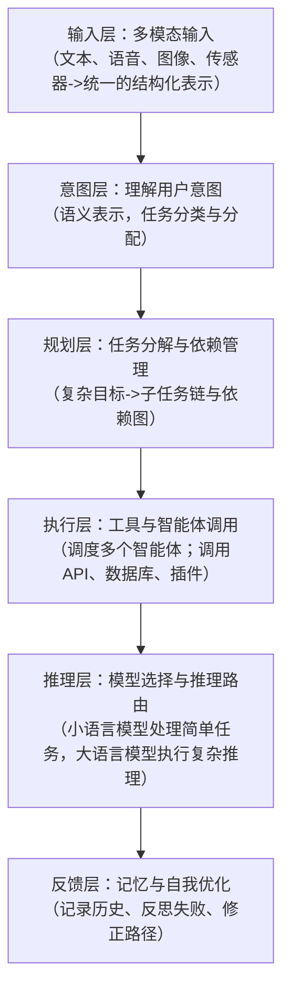

---
# 四项设计原则

在设计智能体系统架构的过程中，逐渐形成了四个被普遍认为最核心的原则。

这四个原则并不是孤立存在的，而是相互支撑、相互制衡的，
它们共同决定了整个系统的工程形态与未来演进方向，这四个原则分别是：

> - 用户友好——自然对话入口，零学习曲线；
> - 系统智能——意图识别、任务规划、多模型路由、工具调用与反馈修正；
> - 拓展性强——模块化、插件化、热插拔升级；
> - 性价比高——本地+云端混合，按复杂度路由

## 用户友好：降低门槛的第一原则

用户友好始终被放在最前面的位置。

任何技术如果不能被普通用户自然地使用，那么其价值都会大打折扣。智能体系统的目标并不是要求人类学习一套新的指令语言，而是让人类能够**像与人交流一样轻松地提出问题或下达命令**。

在理想状态下，用户只需打开一个对话框，
说出“帮我整理一份财务报表”或“推荐一条适合周末出行的路线”，系统就能理解并执行。

这里的友好，不仅体现在**直观的交互方式**上，也意味着**用户无须了解复杂的技术细节**，**无须学习额外的脚本语言或操作命令**。对用户而言，智能体系统的**使用门槛应该和搜索引擎一样低**。

## 系统智能：真正理解用户意图并完成任务

用户之所以能获得友好的体验，是因为系统足够“聪明”。

所谓的“聪明”，不仅要能**回答问题**，还要能够**真正理解任务的意图**，
并具备从**任务分解**、**自动规划**到**结果反思**与**自我优化**的完整能力。

一个成熟的智能体系统应当：

> - 处理模糊或不完整的输入
> - 能够在执行失败后自动定位原因并尝试新的方案

这种智能性依赖多层次技术的协同：

> - 意图识别
> - 任务规划
> - 多模型路由
> - 工具调用
> - 反馈修正机制

系统只有具备**自我调整**与**持续演进**的能力，才能真正称得上“智能”。

## 扩展性强：模块化带来的演进能力

智能体系统不是封闭的整体，而是**开放、模块化的平台**。

随着技术与应用需求的不断变化：

> 系统必须能够快速接入新的模型、工具或接口，而不需要推翻架构重来。
> 每一个核心模块，无论是输入、规划还是推理，都应以插件的形式存在，能够随时替换与升级。

这种设计：

> 不仅在目前适配企业的个性化需求；
> 也能在未来出现更强大的模型或工具时实现快速跟进，保证技术演进的无缝衔接。

换句话说：

> 一个优秀的智能体系统架构应该具备类似“乐高积木”的灵活性，而不是难以挪动的“整体石块”。

## 性价比高：让智能体系统真正可用

任何系统最终都要落地到真实使用场景中，**算力**与**成本**的问题无法忽视。
大语言模型固然强大，但动辄上亿个参数在许多日常应用中既不必要也不经济。

因此，一个合理的智能体系统需要在**性能**与**成本**之间找到平衡：

> - 简单任务可以由轻量级本地模型处理
> - 复杂推理与生成则交给云端大语言模型

通过“本地+云端”的**混合部署方式**，以及**动态多模型的调度机制**，
系统能够在保证响应速度与隐私安全的同时，在必要时调用大语言模型的强大能力。

高性价比不仅体现在**运行成本的降低**上，
也体现在**让更多企业与个人能够真正使用并负担得起**，从而加速智能体系统的普及。

这四项原则共同勾勒出一个清晰的目标：

> - 让智能体系统既能被轻松使用，又能不断进化；
> - 既能适应未来变化，又能在当下实现经济可行。

---
# 六层架构概述

智能体系统并不是简单调用单一模型，而是==将六个层级紧密衔接==，形成从**用户输入**到**系统输出**的完整闭环。这六个层级分别是：

> - 输入层
> - 意图层
> - 规划层
> - 执行层
> - 推理层
> - 反馈层

它们既像流水线一样**环环相扣**，又像生态系统一样**彼此补充与强化**。

## 输入层

输入层是用户与系统交互的第一入口，**承载所有外部信息**。

与传统系统只处理单一文本不同，智能体系统必须具备多模态能力：

> 能够同时接收文本、语音、图像，甚至视频或传感器数据。

输入层的任务是：

> **将这些异构信息标准化、结构化**，为后续处理奠定坚实的基础。

==只有在这一层做到兼容与统一，用户才可能自然地与系统对话，而不需要刻意切换交互方式。==

## 意图层

意图层的任务是**理解“用户真正想要的是什么”**。

用户可能只说一句模糊的自然语言指令：

> “帮我安排下周的会议。”

其背后包含多个子任务。

意图层需要：

> 完成**意图识别**与**任务分类**；
> 将**人类语言**转化为**系统可以理解和处理的内部语义表示**。

同时，它还要：

> **根据识别结果**，在智能体注册中心中**寻找最合适的执行者**，完成任务的初步分配。

==这一层决定了系统能否“听懂人话”，是整个架构的第一个关键转折点。==

## 规划层

规划层的作用是**把复杂的任务目标拆解为若干可执行的子任务，构建出清晰的任务依赖图**。

例如，将：

> “准备一场学术研讨会。”

分解为：

> - 场地预订
> - 嘉宾邀请
> - 议程安排
> - 预算编制

等环节。

规划层不仅要**拆解任务目标**，还要**决定子任务的执行顺序和依赖关系**，保证整个流程合理高效。

==可以说，规划层赋予了系统“像项目经理一样思考”的能力。==

## 执行层

执行层会**调用具体的智能体或外部工具，来完成之前规划好的子任务**。

不同的智能体可能负责不同的领域：

> - 有的用于信息检索；
> - 有的负责代码生成；
> - 有的则专注于数据分析。

执行层就像一个团队的指挥官，需要调度这些“成员”，并确保任务按计划完成。

**工具调用**与**API集成**是这一层的关键能力，
==它让系统不再局限于自身知识，而是能够真正与外部世界交互。==

## 推理层

推理层是**整个系统的“大脑”**。

在任务执行的过程中，不同任务的复杂度差异巨大：

> - 一些只是简单的常见问题问答；
> - 另一些可能涉及跨文档的推理或复杂逻辑判断。

推理层通过**模型路由**机制，自动选择合适的模型来完成任务：

> - 轻量级小语言模型(Small Language Model ,SLM)处理简单问题；
> - 大语言模型(Large Language Model ,LLM)则用于高复杂度推理;
> - 通过本地模型与云端模型的混合部署，在安全、性能与成本之间找到平衡。

## 反馈层

反馈层赋予系统不断进化的能力。

反馈层不仅包括**结果返回**，更包括**对整个执行过程的回顾与反思**。

它会：

> - 记录任务历史
> - 总结成功与失败的经验
> - 修正错误的路径
> - 将这些信息写入记忆系统

随着时间的推移，
==反馈层让系统能够像人一样“记住过去”，并在未来的交互中表现得更加稳健和高效。==

这六层架构构成了智能体系统的完整运行机制：

> - 从多模态输入到意图理解
> - 从任务规划到工具执行
> - 从模型推理到经验反馈

每一层都扮演着不可替代的角色。而它们的**协同**作用，正是智能体系统能够==从单一的“对话机器”进化为具备复杂任务执行与自我优化能力的“通用智能平台”==的根本原因。

---
# 智能体系统六层架构分析

## 智能体系统六层架构的功能定位与主要职责

| 层级名称 | 功能定位       | 主要职责                  |
| ---- | ---------- | --------------------- |
| 输入层  | 用户入口与交互接口  | 接收文本、语音、图像等输入，管理上下文。  |
| 意图层  | 意图识别与任务分发  | 分析输入意图，匹配任务类型和智能体。    |
| 规划层  | 任务拆解与智能体编排 | 拆分任务、生成依赖链、调度智能体      |
| 执行层  | 智能体执行与工具调用 | 多智能体协作调用外部API、数据库等工具  |
| 推理层  | 模型调度与语言处理  | 路由选择大语言模型或小语言模型执行推理任务 |
| 反馈层  | 系统记忆与自我演进  | 存储历史状态、反思失败原因、持续优化自我  |

如上表所示：

- 输入层可以通过**聊天窗口**、**语音助手**或**图片上传接口**完成多模态交互；
- 意图层依托**用户提示词**、**工具调用**与**路由模块**实现任务分发；
- 规划层通常借助LangGraph、AutoGen等**流程控制器**进行任务拆解与智能体编排；
- 执行层依赖**垂类智能体**、**插件集成**及**记忆系统**完成工具调用与多智能体协作；
- 推理层通过RouterLLM等**混合路由框架**进行模型推理；
- 反馈层利用**记忆（Memory）**、**检索增强生成(RAG)**、**自我反思机制**实现系统记忆与自我演进。

## 智能体系统六层架构调用链

在实际运行中，这六层架构并不是孤立的，
而是以**调用链**的形式紧密衔接的，并形成一个**自上而下**、**环环相扣**的完整流程。

所有的用户指令，无论是文本输入、语音交互，还是图像上传，都在输入层被采集和格式化。输入层的目标是把不同来源的多模态信息转化为统一的数据结构，供后续处理使用。

随后进入意图层。这一层就像系统的“语言理解模块”，负责剥离表面语句背后的真实需求。它会调用意图识别模型、提示词或函数调用机制，对输入进行解析，并决定接下来由哪类智能体来处理任务。

确定意图后，进入规划层。这一层相当于“战略制定者”，将复杂任务拆解为若干子任务，构建任务依赖图，并给出清晰的执行路径。规划层的核心是保证任务拆解合理，且各子任务之间的依赖关系正确无误。

执行层则是整个系统的“工人”，真正把规划变为行动。它会调度多个智能体协作，调用外部API、数据库或专业插件，逐步完成子任务。执行层的价值在于整合不同能力，使系统能够在现实世界中产生可验证的结果。

在执行过程中，推理层扮演“大脑”的角色。 它负责根据任务的复杂度选择合适的模型：简单的FAQ问答可以交给轻量级小语言模型，而处理复杂的逻辑推理或跨领域生成任务，则会调用大语言模型。通过这种模型路由机制，系统能在性能和成本之间实现动态平衡。

最后是反馈层。它不仅向用户输出最终结果，更重要的是记录执行过程、发现并修正错误、沉淀经验并优化策略。通过记忆管理与反思机制，反馈层让系统具备了自我学习与长期演进的能力。随着交互的不断积累，系统会逐渐表现出更高的稳健性和个性化。

整个调用链并非简单的串联，而是一个可循环迭代的过程。当反馈层完成一次任务后，其结果又会反过来影响下一轮输入的处理方式，从而形成持续优化的闭环。为了保证效率与稳定性，不同模块之间通常通过远程过程调用（Remote Procedure Call）、事件驱动或消息队列进行通信。这种设计既能降低耦合度，又能在高并发场景下确保响应的及时与行为的一致。

这六层架构既有明确的分工，又通过调用链形成了有机的整体，这正是智能体系统区别于传统单一模型调用的关键。