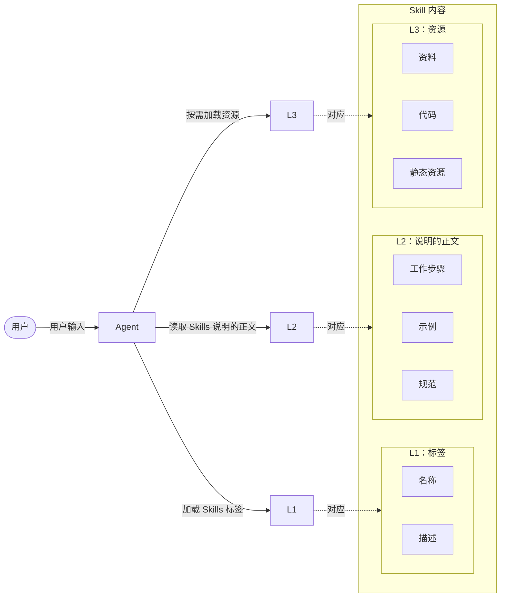
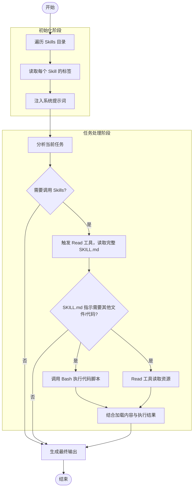

---
# Agent Skills 的诞生背景

每一项新技术的兴起，往往源于它切实解决了业务或工程中的关键痛点，从而为开发者和企业广泛采纳。
去年AI 应用开发领域最受瞩目的技术之一当属模型上下文协议（Model Context Protocol，MCP）。MCP 的核心价值在于为工具与 Agent 之间的集成提供了标准化接口，这种接口的作用类似于 USB 协议之于电子设备：

> 只要遵循统一规范，任意工具都能即插即用，无须为每个 Agent 重新定制对接逻辑。

然而，在企业级应用场景中，业务复杂度远高于演示版或原型系统：

> 一个典型项目常常需要集成数十甚至上百个工具。每个工具的描述信息（通常包含功能说明、参数格式、调用示例等）平均占用 500-800 个 Token。若在 Agent 初始化时将所有工具描述一次性加载到 LLM 的上下文窗口中，将迅速耗尽宝贵的上下文容量。

曾有开发者在实际项目中配置了 7 个 MCP Server，共接入 100 多个工具。
结果，在用户尚未输入任何问题之前，仅工具描述信息就占用了 67 000 余个 Token，相当于其 LLM 上下文窗口总长度的 33%。这意味着，即便仅需 5 个 Token 的对话，即用户问 `1 + 1 = ?`，Agent 回答 `2`，其上下文开销也高达 13 400 倍，成本之高显而易见。

正是在这样的背景下，Skills 应运而生：

> 通过上下文卸载技术动态按需加载工具描述，而非全量预载，从根本上缓解了上下文膨胀问题。

现在我们来深入剖析 Skills 的设计哲学与工作机制，并从实战出发，演示如何编写、部署并测试一个 Skill，帮助各位同学构建高效、可扩展的 Agent 系统。

---
# Agent Skills 的概念定义

下面我们来系统介绍 Agent Skills 的核心概念、结构规范与工作机制，为后续实战提供理论基础。

## Agent Skills 的概念引入

作为项目初期负责人，你从零开始完成了一项全新任务，或攻克了一个长期悬而未决的技术难题。任务完成后，上级通常会提出一个合理且关键的要求：

> “请按照公司模板，将整个过程，包括所用资料、解决步骤、关键判断和注意事项，整理成一份标准化文档，以便后续同事能够快速上手并复现。”

这一要求的本质，是将个体经验转化为可复用的组织知识资产。

Agent Skills 的设计理念正是对这一知识管理逻辑的技术化延伸：

> 它提供了一种标准化的结构化格式（类似于企业文档模板），允许开发者将解决问题所需的完整上下文（包括思考路径、执行流程、依赖工具、数据来源及输出规范）封装为一个独立的专家经验包，通常以 Markdown 文档、静态代码文件等形式存储。

当类似任务再次出现时，Agent 就如同接手项目的同事，通过解析该经验包，即可稳定地复现原有的工作流，从而高效、一致地解决问题。

从另一个视角看，Agent Skills 可视为一种本地化的检索增强生成（RAG）机制：

> 每当 Agent 面临用户请求时，它会动态地从 Skills 库中检索相关内容，并将所需信息与用户请求合并为新提示词，交由 LLM 进行推理。
> 不同之处在于，Skills 的内容组织更结构化、调用更精准，且支持代码与资源的协同执行。

## Agent Skills 的基本特征

Agent Skills 是一种用于为 Agent（智能体）扩展专门能力的开放标准，它通过将特定领域的知识、规则与工作流进行显式封装，使 Agent 能够以可控、可复用的方式调用这些能力，从而完成明确边界内的任务。

从系统视角看，Agent Skills 并非一次性功能调用，而是可被 Agent、IDE 或平台统一调度的标准化能力模块，它的核心特征在于：

> 通过清晰的输入与输出契约、明确的错误模型以及内置的治理钩子，将原本不可控的能力调用转化为可复用、可治理、可审计的工程单元。

这一概念最早由 Anthropic 公司提出。在其 Claude 模型的语境下，Agent Skills 并不是岗位替身，也不是 Agent 本体，而是**被显式定义**、**可重复调用**、**具有明确行为边界**的能力组件。
Agent 通过组合和调度多个 Agent Skills，形成更高层次的决策与行动能力。

在 Dify、扣子等平台中，尽管实现方式各有差异，但 Agent Skills 的核心语义已逐渐趋同：

> 它是一种跨模型、跨平台的能力封装单元，而不是具体产品或工具的专属实现。

## Agent Skills 的判断标准

在 Agent 生态迅速扩展的背景下，Agent Skills 这一概念极易被滥用。任何自动化脚本、提示词模板，甚至一次性工具调用，都可能被冠以 Agent Skills 之名。但如果缺乏清晰的判定标准，这种泛化会直接削弱 Agent Skills 作为工程与治理单元的价值。要判断一种能力是否“配得上”Agent Skills 这一称谓，关键不在于它是否智能，而在于它是否具备长期被系统信任和调度的条件。

判断一种能力是否有资格作为 Agent Skills ，主要有以下五个标准：

1. 第一，**Agent Skills 必须是可重复、可持续运行的能力单元**。如果某个能力只能解决一次性问题，或高度依赖临时上下文与人工干预，那么它本质上仍是脚本或临时方案，而不是 Agent Skills。Agent Skills 需要在相同原则下，反复处理同一类问题，并保持行为的一致性。
2. 第二，**Agent Skills 必须具备明确且稳定的职责边界**。它需要清楚地界定：自己负责解决哪一类问题，不负责解决哪一类问题；在什么条件下可以执行，在什么情况下必须拒绝或升级。没有边界的能力，即使再强，也只会成为不可控的风险源。
3. 第三，**Agent Skills 必须拥有清晰的输入与输出契约**。输入需要可校验、可约束，输出需要结构化、可被系统消费。只有当能力的“进入条件”和“产出形式”都被显式定义，Agent Skills 才能被稳定编排进更大的 Agent 系统，而不依赖模型猜测或隐式约定。
4. 第四，**Agent Skills 必须具备明确的错误模型与失败语义**。失败并不是异常情况，而是系统运行中的常态。合格的 Agent Skills 必须能够区分不同类型的失败原因，并给出可行动的反馈，而不是简单地报错或沉默失效。
5. 第五，**Agent Skills 必须天然支持治理与审计**。既然 Agent Skills 会被 Agent 自动调用，并可能连接真实业务系统，那么权限控制、风险拦截、日志留痕就不再是可选项，而是其成为工程能力的前提条件。

---
# Agent Skills 的结构定义

## Agent Skills 的文件结构

为实现通用性和可互操作性，Agent Skills 必须遵循一套明确的结构规范，这类似于 MCP 之于工具集成。只要 Agent 能解析该结构，即可加载并使用任意 Skills。

一个 Skill 在物理结构上表现为一个文件夹，该文件夹的名称即为该 Skill 的名称。
在该文件夹内，通常包含以下组件。

- 【`SKILL.md` 】文件（必选）：这是一项 Skill 的核心文件，也是唯一的必选组件。它相当于一项 Skill 的标签与说明书，以 Markdown 格式清晰描述该 Skill 的功能、输入输出规范、调用条件、任务执行步骤、使用示例等关键信息。Agent 正是通过阅读此文件，判断是否调用该 Skill，以及如何正确使用它。
- 【`scripts/` 】文件夹（可选）：用于存放可执行的代码脚本（如 Python 等）。例如，对于运维场景，`scripts/` 文件夹可存放运维脚本等；而对于数据分析场景，`scripts/` 文件夹可用于存放 Pandas 脚本等。在实际使用时，需要在`SKILL.md`文件中使用相对于技能根目录的相对路径来引用这些脚本。
- 【`references/`】 文件夹（可选）：用于存放支撑该 Skill 运行的参考资料。例如，若要开发一个每日营养餐推荐 Skill，可在此目录下放入权威食谱、营养成分表或饮食指南等文档。这些资料为 Agent 提供领域知识依据，提升输出的专业性与准确性。
- 【`assets/` 】文件夹（可选）：用于存储静态资源与模板文件，如图片、音频、配置模板、输出格式样例等。这些内容不参与逻辑计算，但可作为任务执行时的辅助素材。

## Agent Skills 的最小结构

在 Dify、Coze、Codex、Claude Code 等支持 Agent Skills 机制的平台中，Agent Skills 是可以被 Agent 稳定调用的能力描述单元。

一个 Agent Skill 是否合格，取决于其是否具备最基本、不可缺失的结构要素。
下面是一个 Agent Skill 必须包含的最小结构。

```markdown
---
name: my-skill
description: 简要描述此技能的功能及使用时机。
---

# 我的技能
为 Agent Skills 提供的能力说明与行为约束。
## 使用时机
- 在以下情况下使用此技能……
- 此技能适用于……
## 指令
- 为 Agent Skills 提供的分步操作指导。
- 特定领域的约定。
- 最佳实践和模式。
- 如需向用户澄清需求，请使用提问工具。
```

### 1. 元信息

每个 Agent Skill 都在带有 YAML 前置信息的`SKILL.md`文件中配置，具体如下：

```yaml
---
name: my-skill
description: 简要描述此技能的功能及使用时机。
---
```

其中，`name` 是 Agent Skills 的唯一标识，用于调度与管理。
`description` 是一句话说明这个 Agent Skills 解决什么问题、在什么情况下使用。
如果 `description` 无法清楚区分它与其他 Agent Skills，说明职责边界尚未定义清楚。

### 2. 角色说明

这一部分不是写给工作人员看的文档，而是用于让 Agent Skills 对齐工作角色，即让 Agent 明确：

> “当调用这个 Agent Skill 时，我应当进入什么样的工作状态。”

具体如下：

```yaml
# 我的技能
为 Agent Skills 提供的能力说明与行为约束。
```

### 3. 使用时机

这一部分是 Agent Skills 与普通 Prompt 的关键区别。

该部分明确什么信号触发调用，哪些情况不应调用，是否需要前置确认或补充信息，具体如下：

```yaml
## 使用时机
- 在以下情况下使用此技能……
- 此技能适用于……
```

注意：没有使用时机的 Agent Skills 无法被 Agent 自主调度。

### 4. 执行指令

这一部分定义的是 Agent Skills 的**行为方式**，而不是输出格式，它需要明确：

- 执行顺序是否固定？
- 遇到不确定情况是否允许推测？
- 是否需要向用户追问信息？

具体如下：

```yaml
## 指令
- 为 Agent Skills 提供的分步操作指导。
- 特定领域的约定。
- 最佳实践和模式。
- 如需向用户澄清需求，请使用提问工具。
```

这部分决定了这个 Agent Skills 是“可控输出”还是“不可预测输出”。

---
# Agent Skills 的工作机制

## Agent Skills 的渐进式加载机制

传统基于 MCP 的 Agent 在初始化时需加载所有工具描述，极易造成上下文窗口的浪费。
为避免此类问题，Agent Skills 设计了渐进式、按需加载的机制。
Skills 的内容按照加载级别分为 L1、L2、L3 这 3 个级别。

Agent 加载 Skills 的顺序如下：

1. 【加载 Skills 标签】：当 Agent 加载一个 Skill 时，仅将 L1 级别的内容，即 `SKILL.md` 中的标签部分存入 LLM 的记忆系统中。此时，Agent 只知道“有这样一个 Skill 可用”，但不会加载其全部细节。
2. 【读取 Skills 说明的正文】：当用户提出具体任务，Agent 根据 `SKILL.md` 中的标签判断某个 Skill 可能适用时，才会加载 L2 级别的内容，即 `SKILL.md` 中的说明，以此指导后续操作。
3. 【按需加载资源】：在实际执行过程中，若任务需要调用代码、参考文档或使用模板，Agent 会按需加载 L3 级别的内容，即 `scripts/`、`references/` 或 `assets/` 中的相关文件。未被使用的资源则始终保留在外部，不进入 LLM 的记忆中。

Agent Skills 的工作机制流程示意图：



这意味着，即便一个 Skill 内部打包了数百个工具定义、完整的数据字典或上百页的参考手册，只要当前任务无须使用，这些内容就不会进入 LLM 的上下文。

特别值得注意的是，`scripts/` 中的代码不会被送入 LLM 上下文，而是由 Agent 内置的 Bash 工具直接执行，仅将运行结果返回 LLM 用于后续推理，这正是 CodeAct 模式的典型延伸应用：

> 将代码视为动作，而非文本。

这种按需加载的机制，显著提升了上下文利用效率，避免了无效信息污染，同时保障了复杂 Skills 的可扩展性与运行稳定性。

## 设计支持 Skills 的 Agent

要构建一个能有效加载和使用 Skills 的 Agent，需从基础工具与 Agent 控制流程两个维度设计。

### 基础工具设计

Skills 本质上是一组结构化文件，因此 Agent 至少需要具备读取（Read）与执行（Act）这两类基础能力，由此可设计以下两个核心工具：

- Read 工具：用于读取任意文件内容（如 `SKILL.md`、参考文档等）。
- Bash 工具：用于执行系统命令，包括遍历目录、运行脚本、创建文件等。

仅凭这两个操作系统级的通用工具，Agent 即可支持大量场景，例如自动运维巡检、金融数据分析、日志诊断等。

随着业务复杂度提升，还可扩展 Write（写入文件）、Edit（修改内容）等工具。
但关键原则是所有工具都应保持通用性，避免为特定 Skills 定制专用接口。

### Agent 控制流程设计

在工具就绪后，Agent 的运行流程如下图所示。



在初始化阶段：

- Agent 首先会遍历预设存放 Skills 的目录（ 如 Claude Code 的预设目录为 `.claude/skill/`），读取每个 Skill 文件夹中 `SKILL.md` 的标签，并将这些标签注入系统提示词，LLM 由此获知当前可用的 Skills 集合。

在任务处理阶段：

- 当 LLM 判断某任务可能匹配某个 Skill 时，触发 Read 工具，读取该 Skill 的完整 `SKILL.md`；
- 若文档指示需执行脚本或查资料，则开始调用 Bash 执行代码脚本或 Read 工具获取所需资源；
- 最终，结合加载的内容与执行的反馈结果，LLM 生成响应并回复给用户。

整个流程天然适配 ReAct 架构：

> LLM 负责推理与决策，工具负责感知与行动。

配合合理的提示工程与Agent策略，即可构建一个轻量、灵活且高度可扩展的 Skills 驱动型 Agent。

---
# 将 Agent Skills 应用于企业

## Agent Skills 是一种可持续运行的能力结构

许多人在谈 Agent Skills 时，潜意识里仍然把它们理解为“更聪明的工具”（写文案更快、做分析更省力、处理事务自动化程度更高）。这种理解并不算错，但它停留在效率层面，无法触及结构层面。

在传统的公司运作模式中，销售、行政、财务、运营、法务、IT与管理等能力，主要由具体的部门和人员来承载，组织运转高度依赖“人”的持续投入与协作；在 AI 时代，公司引入 Agent Skills 并非是要削减或回避人类的职能，而是对其承载方式进行重构：

> 将“人”从高频、可复制的执行层中抽离出来，转而让系统化工具、明确的规则、Agent 以及自动化流程来承担核心执行任务，使个人角色更多聚焦于决策、判断与方向控制层面。

具体到每一位个体就是：

> 你需要决定将精力投向哪些事情，哪些工作必须系统化、标准化、自动化，哪些可以主动放弃，同时判断失败是否值得复盘，经验是否需要沉淀为长期能力。

这正是公司引入 Agent Skills、流程接管与平台化能力的根本原因。
我们的目的并非为追求更炫目的技术，而是将每一位同事所承担的那些繁杂、琐碎的部门职能，从“依赖记忆、盯控、硬扛”，转变为由系统稳定承接、可持续运行的公司能力结构。
Agent Skills 的设计逻辑正是如此，它们并不是零散功能的集合，而是围绕某一部门职责封装的一整套判断规则、处理流程与结果输出能力。

简单来说，Agent Skills 的作用并非替代思考，而是放大判断。

## Agent Skills 承接的是长期能力，而非一次性任务

Agent Skills 的价值体现在长期一致的行为模式与可预期的判断标准上，而不是一次性完成某个任务。因此，合格的 Agent Skills 必须能够在相同原则下反复工作，如：

- 持续处理同类问题
- 遵循稳定规则
- 在异常出现时给出可解释的处理结果

这也是为什么设计 Agent Skills 时不能只关注“这一次的输出是否漂亮”，
而必须关注它在长期运行中是否：

- 可靠
- 可审计
- 可修正

## Agent Skills 从“替你干活”到“替你站岗”

当 Agent Skills 被当作效率工具使用时，它们只是帮你节省时间；
当 Agent Skills 被当作长期能力结构时，它们开始承担守住边界的职责。

它们会替你盯住：

- 流程是否越界
- 规则是否被破坏
- 风险是否开始累积

你不需要时时参与每一个细节判断，而只在关键节点介入决策，这种转变才是适应 AI 协作的关键。

Agent Skills 并不是更高级的效率工具，而是被系统化封装的部门能力。它们替代的不是执行动作，而是部门视角、责任边界与持续判断能力。当你积攒了足够多的 Agent Skills ，你承担的就不再是所有针对细枝末节的即时决策，而是站在更高层级管理这些 Agent 如何协同工作。

这才是 Agent Skills 在公司中的真正位置。

## 最适合技能化的事务与优先级

并不是所有工作中的事务都适合技能化，也不应该同时对多个已稳定运作的工作流程进行技能化。
顺序一旦错误，结果往往是：

> 系统看起来更复杂了，但风险并没有下降，反而加重了对个人的依赖。

技能化的核心目标不是“自动化更多事情”，而是优先消除系统性风险。
因此，工作事务是否适合技能化取决于两个关键标准：

- 一是这件事是否长期、高频占用个人注意力；
- 二是这件事工作一旦失误，是否会直接威胁公司生存。

基于这一逻辑，工作事务的技能化应当遵循清晰的优先级。

### 第一优先级：运营与事务协调类事务（系统稳定性的底座）

最适合技能化的往往不是最高价值的事务，而是最容易造成系统失控的环节，运营与事务协调类岗位正属于这一类。

在日常工作中，像是：

- 任务安排
- 流程执行
- 资料管理
- 信息留痕
- 进度跟踪

等事务，几乎每天都在发生，却极少被系统化管理；一旦这些事务完全依赖个人记忆和即时处理，系统就会迅速陷入混乱。

将这类事务技能化，本质上是在建立一个稳定运转的基础系统：

> 它追求的不是创造价值，而是确保事情不丢、不乱、不反复返工。

这一步完成之前，谈论更高级的替代执行能力往往没有意义。

### 第二优先级：财务与合规类事务（生存风险的第一防线）

财务与合规类事务并不一定占用最多时间，却是风险密度最高的环节，一次判断失误可能直接导致现金流断裂、合规风险暴露，甚至法律纠纷。

在工作中，财务风险、经营合规判断往往被“临时处理”，缺乏稳定规则。
通过技能化将基本的财务检查、回款节奏监控、合同要点校验、合规提示前置化，本质上是在为公司建立一条低成本但持续有效的风险防线。

这类事务技能化的价值不只在于替你做账，更在于提前提醒与阻断错误决策。

### 第三优先级：销售与客户管理事务（减少情绪与判断波动）

销售与客户管理相关事务高度依赖个人状态，判断是否继续跟进、是否让步、是否投入额外精力，往往掺杂大量情绪与即时反应。

将这类事务技能化，并不是让 AI 去谈客户，而是帮助你建立统一的判断框架：

- 哪些客户值得长期投入？
- 哪些合作应当及时止损？
- 哪些信号意味着风险上升？

通过 Agent Skills 承接这类判断，可以显著减少疲劳、情绪或短期压力导致的决策波动，让客户管理回到可控状态。

### 第四优先级：业务支持与分析类岗位（提升决策质量，而非替代创造）

最后一类适合技能化的事务是业务支持与分析类事务，例如：

- 数据整理
- 方案评估
- 经验复盘
- 趋势判断

这类事务并不直接决定公司生死，因此不应过早技能化，但若放在前面几类事务技能化之后，能够显著提升决策质量，减少拍脑袋判断。

需要注意的是，这几类事务技能化的目标并不是“替人类做决定”，而是：

> 为人类的判断提供结构化输入，帮助人类站在更高层级思考。

### 不建议优先技能化的事务：核心创造与战略判断

需要刻意保留在“人类”这一侧的能力，是公司的核心创造与战略判断，例如：

- 产品方向选择
- 关键客户取舍
- 长期路线规划

这类事务本质上依赖价值观、经验与不可完全形式化的判断，过早交给系统容易放大方向性错误。

公司施行人工智能化运作并不是“先自动化赚钱，再搭建体系”，而是恰恰相反：

> 先用技能筑牢系统根基，再释放个人的创造与战略判断能力。

工作事务的技能化应当按“系统稳定→风险控制→判断一致性→决策支持”的顺序逐步推进。
这样构建出来的不是一个工具堆叠的公司，而是一套能真正解放员工天性、长期运转的能力体系。

## Agent Skills 与数字员工的关系

数字员工与 Agent Skills 并非同一概念的两种表述，而是企业人工智能化进程中角色实体与能力构件的层级关系：

- 数字员工是面向业务场景的完整角色封装，如智能报销专员、供应链协调员，其价值体现在端到端流程交付与责任边界清晰；
- Agent Skills 则是构成这些角色的原子化能力单元，例如发票识别、审批规则推理、异常预警触发等可独立验证、可组合复用的功能模块。

二者的关系如同建筑中的房间功能与建材构件：

> 数字员工定义了“谁在做什么”，Agent Skills 决定了“凭什么能做好”。

数字员工的价值实现依赖 Agent Skills 的协同编排与上下文融合。
单一技能仅解决点状问题，而数字员工需在动态业务流中协调多个技能并维持状态连续性。
以银行信贷审批数字员工为例，其工作流包含：

1. 调用【身份核验】技能验证客户资质；
2. 触发【反欺诈】技能扫描异常行为；
3. 激活【风险定价】技能计算利率；
4. 调用【合规审查】技能校验监管规则。

关键挑战在于跨技能的状态传递，如：

> 当反欺诈技能标记高风险时，需将风险标签注入后续所有技能的上下文，而非简单阻断流程。

这种协同依赖工作流引擎实现**状态持久化**与**条件路由**，使数字员工具备类似于人的决策连贯性。

当前实践中的主要误区是将二者混为一谈，导致能力复用率低下。

- 部分企业直接为每个数字员工定制全套功能，结果形成烟囱式架构，如“销售”数字员工与“客服”数字员工各自开发相似的“客户画像分析”模块，重复投入且难以统一迭代。
- 更优路径是先沉淀企业级 Agent Skills 库——将高频能力（如文档解析、多轮对话管理、API 编排）标准化为可复用构件，再按角色需求动态组装。某三甲医院的实践表明，通过构建 23 个医疗领域 Agent Skills（含病历结构化、用药冲突检测、医保规则校验等），仅用 6 周即快速组装出“门诊分诊”、“住院随访”、“处方审核”三类数字员工，能力复用率达 71%，迭代效率提升 3 倍。

未来演进方向在于 Agent Skills 的自适应进化与数字员工的角色泛化。

- 随着强化学习与在线反馈机制的引入，Agent Skills 将从静态规则驱动转向动态策略优化，例如“客户投诉处理”技能通过分析历史工单闭环率，自动调整情绪安抚话术与升级阈值。
- 数字员工则逐步突破单一职能边界，向领域专家演进。一个供应链数字员工不再仅执行订单跟踪工作，而是基于库存技能、物流技能、市场预测技能的融合分析，主动提出备货建议并触发采购流程。这种从“能力堆砌”到“智能涌现”的跃迁，将使数字员工真正成为企业决策网络中的活性节点，而非仅仅作为流程自动化工具。

---