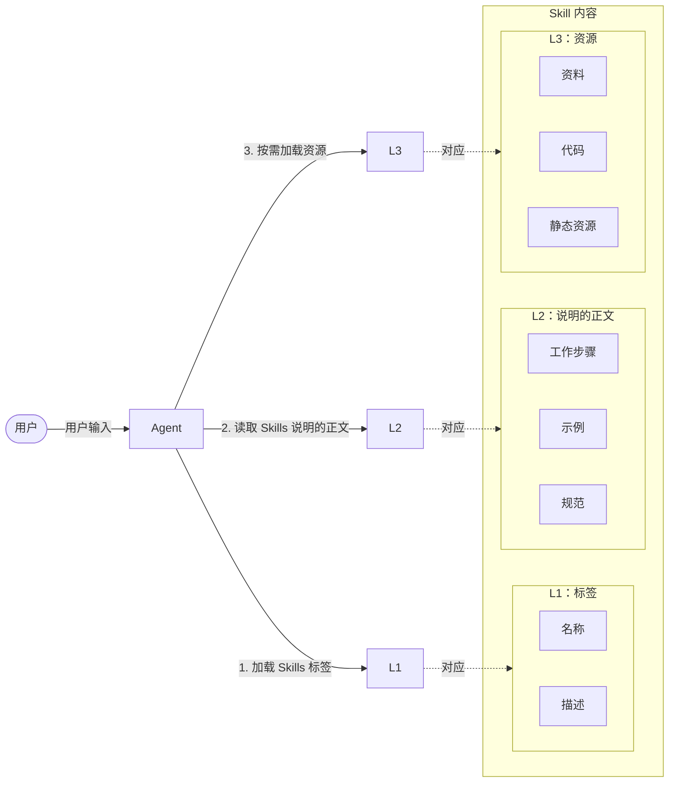
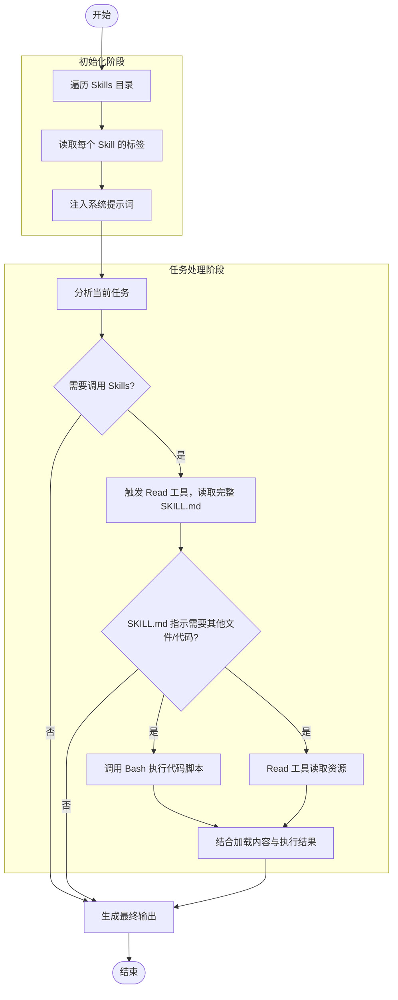

# 背景起源

每一项新技术的兴起，往往源于它切实解决了业务或工程中的关键痛点，从而为开发者和企业广泛采纳。2025 年，AI 应用开发领域最受瞩目的技术之一当属模型上下文协议（Model Context Protocol，MCP）。MCP 的核心价值在于为工具与 Agent 之间的集成提供了标准化接口，这种接口的作用类似于 USB 协议之于电子设备：只要遵循统一规范，任意工具都能即插即用，无须为每个 Agent 重新定制对接逻辑。

然而，在企业级应用场景中，业务复杂度远高于演示版或原型系统。一个典型项目常常需要集成数十甚至上百个工具。每个工具的描述信息（通常包含功能说明、参数格式、调用示例等）平均占用 500-800 个 Token。若在 Agent 初始化时将所有工具描述一次性加载到 LLM 的上下文窗口中，将迅速耗尽宝贵的上下文容量。

曾有开发者在实际项目中配置了 7 个 MCP Server，共接入 100 多个工具。结果，在用户尚未输入任何问题之前，仅工具描述信息就占用了 67 000 余个 Token，相当于其 LLM 上下文窗口总长度的 33%。这意味着，即便仅需 5 个 Token 的对话，即用户问 `1 + 1 = ?`，Agent 回答 `2`，其上下文开销也高达 13 400 倍，成本之高显而易见。

正是在这样的背景下，Skills 应运而生。它通过上下文卸载技术，动态按需加载工具描述，而非全量预载，从根本上缓解了上下文膨胀问题。

下面我们将深入剖析 Skills 的设计哲学与工作机制，并从实战出发，演示如何编写、部署并测试一个 Skill，帮助读者构建高效、可扩展的 Agent 系统。

## Skills 概述

本节将系统介绍 Skills 的核心概念、结构规范与工作机制，为后续的实战开发提供理论基础。

### Skills 是什么

作为项目初期的负责人，你从零开始完成了一项全新任务，或攻克了一个长期悬而未决的技术难题。任务完成后，上级通常会提出一个合理且关键的要求：“请按照公司模板，将整个过程，包括所用资料、解决步骤、关键判断和注意事项，整理成一份标准化文档，以便后续同事能够快速上手并复现。”

这一要求的本质，是将个体经验转化为可复用的组织知识资产。

Skills 的设计理念正是对这一知识管理逻辑的技术化延伸。它提供了一种标准化的结构化格式（类似于企业文档模板），允许开发者将解决问题所需的完整上下文（包括思考路径、执行流程、依赖工具、数据来源及输出规范）封装为一个独立的专家经验包，通常以 Markdown 文档、静态代码文件等形式存储。

当类似任务再次出现时，Agent 就如同接手项目的同事，通过解析该经验包，即可稳定地复现原有的工作流，从而高效、一致地解决问题。

从另一个视角看，Skills 可视为一种本地化的检索增强生成（RAG）机制：每当 Agent 面临用户请求时，它会动态地从 Skills 库中检索相关内容，并将所需信息与用户请求合并为新提示词，交由 LLM 进行推理。不同之处在于，Skills 的内容组织更结构化、调用更精准，且支持代码与资源的协同执行。

### Skills 的结构定义

为了实现通用性和可互操作性，Skills 必须遵循一套明确的结构规范，这类似于 MCP 之于工具集成。只要 Agent 能解析该结构，即可加载并使用任意 Skills。

一个 Skill 在物理结构上表现为一个文件夹，该文件夹的名称即为该 Skill 的名称。在该文件夹内，通常包含以下组件。

- `SKILL.md` 文件（必选）：这是一项 Skill 的核心文件，也是唯一的必选组件。它相当于一项 Skill 的标签与说明书，以 Markdown 格式清晰描述该 Skill 的功能、输入输出规范、调用条件、任务执行步骤、使用示例等关键信息。Agent 正是通过阅读此文件，判断是否调用该 Skill，以及如何正确使用它。
- `scripts/` 文件夹（可选）：用于存放可执行的代码脚本（如 Python 等）。例如，对于运维场景，`scripts/` 文件夹可存放运维脚本等；而对于数据分析场景，`scripts/` 文件夹可用于存放 Pandas 脚本等。
- `references/` 文件夹（可选）：用于存放支撑该 Skill 运行的参考资料。例如，若要开发一个每日营养餐推荐 Skill，可在此目录下放入权威食谱、营养成分表或饮食指南等文档。这些资料为 Agent 提供领域知识依据，提升输出的专业性与准确性。
- `assets/` 文件夹（可选）：用于存储静态资源与模板文件，如图片、音频、配置模板、输出格式样例等。这些内容不参与逻辑计算，但可作为任务执行时的辅助素材。

### Skills 的渐进式加载机制

正如本章开篇所述，传统基于 MCP 的 Agent 在初始化时需加载所有工具描述，极易造成上下文窗口的浪费。为避免此类问题，Skills 设计了渐进式、按需加载的机制。Skills 的内容按照加载级别分为 L1、L2、L3 这 3 个级别。Agent 加载 Skills 的顺序如下。

- 加载 Skills 标签：当 Agent 加载一个 Skill 时，仅将 L1 级别的内容，即 `SKILL.md` 中的标签部分存入 LLM 的记忆系统中。此时，Agent 只知道“有这样一个 Skill 可用”，但不会加载其全部细节。
- 读取 Skills 说明的正文：当用户提出具体任务，Agent 判断某个 Skill 可能适用时，才会加载 L2 级别的内容，即 `SKILL.md` 的说明，以此指导后续操作。
- 按需加载资源：在实际执行过程中，若任务需要调用代码、参考文档或使用模板，Agent 会按需加载 L3 级别的内容，即 `scripts/`、`references/` 或 `assets/` 中的相关文件。未被使用的资源则始终保留在外部，不进入 LLM 的记忆中。

Skills 的工作机制：



这意味着，即便一个 Skill 内部打包了数百个工具定义、完整的数据字典或上百页的参考手册，只要当前任务无须使用，这些内容就不会进入 LLM 的上下文。

特别值得注意的是，`scripts/` 中的代码不会被送入 LLM 上下文，而是由 Agent 内置的 Bash 工具直接执行，仅将运行结果返回 LLM 用于后续推理。这正是 CodeAct 模式的典型延伸应用：将代码视为动作，而非文本。

这种按需加载的机制，显著提升了上下文利用效率，避免了无效信息污染，同时保障了复杂 Skills 的可扩展性与运行稳定性。

### 如何设计支持 Skills 的 Agent

要构建一个能有效加载和使用 Skills 的 Agent，需从基础工具与 Agent 控制流程两个维度进行设计。

#### 基础工具设计

Skills 本质上是一组结构化文件，因此 Agent 至少需要具备读取（Read）与执行（Act）这两类基础能力，由此可设计以下两个核心工具。

- Read 工具：用于读取任意文件内容（如 `SKILL.md`、参考文档等）。
- Bash 工具：用于执行系统命令，包括遍历目录、运行脚本、创建文件等。

仅凭这两个操作系统级的通用工具，Agent 即可支持大量场景，例如自动运维巡检、金融数据分析、日志诊断等。

随着业务复杂度提升，还可扩展 Write（写入文件）、Edit（修改内容）等工具。但关键原则是所有工具都应保持通用性，避免为特定 Skills 定制专用接口。

#### Agent 控制流程设计

在工具就绪后，Agent 的运行流程如图 5-2 所示。



在初始化阶段，Agent 遍历预设存放 Skills 的目录（如 Claude Code 预设的目录为 `.claude/skill/`），读取每个 Skill 文件夹中 `SKILL.md` 的标签，并将这些标签注入系统提示词。LLM 由此获知当前可用的 Skills 集合。

在任务处理阶段：

- 当 LLM 判断某任务可能匹配某个 Skill 时，触发 Read 工具，读取该 Skill 的完整 `SKILL.md`。
- 若文档指示需执行脚本或查阅资料，则进一步调用 Bash 执行代码脚本或 Read 工具获取所需资源。
- 最终，结合加载的内容与执行结果，LLM 生成最终响应。

整个流程天然适配 ReAct 架构：LLM 负责推理与决策，工具负责感知与行动。配合合理的提示工程与工具调度策略，即可构建一个轻量、灵活且高度可扩展的 Skills 驱动型 Agent。

## 实战：零代码开发“运维巡检 Skill”

在理解了 Skills 的基本原理之后，本节将通过“运维巡检 Skill”的开发过程，展示如何编写和使用 Skills。

### 使用扣子编程开发“运维巡检 Skill”

Skills 的开发并不复杂，其核心在于精心编写的 `SKILL.md`。该文件作为核心提示词，指导 LLM 完成特定任务。接下来，将详细介绍如何撰写高质量的 `SKILL.md`，并探讨如何利用扣子编程等平台加速开发过程。

#### `SKILL.md` 写作指导

为了确保 LLM 能够准确地理解和可靠地执行某个 Skill，一份优秀的 `SKILL.md` 应包含以下 5 个关键部分。

- 定时机：明确该 Skill 的适用情境或触发条件，即在什么上下文、用户意图或系统状态下，应激活该 Skill。清晰界定使用时机，有助于 LLM 判断何时调用该能力，避免误用或遗漏。
- 立目标：用一句简洁、具体的话说明该 Skill 要解决的核心问题。目标描述应聚焦、可衡量，避免模糊或宽泛的表述。例如，“将用户输入的自然语言查询转换为结构化的 SQL 语句”比“帮助用户查询数据”更具指导性。
- 理规则：详细说明该 Skill 的执行逻辑与操作步骤，包括输入如何解析、中间如何处理、输出应遵循何种格式等。此部分是该 Skill 实现的操作手册，需条理清晰、逻辑严密，便于 LLM 按步骤推理和执行。
- 给示例：提供典型输入-输出对作为参考。理想情况下，应同时包含正面示例（展示正确用法）和反面示例（说明常见错误或不适用情形）。示例应贴近真实使用场景，具有代表性，能有效引导模型行为。
- 划边界：明确定义该 Skill 的能力边界与限制条件。例如，不处理敏感信息、在数据不足时返回特定提示（如“信息不足，无法生成答案”）、遇到未覆盖的异常情况时采用兜底策略等。这有助于提升系统的鲁棒性与安全性。

基于上述指导原则，开发者既可以手动编写 `SKILL.md`，也可以借助 AI 编程工具自动生成。“扣子编程”平台提供了完整的基于自然语言编程的 Skills 开发支持，极大地简化了开发者从构思到实现的全过程。

#### 基于扣子编程开发 Skills

打开“扣子编程”，进入其主页。在主页点击“技能”标签，即可进入 Skills 开发界面。随后，在对话框中输入如下提示词。

```text
帮我编写一个“运维巡检”，可以自动进行服务器的巡检（检查 CPU、内存、磁盘、Docker 容器状态），并输出一份巡检报告。

为了确保 LLM 能够准确地理解和可靠地执行某个 Skill，一份优秀的 SKILL.md 应包含以下 5 个关键部分：

1. 定时机。明确该 Skill 的适用情境或触发条件，即在什么上下文、用户意图或系统状态下，应激活该 Skill。清晰界定使用时机，有助于模型判断何时调用该能力，避免误用或遗漏。
2. 立目标。用一句简洁、具体的话说明该 Skill 要解决的核心问题。目标描述应聚焦、可衡量，避免模糊或宽泛的表述。例如，“将用户输入的自然语言查询转换为结构化的 SQL 语句”比“帮助用户查询数据”更具指导性。
3. 理规则。详细说明该 Skill 的执行逻辑与操作步骤，包括输入如何解析、中间如何处理、输出应遵循何种格式等。此部分是该 Skill 实现的操作手册，需条理清晰、逻辑严密，便于模型按步骤推理和执行。
4. 给示例。提供典型输入-输出对作为参考。理想情况下，应同时包含正面示例（展示正确用法）和反面示例（说明常见错误或不适用情形）。示例应贴近真实使用场景，具有代表性，能有效引导模型行为。
5. 划边界。明确定义该 Skill 的能力边界与限制条件。例如，不处理敏感信息、在数据不足时返回特定提示（如“信息不足，无法生成答案”）、遇到未覆盖的异常情况时采用兜底策略等。这有助于提升系统的鲁棒性与安全性。
```

该提示词既明确了功能需求，又嵌入了前文所述的 `SKILL.md` 写作规范，有助于引导 AI 生成高质量、结构完整的 Skills。

提交后，扣子编程将跳转至开发与调试界面：左侧展示 AI 的开发过程（类似于使用 Cursor 的体验）；右侧为沙盒环境，支持直接调用名为扣子产品的通用 Agent 对 Skills 进行测试。

在开发完成后，点击左侧开发区域右上角的文件夹图标，将弹出文件目录视图。该视图完整展示了生成的 Skill 结构，包括 `SKILL.md`、`scripts/` 和 `references/` 等标准组件。

点击任意文件即可预览其内容。例如，`SKILL.md` 的部分内容结构严谨，清晰定义了任务目标、前置条件、执行流程及输出格式。可以看出，扣子编程采用了如下设计思路。

- 使用 Python 的 `psutil` 库采集系统指标。
- 将采集逻辑封装在 `scripts/collect_system_info.py` 中。
- 依据 `references/inspection-standards.md` 中定义的健康阈值进行评估。
- 最终整合结果，生成标准化巡检报告。

如下为 `collect_system_info.py` 中获取 CPU 指标的代码片段。

```python
from typing import Dict, Any
import psutil


def get_cpu_info() -> Dict[str, Any]:
    try:
        cpu_percent = psutil.cpu_percent(interval=1)
        cpu_count = psutil.cpu_count(logical=True)
        cpu_count_physical = psutil.cpu_count(logical=False)
        load_avg = psutil.getloadavg() if hasattr(psutil, "getloadavg") else [0, 0, 0]

        return {
            "success": True,
            "percent": round(cpu_percent, 2),
            "count": cpu_count,
            "physical_core_count": cpu_count_physical,
            "load_avg_1m": round(load_avg[0], 2),
            "load_avg_5m": round(load_avg[1], 2),
            "load_avg_15m": round(load_avg[2], 2),
        }
    except Exception as e:
        return {
            "success": False,
            "error": str(e),
        }
```

这段代码充分利用了 `psutil` 提供的系统接口：第 8 行获取 CPU 使用率，第 9、10 行分别获取逻辑与物理核心数，第 11 行读取系统负载均值。最终，所有指标被封装为结构化字典返回，便于后续处理与判断。

此外，`references/inspection-standards.md` 定义了各项指标的健康阈值标准。每个标准均标注了数据来源，确保评估逻辑有据可依，避免因指标缺失导致推理失败。

最后点击“下载”按钮，即可将整个 Skill 文件夹下载下来，以便将其复用到其他支持 Skills 的 Agent 平台（如 Claude Code、OpenClaw 等）。

### 基于 OpenClaw 测试“运维巡检 Skill”

Skills 本质上是为 Agent 提供的专家经验包，因此必须在支持 Skills 加载机制的 Agent 环境中进行测试。本节选用近期广受关注的开源 Agent 产品 OpenClaw（社区昵称“小龙虾”）作为测试平台。读者也可使用 Claude Code、Open Code 等其他支持 Skill 的 Agent 进行类似验证。

本文所用的 OpenClaw 为中文社区维护版本，部署于一台 Linux 服务器，并通过飞书作为即时通信（Instant Messaging，IM）渠道接入用户交互。

根据 `SKILL.md` 中的依赖说明，“运维巡检 Skill”要求系统满足以下条件。

- Python 版本 >= 3.7。
- 安装 `psutil` 库，版本 >= 5.9.0。

通过如下命令可安装所需的依赖。

```bash
pip install "psutil>=5.9.0"
```

依赖安装就绪后，将 5.2.1 节生成的 Skill 文件夹（`ops-inspection`）上传至 OpenClaw 的 Skill 存放目录。在笔者使用的版本中，该路径为：

```text
/usr/lib/node_modules/openclaw-cn/skill
```

在飞书中向 OpenClaw 机器人（此处命名为“龙虾”）发起对话，首先发送消息：

```text
你是否存在 ops-inspection 这个 Skill
```

用于检测 Skill 是否被 OpenClaw 加载。系统返回结果表明，该 Skill 已被成功加载。

随后，发送新的对话：

```text
使用该 Skill 执行一次巡检
```

这个对话用于测试 Skill 的执行效果。最终输出为服务器巡检报告，包含总体评估、CPU、内存、磁盘、Docker 等状态，以及对应的优先级建议。

从结果可见，报告内容真实、格式规范、判断依据明确，完全达到了预设的巡检目标。

整个过程无须编写任何运维脚本，无须配置告警推送逻辑，也无须手动调度任务。仅通过几轮自然语言对话，便完成了传统运维中通常需要数小时编码、测试与部署的工作。这不仅大幅降低了自动化门槛，也充分体现了 Skills + Agent 架构在实际工程场景中的高效性与实用性。
