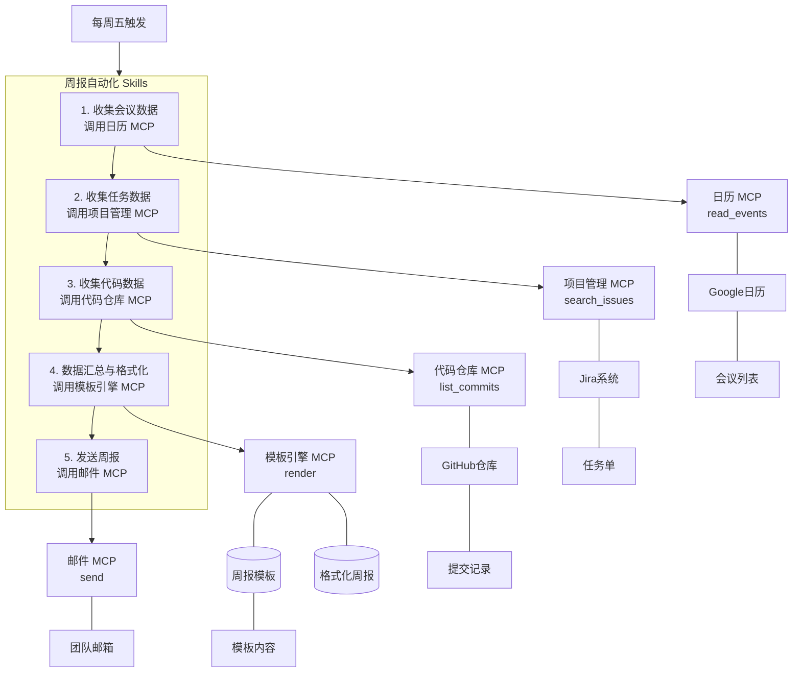

---
要深入理解 Skills 与 MCP 在智能体架构中的角色，可以从一个更宏观的视角切入：

> 如果将 Claude 等核心模型视为智能体的“大脑”，要完成复杂任务，既需要有内在的“方法论”指导，也需要有外在的“交互界面”去感知和作用于外部世界。
> Skills 与 MCP 正是承载这些功能的关键设计。

在 Claude 的生态系统中，Skills 和 MCP 经常被混淆，但两者解决的是两个截然不同的问题。Claude 官方文档给出了一个精辟的定义：

> “Skills 告诉 Claude 如何使用工具，而 MCP 提供工具”。

# Skills 与 MCP 的本质区别

如果把执行任务比做是制作一道菜，那么：

- MCP 相当于是“厨具”和“食材”——它连接冰箱（数据库）、操作烤箱（部署系统）或切菜（API 调用）；
- Skills 则相当于是“菜谱”和“大厨经验”——它规定先放盐还是先放糖、火候要多大、摆盘的标准是什么。

## Skills 负责流程与标准

Skills 的核心价值在于“领域知识”与“操作规范”。它将组织内部难以言传的隐性经验，转化为模型可以理解和遵循的明确规则与步骤。

（1）**知识注入**

将专家的经验和专有知识封装为规则库，供模型调用。
例如，一份 Skills 可以包含：

> - “本公司的 Python 代码审查要求所有函数必须包含类型提示（Type Hints）”
> - “处理用户支付信息时，敏感字段在日志中必须脱敏显示”
> - “撰写季度市场报告时，引言部分要优先引用最新一季度的行业数据”

（2）**流程编排**

规定任务执行的正确顺序和条件逻辑，确保操作合规、安全。
例如，一个部署流程 Skills 会明确规定：

> “在向生产推进代码前，必须依次通过单元测试、集成测试和安全扫描，若任何一步骤失败，则自动中止流程并通知相关负责人。”

（3）**上下文管理**

通过“渐进式披露”机制，智能地控制信息的呈现时机。
模型不会一次性加载所有可能相关的文档，而是在任务推进到特定阶段时，才动态加载最必要的指导材料。例如：

> 当用户开始询问“如何配置数据库连接池”时，相关的 Skills 才会将《公司数据库配置最佳实践》和《连接池参数调优指南》这两份文档提供给模型，避免其他无关的开发文档干扰模型的判断。

## MCP 负责连接与执行

MCP 服务器（MCP Server）是 Claude Code 与现实世界交互的“标准接口”。
MCP 的核心价值在于将原本孤立的本地环境或云端资源，转化为 AI 可以直接调用的原子化能力。

**1. 动作执行（Action Execution）：AI 的现实操控手**

Do 操作使 Claude Code 从“建议者”转换为“执行者”，在授权范围内对外部系统产生实际影响。例如，Claude Code 可以根据对话需求在本地创建文件夹、重命名文档，或者将格式混乱的代码进行自动化重构（Refactor）。当任务完成时，Claude Code 能自动撰写信息并发送至 Slack 频道，或者向指定的飞书/钉钉群组推送项目进度预警。

**2. 数据获取（Fetch）：AI 的外部感知眼**

Fetch 操作赋予了模型实时感知外部世界数据的能力，使其突破了静态预训练数据集的时空限制。这不仅让 AI 能够访问本地存储的文件与信息，更能通过安全授权主动获取并整合来自网络或企业内网的动态数据。

例如，在获取相应权限后，Claude Code 可以通过 MCP 连接到 GitHub 仓库，实时获取最新的 Issue 列表与代码提交记录（Commit Log），并自动解析、汇总这些信息，生成一份结构清晰、内容准确的研发工作周报。

**3. 工具定义（Tool Define）**

在 MCP 中，工具的定义采用 JSON Schema 标准，通过结构化描述向 AI 传递以下信息：

- 工具名称
- 具体功能说明
- 参数定义

通过这种高度结构化的描述，Claude Code 能够精准理解如何在恰当时机触发正确的操作。
这些 JSON Schema 直接暴露给 Claude Code，作为其决策的依据。

下面这个文件展示了读取工具（read_file）的 JSON Schema 定义，该工具定义的目的是**让 AI 能够查看本地代码或文档**。

```json schema
{
  "name": "read_file",
  "description": "读取本地文件系统中的文件内容",
  "input_schema": {
    "type": "object",
    "properties": {
      "path": {
        "type": "string",
        "description": "文件的绝对路径或相对路径"
      }
    },
    "required": ["path"]
  }
}
```

与 Skills 类似，MCP 的 JSON Schema 也包含一些必须定义的核心要素：

- **名称（ "name" ）**：工具的唯一标识符，Claude Code 在调用时会指明该名称。
- **描述（ "description" ）**：这是最重要的部分。Claude Code 通过阅读这段自然语言描述来判断当前场景是否需要使用该工具。描述越准确，AI 调用的成功率越高。
- **输入架构( "input_schema" )**：规定了调用工具时必须传送的参数类型（如字符串、数字）及其含义。这保证了模型生成的指令能够被后端程序正确解析和执行。

---
## 为什么两者会被混淆

既然 Skills 与 MCP 分工明确，为何在实践中经常被混淆？这种混淆并非偶然，其根源在于二者在智能体（Agent）的运作流程中扮演了相似的外在角色，并共享了一套底层交互逻辑。

二者的内部驱动机制都遵循着类似的“模式匹配 - 意图理解 - 任务编排”逻辑。接下来，通过剖析 MCP 工具的工作流程，可以更清晰地看到这种相似性，并理解混淆是如何产生的。

### MCP 的运作流程

当 AI 接收到一组 MCP 工具的 JSON Schema（定义文档）后，不会盲目地执行，而是会经历一个从“理解意图”到“逻辑匹配”的推理过程，这被称为工具路由。此过程可以细分为以下四个核心阶段：

1. 【**工具注册与语义化能力声明**】外部工具以“MCP 服务器”的形式独立运行，启动后，服务器不仅通过 MCP 向 AI 应用（如 Claude Code 客户端）声明其功能名称和参数结构（JSON Schema），还提供语义描述，例如“该工具用于查询住院患者的最新生命体征记录，适用于临床评估场景”。
2. 【**基于意图的任务规划与工具选择**】在任务处理过程中，AI 模型结合用户目标与已注册工具的语义描述，完成上下文感知的工具匹配。例如，当用户指令为“查看病人最近的血压”，AI 模型通过语义理解将其与具备“查询生命体征”语义标签的工具进行关联。
3. 【**结构化调用与安全执行**】选定工具后，模型生成符合该工具 JSON Schema 的结构化调用请求（如 `{"name": "query_vitals", "arguments": {"patient_id": "P123"}}`），并通过 MCP 发送至对应的 MCP 服务器。MCP 服务器在隔离环境中执行操作，并将结果以标准格式返回，确保安全性与一致性。
4. 【**结果整合与迭代推理**】返回的数据被注入模型上下文，支持后续推理。若任务未完成，模型可基于新信息再次触发语义匹配，调用其他工具，形成多跳协作链，即通过连续多次工具调用完成复杂任务。

### 产生混淆的根源

从外在表现看，无论是 Skills 还是 MCP 工具，最终都通过智能体与用户进行对话和交互。用户下达指令后，智能体均可能表现出“思考 - 决策 - 执行 - 反馈”的行为模式。

一个配置了代码审查 Skills 的 Claude Code，与一个连接了 GitHub MCP 工具的 Claude Code，在面对“请审查这段代码”的请求时，都可能给出包含具体修改建议的回复。这种高度相似的用户体验，模糊了后台“知识指导”与“连接执行”的技术边界。

通过前文对 MCP 工具路由机制的剖析，可以看到一个核心特征：在仅配置 MCP 工具的环境中，Claude Code 需要完全依靠自身的理解和推理能力来判断“应该做什么”，以及“按什么顺序做”。

而 Skills 的引入，实质上是为这一自主决策过程引入了“标准作业程序”（SOP）。
当面对特定领域任务时，装配了相应 Skills 的 Claude Code 的行为模式会发生根本性转变：

> Claude Code 不再从零开始规划整个任务流程，
> 而是优先遵循 `SKILL.md` 文档中预先定义好的最佳实践、标准步骤与判断逻辑。

例如，在“代码部署”这个场景下：

- **仅有 MCP 时**——模型需要自行判断部署的典型步骤，可能先读取代码，然后运行测试，最后执行部署命令。但顺序可能出错，或遗漏关键步骤（如安全检查）。
- **具备“安全部署”Skills 后**——模型会严格遵循 `SKILL.md` 预定义的流程：“1. 运行单元测试 → 2. 执行安全漏洞扫描 → 3. 在预发环境验证 → 4. 人工确认后执行生产部署”。

因此，Skills 并不替代 MCP 的执行功能，而是在更高层面接管了流程的“指挥权”。这种从“自主探索”到“按图索骥”的范式转变，正是 Skills 赋予企业级智能体的核心价值。

---
# 协同作战：用 Skills 指挥 MCP 工具干活

在构建高级 Agent 系统时，清晰地界定 Skills（技能）与 MCP（模型上下文协议）的职责边界至关重要。二者并非功能重叠，而是通过“认知”与“行动”的分工实现了互补。

## Skills 是“SOP 说明书”，MCP 是“万能工具箱”

MCP 负责解决“能做什么”的问题。MCP 服务器本质上是 AI 与外部世界连接的桥梁，可以视作 AI 的“手”和“脚”，其赋予了 AI 模型操作外部数据、文件系统或 API 的原始能力。

Skills 负责解决“该怎么做”的问题。Skills 包含的是特定领域的专有知识、标准作业程序（SOP）和业务规则。Skills 不直接通过代码连接数据库，但其包含数据库的 JSON Schema 定义、常用的 SQL 查询模板及数据分析的逻辑。

例如，当任务目标是“代码审查”时：

- MCP 工具提供读取代码文件的能力；
- 而 Skills ：
	- 则明确指示：“审查 Python 代码时，第一步应使用 Linter 检查 PEP8 规范符合情况；第二步必须核验所有函数是否有类型注解；第三步需要运行单元测试并检查测试覆盖率”；
	- 将散乱的知识点和操作步骤整合为可重复执行的标准化流程。

将 Skills 与 MCP 结合，便能实现“用一套通用工具服务多种专业流程”的高效模式。

接下来以“周报自动化”Skills 为例，展示二者的协同机制。

当需要生成周报时，Skills 按照预定义的 SOP 指挥 Claude Code 调用多个 MCP 工具：

1. 首先，调用 `GoogleCalendar:read_events` 工具读取本周日历事件；
2. 接着，调用 `Jira:search_issues` 工具查询本周已关闭的任务单；
3. 然后，调用 `GitHub:list_commits` 工具获取代码提交记录；
4. 最后，调用 `TemplateEngine:render` 工具将所有信息填充到固定周报模板中，并调用 `Email:send` 工具发送给团队。

周报自动化 Skills 的流程如下图所示。


<center>周报自动化流程示意图</center>

在此过程中，所有“体力活”由 MCP 工具完成，而“先收集哪些数据、按什么逻辑整理、以什么格式输出”这套公司内部特有的周报流程，则完全封装在 Skills 里。

---
## Skills 通过命名空间与权限控制精细调用 MCP

当 Claude Code 同时连接多个 MCP 服务器后，面前可能摆放着几十个甚至上百个可用工具。为确保 Skills 能够精准无误地调用正确的工具，必须在编写 Skills 时建立清晰的调用规范和严格的权限控制。

### 消除工具歧义

在 Skills 的核心声明文件（`SKILL.md`）中，当指示 Claude Code 使用某个 MCP 工具时，强烈建议始终采用 `ServerName:tool_name`（服务名:工具名）的全限定格式。这种方式类似于编程中的命名空间（`namespace`）机制——即通过命名空间区分同名函数或变量， Skills 则通过明确工具所属的上下文，避免同名工具之间的冲突。

随着 MCP 生态的扩展，不同 MCP 服务器提供同名工具的情况将日益普遍。
例如，一个本地文件系统 MCP 和一个云存储服务 MCP 可能均提供名为 read_file 的工具：

- 如果 `SKILL.md` 中只模糊地写着“使用 read_file 读取配置文件”，Claude Code 可能产生混淆，错误地读取云端文件而非本地文件。
- 通过明确指定 `local_filesystem:read_file` 或 `cloud_storage:read_file`，可彻底消除歧义，确保指令精确执行。

这对构建涉及多个数据源和服务的复杂工作流至关重要。

### 构建安全操作沙箱

用“允许工具清单”设定权限边界。Skills 中的 `allowed-tools`（目前仅支持在 Claude Code 中使用）配置项是实现信息安全“最小权限原则”的核心机制。通过在 `SKILL.md` 文件的 YAML 头部显式声明该 Skills 被授权调用的 MCP 工具，可有效限制其操作范围，防止权限滥用。

`SKILL.md`元数据的配置方法如下所示。其中：

- 逗号分隔字符串 (a) 适用于工具较少的情况；
- 无序列表 (b) 适用于工具较多或注重可读性的情况。

```yaml
---
name: data-analyst
description: 使用 BigQuery 查询数据并生成报表。
allowed-tools: Bash, BigQuery:run_query, BigQuery:get_schema
---
```
<center>(a) 逗号分隔字符串</center>

```yaml
---
name: data-analyst
description: 使用 BigQuery 查询数据并生成报表。
allowed-tools:
  - Bash                # 允许运行本地脚本
  - BigQuery:run_query  # 仅允许在 BigQuery 场景下运行 run_query 工具
  - BigQuery:get_schema # 允许获取数据库结构
# 注意：这里没有列出 GitHub 或 Filesystem 所有权限，防止 Claude 擅自修改代码或提交 PR
---
```
<center>(b) 无序列表</center>

此做法带来双重好处：

- 一方面，通过安全性保障，即使底层连接的数据库 MCP 服务器本身拥有 `delete_table` 等危险工具，在该 Skills 激活的对话上下文中，Claude 也无法发现或调用未列入清单的工具，这一机制如同为其戴上“操作手套”，有效防止因模型理解偏差或“幻觉”而执行破坏性操作；
- 另一方面，该机制显著提升了自动化体验，对于列入 `allowed-tools` 清单的工具，Claude Code 在需要时可不经用户二次确认直接调用，使自动备份、定时巡检等高自动化流程能够大幅减少交互中断。

---
# 选型与架构决策清单

在实际构建智能体应用时，常见的困惑是：

- 何时应该编写 Skills？
- 何时需要连接 MCP？
- 何时需要两者并用？

下面将提供一个清晰的决策框架，通过具体场景和案例帮助大家做出合适的架构选择。

## 什么时候优先写 Skills

当需求侧重于“软性的认知引导”而非“硬性的能力扩展”时，应优先编写 Skills。Skills 本质上是存储在文件系统中的 Markdown 指令集，其核心价值在于将隐性知识显性化，使 AI 从一个通用基础模型转化为符合标准规范的专用工具。

### 规范行为与标准化输出

这是 Skills 最典型的应用场景。
通用模型具备基础的代码编写能力，但无法自动遵循特定团队的工程规范。

例如，某团队要求：

- “所有 Python 变量必须使用蛇形命名法（`snake_case`）”；
- “每次 Git 提交必须关联 Jira 单号”。

如果输出格式经常需要人工纠正，编写 Skills 是最高效的解决方案。
Skills 如同随时生效的员工手册，确保 AI 在处理特定任务时自动对齐标准。

### 注入隐性知识与最佳实践

大量业务逻辑并非存在于代码中，而是存在于经验丰富的员工认知中。

例如：

- “在修改计费模块前必须备份交易表”；
- “某旧系统 API 经常超时，需要三次重试”。

这些“避坑指南”通过 Skills 固化后，AI 相当于有了资深专家的实时指导，从而避免触犯业务禁忌。

### 复杂流程编排与安全循环

对于涉及多个步骤的任务，单纯依靠工具调用是远远不够的。

MCP 能提供原子化操作（如“读文件”），而 Skills 负责编排顺序。

在高风险操作中，Skills 可以强制执行“计划 - 验证 - 执行”模式：

> 1. 先生成计划；
> 2. 运行脚本检查无误；
> 3. 最后才调用执行工具。

### 约束现有 AI 工具的使用方式

AI 虽然具备调用基础工具的能力（如 Bash、文件读写），但可能缺乏业务上下文而滥用这些能力：

- 例如，当需要从超大日志文件中搜索特定信息时，AI 可能直接尝试一次性读取整个文件，导致性能问题甚至崩溃。
- 此时，通过 Skills 为 AI 设定使用规范即可解决，无需开发新的 MCP 工具。
	- 例如，在 Skills 中明确规定“搜索日志时，必须使用 `grep` 命令按行过滤，禁止使用 `cat` 命令一次性读取全量内容”。这种约束能显著提升 AI 工具的执行效率与稳定性。

---
## 什么时候优先做 MCP 连接

当 AI 面临“物理隔离”或“能力缺失”时，必须开发或连接 MCP 服务器。
MCP 解决的是连接性和计算卸载的问题，是 AI 的感官和肢体延伸。

### 获取实时、外部或私有数据

Skills 无法无中生有。如果 Claude Code 需要访问其训练数据之外的信息（例如公司内部的数据库、即时的客户记录、最新的工单状态或私有仓库代码），就必须开发 MCP。

例如，用户需要借助 Claude Code 分析最近的销售趋势：

- 在没有 MCP 的情况下，Claude Code 只能基于过时的公开数据进行推测；
- 而连接“`Sales_force-MCP`”后，Claude Code 可直接调用 `query_recent_opportunities` 工具，获取真实、实时的销售管道数据进行分析。

### 执行可能产生“副作用”的操作

如果目标不仅是让 Claude Code “分析”问题，而是要求其“解决”问题，通常需要 MCP 的支持。

典型场景包括：

- 发送邮件；
- 通过 API 推送通知；
- 触发构建流水线；
- 在云平台上创建资源。

这些操作涉及对外部系统状态的变更。

虽然 Claude Code 可以生成 API 请求代码，但通过 MCP 封装的工具更加安全、受控且不易出错，其底层认证和复杂的 API 细节被屏蔽，调用者仅需关注业务参数。

### 将大数据量的计算外包

尽管 AI 模型的上下文窗口持续扩展，但处理 TB 级日志或数百万行数据库记录仍面临窗口容量限制和性能瓶颈。此时 MCP 作为“计算代理”承担数据处理任务：

> 通过开发 `search_logs` 等工具，将繁重的搜索与聚合操作交由外部数据库引擎执行，仅将精简后的结果返回给模型。

这不仅突破了上下文窗口的容量限制，也显著提升了响应速度。

例如，用户需要分析过去一年的应用报错模式：

> 可以开发一个“日志平台 -MCP”，提供 `aggregate_errors_by_day` 工具。

Claude Code 仅需调用此工具并指定时间范围、日志平台，即可在内部完成聚合计算，并返回每天的错误计数统计。

---
## 什么时候两者都需要

在构建企业级智能体系统时，“MCP+Skills”的组合是实现高可用、高可靠智能体的黄金标准。

这种架构遵循“**能力与管控分离**”的原则：

- MCP 提供能力的上限；
- Skills 守住可靠性的下限。

### 为强大的工具装上安全护栏

假设开发了一个功能强大的“云平台管理 MCP”，其具有创建、删除云服务器等全部权限。

这是一个功能强大但潜在风险极高的工具。
如果直接暴露给 AI，一次推理偏差就可能导致生产环境灾难。
因此，必须配套编写严格的运维管理 Skills，在这个 Skills 中：

> 不仅要定义操作流程，还必须利用 `allowed-tools` 字段建立明确的安全边界。

### 降低复杂度，提升准确率

当 MCP 工具功能复杂、参数繁多时，完全依赖模型自主推测参数容易出错。
Skills 可以充当“向导”，存储预定义的参数模板和配置文件 `JSON Schema`。

例如：

> - MCP 提供了 `aws:create_ec2` 工具，包含数十个配置参数；
> - 配套的“Web 服务器部署 Skills”则提供了一个 `standard_web_server.json` 模板文件，其中填好了适合 Web 服务器的实例类型、安全组、AMI 镜像等参数。

Claude Code 只需根据 Skills 的指导读取模板，并填入少量特定的变量（如服务器名称），再将完整参数传递给 MCP 工具执行即可。
这样既充分发挥了 MCP 的执行力优势，又通过 Skills 降低了任务的复杂度与出错率。

架构决策应随时为 AI 提供：

> - 一把强大的“锤子”（MCP）；
> - 一本详尽的“安全操作规范”（Skills）。

只有两者紧密结合，才能让 AI 在企业环境中真正落地，既能承担繁重工作，又能安全可靠、不越界操作。这如同为一位能力出众的工程师配备 SOP 手册和必要的权限控制系统，从而实现价值最大化与风险最小化的平衡。

---
# 小结

Skills 与 MCP 是智能体架构中“认知”与“执行”的两大支柱：

- Skills 作为“SOP 说明书”专注于流程规范与方法论（How）；
- 而 MCP 作为“万能接口”则负责实时数据的连接与执行（Do）。

在企业级架构的协同实践中，二者构成了“Skills 指挥 MCP”的黄金组合：

> 由 Skills 充当“编排大脑”，将 MCP 提供的原子化工具串联为可靠的业务流。

简而言之：

- MCP 决定了智能体能力的上限
- Skills 兜底了智能体可靠性的下限

唯有这种清晰的分工与互补，才能让智能体在复杂场景中：

> 既拥有强大的行动力，又能保持严谨的稳定性。

---