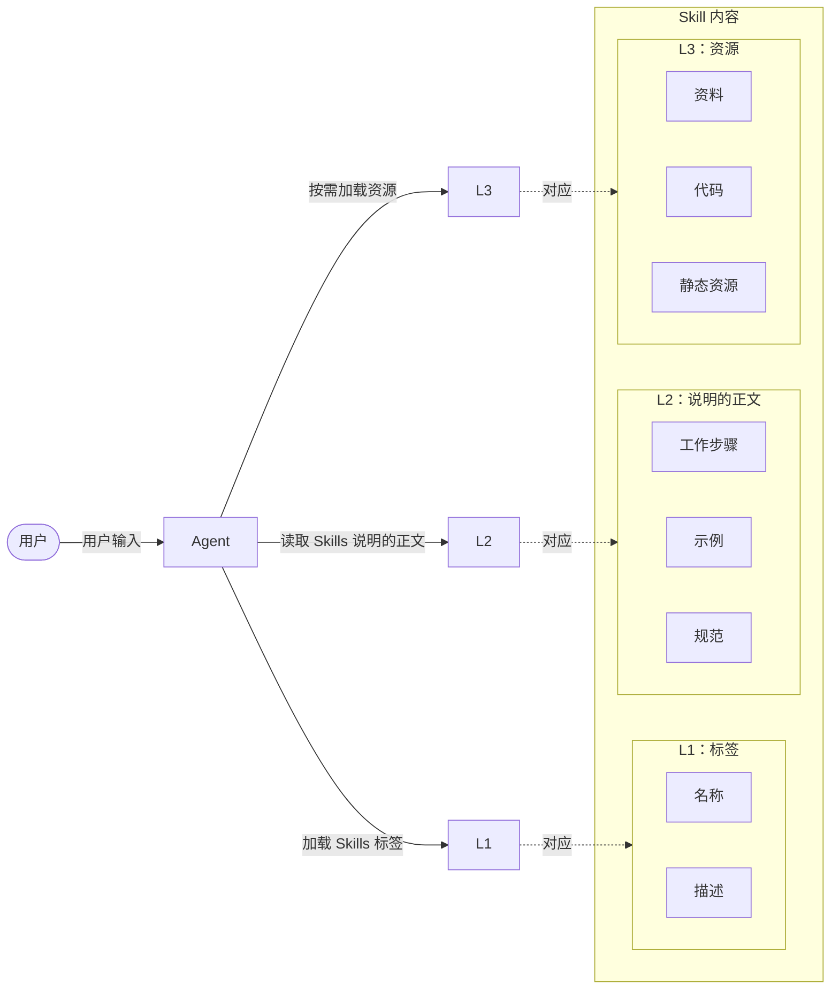
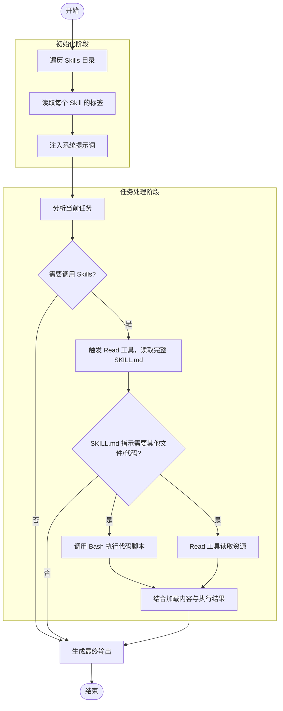

---
# Agent Skills 的发展史

下面我们将沿着“局限-痛点-突破”的逻辑，梳理这一演进过程的核心背景与关键细节，并向各位同学呈现技能这一能力扩展机制的发展脉络。

## Agent Skills 的诞生背景

智能体技能（Agent Skills）是 Anthropic 公司于 2025 年 10 月 16 日推出的人工智能智能体（AI Agent）能力扩展机制，并于 2025 年 12 月 18 日升级为开放标准，成为 Agent 能力层的重要技术标准之一，与模型上下文协议（Model Context Protocol，MCP）共同构成 Agent 生态的关键基础。

技能的诞生并非偶然涌现的一个新概念，而是 Agent 在长期工程实践中，对工具调用范式持续演化的必然结果，其核心演进逻辑是从“零散工具调用”向“标准化能力封装”的转变。每一项新技术的兴起，往往源于它切实解决了业务或工程中的关键痛点，从而为开发者和企业广泛采纳。

去年AI应用开发领域最受瞩目的技术之一当属模型上下文协议（Model Context Protocol，MCP）。MCP 的核心价值在于为工具与 Agent 之间的集成提供了标准化接口，这种接口的作用类似于 USB 协议之于电子设备：

> 只要遵循统一规范，任意工具都能即插即用，无须为每个 Agent 重新定制对接逻辑。

然而，在企业级应用场景中，业务复杂度远高于演示版或原型系统：

> 一个典型项目常常需要集成数十甚至上百个工具。每个工具的描述信息（通常包含功能说明、参数格式、调用示例等）平均占用 500-800 个 Token。若在 Agent 初始化时将所有工具描述一次性加载到 LLM 的上下文窗口中，将迅速耗尽宝贵的上下文容量。

曾有开发者在实际项目中配置了 7 个 MCP Server，共接入 100 多个工具。
结果，在用户尚未输入任何问题之前，仅工具描述信息就占用了 67 000 余个 Token，相当于其 LLM 上下文窗口总长度的 33%。这意味着，即便仅需 5 个 Token 的对话，即用户问 `1 + 1 = ?`，Agent 回答 `2`，其上下文开销也高达 13 400 倍，成本之高显而易见。

正是在这样的背景下，Skills 应运而生：

> 通过上下文卸载技术动态按需加载工具描述，而非全量预载，从根本上缓解了上下文膨胀问题。

---
## Agent Skills 的技术起源

要理解技能的技术起源，必须回到一个更基础的问题：当大语言模型（Large Language Model，LLM）具备理解能力之后，我们究竟应该让它“如何做事”？

### 早期探索：工具调用时代的局限

在技能出现之前，Agent 的能力拓展主要依赖“工具使用”（Tool Use）模式，也叫“函数调用”（Function Calling）。这种模式通过硬编码或者简单的提示词（Prompt）引导，让大语言模型调用外部 API、代码片段或第三方工具，来实现模型文本对话之外的能力，本质上解决了“AI 只能说不能做”的核心问题。

其基本思路是：

> 由开发者预先定义一组可调用的工具（如函数、API、脚本等），当用户与模型交互时，模型根据用户的意图，选择预先定义好的合适工具并生成调用参数；系统调用这个工具，将结果返回给模型，模型生成最终回复，反馈给用户。

这个模式在早期是有效的，确实让模型第一次具备了“行动能力”，突破了仅生成文本对话的限制。

然而，随着应用场景日益复杂，工具使用模式的局限性逐渐显现，暴露出一系列问题：

#### 问题1：工具与任务耦合性过强，复用性极差

早期阶段，工具使用都针对具体任务场景设计，调用逻辑、参数格式、输出范式与单一任务绑定，分散在提示词或代码中，缺乏标准化定义。开发者需要为每个任务重复编写工具使用代码，无法形成可复用的能力单元，无法跨项目、跨团队共享。

#### 问题2：模型认知负担过重，Token 消耗过多

模型不仅需要理解用户意图，还需要理解每个工具的参数结构、使用条件、边界限制等。
当可用工具数量过多时，模型需要在大量工具选项中做出决策，容易出现选择困难或误判。

每次加载对话窗口时，都需要将可用工具的完整定义全部加载到上下文中。即使某个工具在当前任务中完全用不到，它的参数、描述、使用说明等信息，也会占用大量 Token，造成 Token 消耗量急剧上升。这就好比一名工人每次作业前，都要把整个工具箱里的所有工具摆上工作台，哪怕实际上只会用到螺丝刀。工具越多，台面越杂乱，不仅取用效率变低，还极易出现误拿误用的问题。

这种模式不仅会增加使用成本，还会导致模型响应速度下降，以及稳定性和输出质量显著下降。

#### 问题3：缺乏统一规范，协同能力缺失

工具使用没有统一的协议与标准，不同开发者设计的工具调用逻辑、参数格式、输出规范等各不相同，导致多个工具无法协同工作。

简而言之，传统工具调用仅解决了“模型能否使用工具”的基础问题，却不能解决“模型如何稳定完成任务”的核心问题。

### 直接诱因：Claude Code 开发中的痛点

Claude Code 是 Anthropic 公司推出的面向命令行的 Agent 开发工具，支持代码执行、工具调用和多任务协同的开发环境，被广泛应用于代码编写、系统搭建、任务自动化等场景。

在 Claude Code 的实际使用过程中，开发者逐渐发现，基于传统工具使用模式的开发逻辑，已无法满足其高效开发与规模化复用的核心诉求。早期工具使用模式固有的局限在实践中转化为具体痛点并持续凸显，这也直接推动了“能力封装”思想的形成，并成为技能诞生的直接诱因。

这些痛点并非 Claude Code 独有的问题，而是传统工具使用模式的固有局限在具体开发环境中的集中体现。Claude Code 作为主流的 Agent 开发工具，其在实践中暴露的问题被大量一线开发者洞察并总结，逐步成为行业共识。

### 关键突破：渐进式加载机制的提出

在 Claude Code 实践过程中暴露的各类痛点，让开发者普遍意识到：仅通过优化工具调用的提示词或代码，无法从根本上解决问题，必须打破“零散工具调用”的思路，将工具调用逻辑、执行流程、参数规范、错误处理等内容，封装成一个独立、标准化、可复用的“能力单元”，实现模型的按需调用、灵活配置与高效复用。这种“能力封装”的思想，正是技能的核心雏形。

Claude Code 团队提出的渐进式加载机制（Progressive Disclosure），为技能的落地提供了关键技术支持。其核心思想可以概括为以下三点。

- 不将全部能力同时暴露给模型。
- 模型只在“需要时”获取必要的信息。
- 模型无须反复学习工具用法，而是遵循“遇到此类任务需求，调用对应技能解决”的逻辑。

在这一思路下，技能被定义为一个对外呈现单一能力的接口，对内封装了多个工具、规则与执行流程的能力单元。

至此，Agent 系统开始从“工具使用驱动”转向“能力封装驱动”。

渐进式加载并非单纯的工程优化技巧，更代表了 Agent 架构设计的范式转变。
这一机制的巧妙之处在于，同时解决了**效率**、**可扩展性**和**用户体验**三个维度的问题。

---
## Agent Skills 的行业背景

技能在技术层面源于工具使用范式的演进，从宏观层面来讲，它的出现顺应了 Agent 发展的底层需求：从实验室原型走向产业级应用。

从单一任务工具升级为全流程 Agent，行业层面对“标准化、可复用、低门槛、强协同”的能力单元需求日益迫切。这种需求并非偶然产生的，而是 Agent 在企业级落地、开发范式转型与生态协同演进三方面遭遇瓶颈后做出的必然选择，最终推动技能成为连接技术能力与行业价值的核心载体。

Agent 能力演进的各个阶段如下表所示。

| 阶段     | 典型形态        | 关键特征             |
| ------ | ----------- | ---------------- |
| 实验室原型  | 概念验证        | 低可用性             |
| 单一任务工具 | 工具调用 / 函数调用 | 能力增强：从概念验证到标准化   |
| 全流程智能体 | 任务组合、强协同    | 复用性提升：从单一功能到通用能力 |
| 技能     | 标准化、可复用、低门槛 | 协同能力：从独立工具到系统集成  |

### 企业级应用的核心挑战

在个人使用场景中，Agent 的不稳定、复用性差及偶发性错误等问题通常可被容忍。而在企业级场景中，引入 Agent 的目标是持续稳定地完成任务，这使企业面临与个人用户完全不同的现实挑战，具体来说，主要存在以下挑战：

#### 挑战1：规模化落地困难

当前大量 Agent 项目往往围绕着单一业务场景进行高度定制开发，这种方式虽然能够在局部取得效果，但能力高度依赖具体业务背景，难以迁移和复用，并导致“一次开发、只能解决一件事”，无法形成规模化复用。

#### 挑战2：跨系统协同成本过高

企业内部数据通常分散在多个平台，接口规范、数据格式等存在不小的差异。早期 Agent 依赖零散工具调用进行系统对接，不仅开发成本很高，而且在系统协同场景中容易出现执行失败、流程中断等问题，难以支撑复杂业务流程的自动化。

#### 挑战3：智能性与可控性失衡

在企业环境中，Agent 的行为必须具备可控性、可解释性和可追溯性，其重要性不亚于智能性。尤其是金融、医疗等高度监管行业，模型幻觉、敏感信息泄露、操作不可追溯等问题，可能引发严重的风险与业务损失。早期单纯依赖提示词和工具使用模式，执行逻辑隐含于上下文中，缺乏统一的能力边界定义与行为约束机制，一旦出现异常，排查和治理成本极高。

这些问题共同指向一个事实：

> 企业真正需要的不是更多工具，而是可复用、可统一管理的能力单元。

### AI 开发范式的转型需求

随着 Agent 应用场景不断拓展，早期以提示词和工具使用模式进行定制化开发的方式已无法适应行业快速迭代，难以支撑 Agent 长期演进，逐渐触及工程极限。

随着实践深入，开始出现明显的转型趋势：

- 【从临时性指令驱动转向原子化能力单元】：开发者不再希望每次执行任务时都从头描述如何操作，而是期望将成熟做法固化下来，反复使用。
- 【从模型即能力转向“模型 + 能力体系”】：模型负责理解与推理，由多个能力单元构成的能力体系负责执行与落地，二者的权责边界日益清晰。
- 【从提示词驱动转向结构驱动】：系统开始更多依赖明确的能力定义、输入输出约定和执行流程，而非隐含在上下文中的约定。

在这个过程中，Agent 的角色也发生了变化：

> 它不再是临时组合工具的即时执行者，而是逐渐演变为负责能力调度和组合的决策核心。

Agent Skills，正是在这一范式转型中，承担起能力标准化载体的角色。

这一范式的演变，极大地降低了开发门槛，推动 AI 开发从技术垄断走向全民开发成为可能。

### 模型上下文协议的基础铺垫

在 Agent 能力体系演进的过程中，行业也在解决另一个关键问题：

> 模型如何安全、标准化地接入外部能力？

模型上下文协议的提出，正是为了解决这一连接层问题。

模型上下文协议是 Anthropic 公司推出的用来规范 Agent 与外部工具、数据和其他 Agent 之间进行交互的一种协议。通过模型上下文协议，外部工具和服务可以统一接入模型，向模型提供能力描述、调用接口与权限边界等标准化信息。

这里需要明确的是：模型上下文协议解决的是“如何接入工具”，而不是“如何组织能力”。简单类比，模型上下文协议提供了稳定标准的“插座”接口，但是并未规定插上去的电器应该如何使用。

正是在模型上下文协议提供连接能力和 Agent 需求场景不断升级的背景下，Agent Skills 作为一种面向任务、面向复用的能力封装方式，逐渐成为 Agent 系统中不可或缺的一层。

---
## Agent Skills 的核心优势

Agent Skills 并非简单的功能封装，而是一种能力组织与交付方式的升级。它的优势并不体现在让模型变得更聪明，而体现在能力更加稳定、更可复用、更易拓展，以及是否适合长期、规模化使用。

### 模块化与可复用性：技能的“积木式”设计

Agent Skills 将一类问题的解决能力和方案封装成边界清晰、可独立使用的能力单元。

在传统 Agent 实现中，能力往往是以提示词或者工具调用的形式分散存在的，高度依赖具体的场景，难以复用，也难以维护。

技能的设计思路是：

> 一个技能只解决一类相对稳定的问题，并对外暴露清晰的能力边界。

这种模块化设计，使技能具备“积木式”特征：

- 单个 Skill 可以被多个 Agent 重复使用；
- 多个 Skills 可以组合完成更复杂的任务；
- 技能的内部实现可独立迭代，不影响使用它的 Agent。

从工程视角来看，这种模块化可带来三个直接收益：

1. 降低重复开发成本；
2. 提升系统可维护性；
3. 支持 Agent 能力“搭积木”式扩展。

### 动态适配性：跨场景迁移与自主优化能力

Agent Skills 不依赖具体的业务场景，可以满足不同场景的需求。

Agent Skills 的定义聚焦于“解决何种问题”，而非“适配哪类场景”，只要满足输入输出条件，同一个Skill 就可以被迁移到不同业务场景中使用。

例如：

- 同一个“PDF结构化解析”Skill，可以用于学术论文分析、合同审查、办公文档整理等；
- 同一个“内容生成”Skill，可以用于营销文案、内部报告、客服回复等。

同时，Agent Skills 本身是稳定的，但它的调用方式是可调整的：

- 是否调用某个Skill？
- 以何种参数调用？
- 是否组合其他Skills？

这些通常由 Agent 根据当前任务与上下文决定。

这种设计使 Agent 能够在不修改 Agent Skills 实现的前提下，对不同任务场景进行适配与优化，提升整体执行效率和灵活性。

### 标准化与开放性：跨平台兼容的基础

如果说模块化解决了“能不能复用”的问题，动态适配性解决了“能不能迁移”的问题，
那么标准化与开放性解决的是一个更加关键的问题：

> 能力能否脱离单一平台或者单一项目，形成长期可用的生态。

为此，Agent Skills 在设计上强调标准化：

- 能力描述结构统一；
- 明确约定输入输出规范；
- 调用方式与运行环境解耦。

在这一前提下：

> Agent Skills 不再是某个平台的“私有实现”，而是具备跨平台理解与接入可能性的能力单元。

其标准化同时也带来了开放性：

- 不同平台可以在遵循统一规范的前提下支持同一技能；
- 技能可以被共享、分发与复用，而不必绑定特定 Agent 或平台架构；
- 不同开发者可以围绕同一技能进行实现、优化与扩展。

从行业视角来看，这种标准化与开放性是 Agent 从工具堆叠走向能力生态的必要条件。

---
## Agent Skills 的关键阶段与核心价值定位

下面我们将对 Agent Skills 从概念提出到初步成熟的关键阶段进行系统回顾，明确其在 Agent 整体技术演进路径中的位置，并在此基础上定位技能的核心价值。

### 关键阶段与里程碑

Agent Skills 的发展并非一蹴而就的，而是伴随 Agent 技术迭代、能力形态持续演进与行业需求不断升级而逐步形成的。整体来看，这一演进过程可划分为四个阶段。

#### 第一阶段：模型能力释放期（以“基础问答能力”为核心）

在大语言模型发展的初期，Agent 更多扮演“增强型对话系统”的角色，其核心能力集中在理解、推理与文本生成上。这一阶段所产生的价值主要依托于模型自身的理解与生成能力。

#### 第二阶段：工具调用引入期（以“工具调用能力”为突破）

随着函数调用和工具使用等机制的引入，Agent 开始具备调用外部工具的能力，能够执行搜索、读写文件、调用 API 等操作。这一阶段的重要突破在于，Agent 首次实现从“只会说”到“可以做”的跨越。与此同时，工具使用的局限性也逐渐显现，例如能力零散、复用性不足、流程稳定性较差等问题，逐渐成为行业公认的痛点。

#### 第三阶段：Agent 原型扩展期（以“多工具协同”为特征）

在大量实践推动下，行业开始尝试通过规划与反思机制实现多轮工具协同，以增强 Agent 完成复杂任务的能力。在这一阶段，出现了一批 Agent 框架和模式，但是整体仍然高度依赖提示词和上下文窗口，稳定性不足、可维护性差等问题日益突出。

#### 第四阶段：能力工程化（以“技能作为标准化能力封装形态”为标志）

当 Agent 被要求能够长期稳定用于真实业务、长期任务和企业级场景时，行业开始意识到，单纯增加工具或优化提示词，无法解决根本问题，也难以支撑 Agent 的进一步演进。只有将能力进行明确划分、封装与管理，才能实现有效复用、系统治理与规模化应用。

正是在这一背景下，Agent Skills 作为一种面向任务、可复用、可治理的能力单元，从工程实践中诞生，成为 Agent 系统中的关键组成部分。同时，它升级为开发标准，成为这一阶段的标志性成果，从而确立其作为当前 Agent 能力工程化的核心载体地位。

### 核心价值：从工具使用者升级为问题解决者

在明确 Agent 的四阶段演进逻辑后，Agent Skills 的核心价值也随之清晰：

> 它正是为解决前一阶段 Agent“只会使用工具、不会解决问题”这一痛点而生的。

在 Agent Skills 范式下，Agent 不再围绕“如何使用工具”展开决策，而是围绕“如何解决问题”开展整体规划。这一转变主要体现在以下三个层面。

#### 第一个层面：决策内容的变化。

Agent 的决策内容，从调用哪个工具，升级为采用哪种解决方案。

Agent Skills 将一系列操作步骤、经验规则和执行约束等，封装成一个完整的能力，这样一来，Agent 面对的是语义清晰、边界明确的问题解法。

#### 第二个层面：责任边界的变化。

在传统工具使用模式下，Agent 需要对模型的每一步操作负责；

而在 Agent Skills 模式下，其责任聚焦于能力选择与结果评估，执行细节则由各技能自主决定，这使系统整体更可控、更易治理。

#### 第三个层面：系统价值的变化。

当 Agent 具备了稳定调用一系列技能的能力后，其价值就不再取决于工具数量或提示词复杂度，而是取决于**能否构建一套成熟、可持续迭代演进的能力体系**。

我们不难看出，Agent Skills 的核心价值在于：

> 它推动了 Agent 从工具使用者升级为问题解决者，成为 Agent 行业发展的核心驱动力。

---
# Agent Skills 的概念定义

前面，我们从技术演进和行业实践两个维度，梳理了技能的诞生脉络与核心价值：

> 源于早期 AI 工具调用的实践痛点，依托模型上下文协议奠定的标准化基础，借助渐进式披露机制实现核心技术突破，最终成为推动 Agent 从“工具使用者”向“问题解决者”转型的核心载体。

下面我们来系统介绍 Agent Skills 的核心概念、结构规范与工作机制，帮助各位同学构建关于技能的系统性、精准化的认知体系，来为后续实战提供理论基础。

## Agent Skills 是什么

之前我们提到，技能是“标准化、可复用的能力单元”，是支撑 Agent 从“工具使用者”转型为“问题解决者”的核心载体。这个说法对于刚接触技能的同学来说可能显得抽象。

没关系，下面我们将从技能的定义开始，带领大家逐步了解技能。
在给技能下定义之前，我们先了解基于大语言模型的 Agent 的含义。

### 基于大语言模型的 Agent 的含义

基于大语言模型的 Agent，是指以大语言模型作为核心认知与决策引擎，能够在给定目标或上下文的约束下，理解输入、规划行动、调用外部工具或能力，并根据执行结果持续调整行为的智能系统。

通俗来讲，Agent 就像一位通读了全世界所有书籍的天才实习生，他知识渊博、上知天文下知地理，却只会说不会做，缺乏动手能力，且短期记忆有限，无法持久留存信息——本质上是一个强大的“思考与表达大脑”，而非“行动者”。

为了让这位天才实习生能够以实际行动创造价值，我们需要给他配备一套“锦囊包”，这个“锦囊包”由以下几个核心能力组件构成：

> #### 【规划（Planning）与任务拆解】 ####
> 
> 将任务进行拆解，形成可执行步骤。
> 例如，对于“准备一个家庭旅游方案”的任务：
> 	1. 首先确定人数；
> 	2. 然后查景点、规划路线；
> 	3. 最后订机票、订酒店、安排具体行程。
> 
> 
> #### 【记忆（Memory）系统 】####
> 
> 弥补模型短期记忆的局限。
> 模型本身有短期记忆，也就是记得当前对话的上下文，当前对话一结束，他就记不住了。
> 我们需要给他一个“笔记本”，记录历史对话、偏好和专业知识等。
> 技术上，这个记忆系统叫作向量数据库。
> 
> 
> #### 【工具使用（Tool Use，又称 Function Calling）】 ####
> 
> 赋予模型动手能力，也就是给它干活的工具并赋予它使用工具的能力，让它不再是“只会说不会做”的行动矮子。
> 例如：
> 	- 让它获取当前热榜数据，它就会自主选择搜索引擎工具搜索相关信息；
> 	- 让它查询天气情况，它就会调用封装了查询天气的 API 的工具查看天气情况。 
> 它能根据任务，自己决定什么时候调用什么工具。
> 
> 
> #### 【行动与反思（ReAct）】 ####
> 
> 执行与复盘，根据执行结果，进行自我评估，迭代优化输出。
> 例如：
> 	- 在安排旅游行程时，漏掉了订酒店这个环节，它就会自动重新规划安排。

这个“锦囊包”即为 Agent，其中的功能组件便是构建 Agent 的核心模块。

如果说大语言模型是“天才大脑”，那么 Agent 就是“全能打工人”。

### Agent Skills 是 Agent 发展的必然需求

有同学可能会问，Agent 看起来已经很强大了，为什么还要有技能？

问题的核心在于**工具使用环节**。
虽然 Agent 被赋予了工具使用能力，但在工具的开发定义与实际使用过程中，一些问题逐渐显现。

假设有两个 Agent：

- 一个是旅游助手，帮助用户规划行程；
- 一个是农业助手，帮助农户管理大棚。

两者都需要查询天气功能。但是：

- 旅游助手在查询天气时，需要返回“景点名称+温度+穿衣建议”；
- 农业助手在查询天气时，需要返回“农田坐标+湿度+风速+灌溉建议”，

导致不得不针对不同 Agent 分别定制开发具备同一功能的工具。

缺乏统一规范，具体场景高度耦合，导致工具完全不可复用。
更麻烦的是，如果第三个 Agent（如外卖助手）也要查天气，那么还得再开发一个工具。
没有统一标准，每个工具只能“绑定”在特定 Agent 上，无法通用。
这就是“重复造轮子”的困境。

在开发过程中，为了让 Agent 在使用工具时能给用户更好的反馈，开发者往往需要反复调试、优化策略、尝试不同的知识组合与工具搭配。这个过程中积累的经验和方法论，会形成一套可以看作实践指南的指导手册，而此类经验如何实现复用与可持续传承？

假设已经针对每个 Agent 的使用场景完成了功能工具的定义与开发，但在实际使用过程中仍然会出现问题。通常情况下，单个 Agent 会配备多个功能工具，在每次交互对话时，当前对话窗口会将所有工具的完整定义（包括参数结构、使用约束等）全部加载至上下文。在当前对话任务中，大量工具实际未被调用，不仅造成大量 Token 浪费，还可能加剧 Agent 幻觉并降低结果稳定性。

这一系列问题如何解决？

技能便是为解决这些问题而生的，在这个过程中，Agent 的角色定位也逐渐发生了转变。

### Agent Skills 的基本定义

如果把 Agent 比作一个人，那么技能就是他的“职业技能证书+工具箱+行业经验手册”。
技能让 AI 从“会聊天的百科全书”真正进化为“能执行任务的数字员工”，也让非技术人员能像搭积木一样，组装出能够解决具体问题的 AI 应用。

这里给出了技能的基本定义：

> 技能将特定领域的知识、工具能力与任务执行流程进行模块化封装，形成可复用、可组合的能力单元，为 Agent 提供稳定的任务执行能力。

借助技能，Agent 可按需加载、动态组合多元能力，并在规划与推理机制驱动下完成特定任务乃至复杂工作流，从而显著降低开发与使用门槛，全面提升问题解决效能。

### 从工作角度看 Agent Skills 的定义

作为项目初期负责人，你从零开始完成了一项全新任务，或攻克了一个长期悬而未决的技术难题。任务完成后，上级通常会提出一个合理且关键的要求：

> “请按照公司模板，将整个过程，包括所用资料、解决步骤、关键判断和注意事项，整理成一份标准化文档，以便后续同事能够快速上手并复现。”

这一要求的本质，是将个体经验转化为可复用的组织知识资产。

Agent Skills 的设计理念正是对这一知识管理逻辑的技术化延伸：

> 它提供了一种标准化的结构化格式（类似于企业文档模板），允许开发者将解决问题所需的完整上下文（包括思考路径、执行流程、依赖工具、数据来源及输出规范）封装为一个独立的专家经验包，通常以 Markdown 文档、静态代码文件等形式存储。

当类似任务再次出现时，Agent 就如同接手项目的同事，通过解析该经验包，即可稳定地复现原有的工作流，从而高效、一致地解决问题。

从另一个视角看，Agent Skills 可视为一种本地化的检索增强生成（RAG）机制：

> 每当 Agent 面临用户请求时，它会动态地从 Skills 库中检索相关内容，并将所需信息与用户请求合并为新提示词，交由 LLM 进行推理。
> 不同之处在于，Skills 的内容组织更结构化、调用更精准，且支持代码与资源的协同执行。

---
## Agent Skills 的基本特征

Agent Skills 是一种用于为 Agent（智能体）扩展专门能力的开放标准，它通过将特定领域的知识、规则与工作流进行显式封装，使 Agent 能够以可控、可复用的方式调用这些能力，从而完成明确边界内的任务。

从系统视角看，Agent Skills 并非一次性功能调用，而是可被 Agent、IDE 或平台统一调度的标准化能力模块，它的核心特征在于：

> 通过清晰的输入与输出契约、明确的错误模型以及内置的治理钩子，将原本不可控的能力调用转化为可复用、可治理、可审计的工程单元。

这一概念最早由 Anthropic 公司提出。在其 Claude 模型的语境下，Agent Skills 并不是岗位替身，也不是 Agent 本体，而是**被显式定义**、**可重复调用**、**具有明确行为边界**的能力组件。
Agent 通过组合和调度多个 Agent Skills，形成更高层次的决策与行动能力。

在 Dify、扣子等平台中，尽管实现方式各有差异，但 Agent Skills 的核心语义已逐渐趋同：

> 它是一种跨模型、跨平台的能力封装单元，而不是具体产品或工具的专属实现。

---
## Agent Skills 的判断标准

在 Agent 生态迅速扩展的背景下，Agent Skills 这一概念极易被滥用。任何自动化脚本、提示词模板，甚至一次性工具调用，都可能被冠以 Agent Skills 之名。但如果缺乏清晰的判定标准，这种泛化会直接削弱 Agent Skills 作为工程与治理单元的价值。要判断一种能力是否“配得上”Agent Skills 这一称谓，关键不在于它是否智能，而在于它是否具备长期被系统信任和调度的条件。

判断一种能力是否有资格作为 Agent Skills ，主要有以下五个标准：

> 1. 第一，**Agent Skills 必须是可重复、可持续运行的能力单元**。——如果某个能力只能解决一次性问题，或高度依赖临时上下文与人工干预，那么它本质上仍是脚本或临时方案，而不是 Agent Skills。Agent Skills 需要在相同原则下，反复处理同一类问题，并保持行为的一致性。
> 2. 第二，**Agent Skills 必须具备明确且稳定的职责边界**。——它需要清楚地界定：自己负责解决哪一类问题，不负责解决哪一类问题；在什么条件下可以执行，在什么情况下必须拒绝或升级。没有边界的能力，即使再强，也只会成为不可控的风险源。
> 3. 第三，**Agent Skills 必须拥有清晰的输入与输出契约**。——输入需要可校验、可约束，输出需要结构化、可被系统消费。只有当能力的“进入条件”和“产出形式”都被显式定义，Agent Skills 才能被稳定编排进更大的 Agent 系统，而不依赖模型猜测或隐式约定。
> 4. 第四，**Agent Skills 必须具备明确的错误模型与失败语义**。——失败并不是异常情况，而是系统运行中的常态。合格的 Agent Skills 必须能够区分不同类型的失败原因，并给出可行动的反馈，而不是简单地报错或沉默失效。
> 5. 第五，**Agent Skills 必须天然支持治理与审计**。——既然 Agent Skills 会被 Agent 自动调用，并可能连接真实业务系统，那么权限控制、风险拦截、日志留痕就不再是可选项，而是其成为工程能力的前提条件。

---
# Agent Skills 的结构定义

一个可运行、可复用、设计良好的技能，既非一段临时编写的代码或提示词，亦非单一文件，
而是：

> 一个遵循明确规范、内含多重要素的结构化目录。

技能的基本架构通常由两个关键部分组成：

- 核心声明文件（仅指`SKILL.md`）
- 功能支撑要素（`scripts/` 、`references/`、`assets/` ，以及其它说明性文档）

## Agent Skills 的文件结构

为实现通用性和可互操作性，Agent Skills 必须遵循一套明确的结构规范，这类似于 MCP 之于工具集成。只要 Agent 能解析该结构，即可加载并使用任意 Skills。

一个 Skill 在物理结构上表现为一个文件夹，该文件夹的名称即为该 Skill 的名称。在该文件夹内，通常包含核心声明文件和功能支撑要素组件，典型技能的目录结构如下所示。

<div align=center>一个典型的技能目录结构</div>
```plain
skill-name/               # 技能目录结构，目录名即为技能的名字
├── SKILL.md              # 入口核心文件，唯一必须文件，相当于产品说明
├── scripts/              # 可选，存放脚本文件
│   ├── validate.py       # 特定脚本，验证表单数据
│   └── processor.py      # 特定脚本，处理数据
├── references/           # 可选，存放参考文件
│   └── best_practices.md # 参考文件
└── assets/               # 可选，存放资源文件
    └── template.json     # 模板数据
```

其中，SKILL.md 是每个标准化技能目录唯一不可或缺的文件，是一个技能的“身份说明”或“产品说明书”，采用 Markdown 格式，是开发者和 Agent 理解该技能的首要入口。
SKILL.md 的作用是实现能力的标准化描述与自我声明，通俗地说，就是向 Agent 清晰传达：我是谁、我能做什么、我该如何被调用、我的边界在哪里。

下面是对这个目录结构组成的详细说明：

- 【`SKILL.md` 】文件（必选）：这是一项 Skill 的核心文件，也是唯一的必选组件。它相当于一项 Skill 的标签与说明书，以 Markdown 格式清晰描述该 Skill 的功能、输入输出规范、调用条件、任务执行步骤、使用示例等关键信息。Agent 正是通过阅读此文件，判断是否调用该 Skill，以及如何正确使用它。
- 【`scripts/` 】文件夹（可选）：用于存放可执行的代码脚本（如 Python 等）。例如，对于运维场景，`scripts/` 文件夹可存放运维脚本等；而对于数据分析场景，`scripts/` 文件夹可用于存放 Pandas 脚本等。在实际使用时，需要在`SKILL.md`文件中使用相对于技能根目录的相对路径来引用这些脚本。
- 【`references/`】 文件夹（可选）：用于存放支撑该 Skill 运行的参考资料。例如，若要开发一个每日营养餐推荐 Skill，可在此目录下放入权威食谱、营养成分表或饮食指南等文档。这些资料为 Agent 提供领域知识依据，提升输出的专业性与准确性。
- 【`assets/` 】文件夹（可选）：用于存储静态资源与模板文件，如图片、音频、配置模板、输出格式样例等。这些内容不参与逻辑计算，但可作为任务执行时的辅助素材。

---
## 核心声明文件：`SKILL.md`

在 Dify、Coze、Codex、Claude Code 等支持 Agent Skills 机制的平台中，Agent Skills 是可以被 Agent 稳定调用的能力描述单元。

`SKILL.md` 是核心声明文件，也是一个 Agent Skill 必须包含的最小结构。

一份完整的`SKILL.md`文件，其核心内容分为两个部分：

- YAML 前置元数据
- Markdown 正文指令

其完整的内容结构如下所示：

<div align=center>SKILL.md的内容结构组成</div>

```markdown
---
name: skill名字
description: skill能力描述和使用时机说明
---

# 技能概述
[技能概述，使用2~3句话说明这个技能所提供的核心功能、运作方式、适用范围与能力边界。]

## 使用时机
- 在以下情况下使用此技能……
- 此技能适用于……

## 执行指令
- 为 Agent Skills 提供的分步操作指导。
- 特定领域的约定。
- 最佳实践和模式。
- 如需向用户澄清需求，请使用提问工具。

## 示例
[具体示例的描述说明]

## 边界情况
- **情况1**: 如何处理[特定异常情况]
- **情况2**: 当[条件]时的特殊处理逻辑

## 资源
- 详见 ([references/details.md])
- 脚本路径: ([scripts/processor.py])
- 模板文件: ([assets/template.json])
```

### YAML 前置元数据

头部 YAML 元数据在 SKILL.md 文件的最顶部，使用 YAML 格式的上、下符号（---）包裹起来，其中名称（name）和描述（description）是必填的两个字段：

> - `name`是技能的唯一标识，推荐使用以小写字母开头的英文连字符分隔式动名词形式（如 pdf-processing、data-analysis），且须与技能所在父目录名称严格一致。
> - `description`需清晰简洁地说明这个 Agent Skills 解决什么问题、在什么情况下使用，并包含关键词义词，以便 Agent 快速判断其与当前任务的匹配度——该字段为元数据中权重最高的必填项。如果 `description` 无法清楚区分它与其他 Agent Skills，说明职责边界尚未定义清楚。


每个 Agent Skill 都在带有 YAML 前置信息的`SKILL.md`文件中配置，其格式如下：

```yaml
---
name: my-skill
description: 简要描述此技能的功能及使用时机。
---
```

例如，我们要写一个解析PDF文档的技能，那么它的YAML元数据应该是：

```yaml
---
name: pdf-parsing
description: 解析PDF文件内容，支持文本提取、表格识别、关键信息结构化输出，适用于文档处理、学术研究、企业办公等场景，可直接输出结构化文本或关键信息摘要
---
```


除了`name`和`description`以外，还可以加入一些其他可选的字段，具体如下表所示。

<div align=center>YAML前置元数据的可选字段</div>

| 字段                   | 约束说明                                                                          |
| :------------------- | :---------------------------------------------------------------------------- |
| 许可证（license）         | 许可证名称或者绑定许可证文件的引用，例如：版权所有。完整的许可条款详见 LICENSE.txt 文件                            |
| 兼容性（compatibility）   | 说明环境要求（如预期产品、系统组件、网络访问等），例如：专为 Claude Code（或类似产品）设计。一般用不到                     |
| 元数据（metadata）        | 用于存储额外元数据的任意键值映射。例如：<br>metadata:<br>  author: aigcxworld<br>  version: "1.0" |
| 允许的工具（allowed-tools） | 该技能可调用的预授权工具列表以空格分隔，例如：allowed-tools: Bash(git:\*) Bash(jq:\*) Read           |

例如，我们要给这个解析PDF的技能添加一些可选字段：

```yaml
---
name: pdf-parsing
description: 解析PDF文件内容，支持文本提取、表格识别、关键信息结构化输出，适用于文档处理、学术研究、企业办公等场景，可直接输出结构化文本或关键信息摘要
license: Apache-2.0
metadata:
  author: aigcxworld
  version: "1.0"
---
```

这些必填的字段和可选的字段，共同构成 SKILL.md 的 YAML 元数据，帮助 Agent 快速适配调用，同时方便了开发者维护与升级。

### Markdown 正文指令

Markdown 正文指令位于 YAML 元数据下方，是技能的“执行手册”，用于定义完整的执行逻辑、操作步骤、参数规范、输出示例、错误处理方式及注意事项等，构成 Agent 执行任务的核心依据。

对于 Markdown 正文指令的格式目前没有具体限制，只要编写有助于 Agent 完成任务的内容即可。
目前常见的 Markdown 正文指令主要由以下几个部分组成：
#### 技能概述

这一部分不是写给工作人员看的文档，而是用于让 Agent Skills 对齐工作角色，即让 Agent 明确：

> “当调用这个 Agent Skill 时，我应当进入什么样的工作状态。”

具体如下：

```yaml
# 技能概述
简洁明了地说明这个技能所提供的核心功能、运作方式、适用范围与能力边界。
```

#### 使用时机

这一部分是 Agent Skills 与普通 Prompt 的关键区别。

该部分明确什么信号触发调用，哪些情况不应调用，是否需要前置确认或补充信息，具体如下：

```yaml
## 使用时机
- 在以下情况下使用此技能……
- 此技能适用于……
```

注意：没有使用时机的 Agent Skills 无法被 Agent 自主调度。

#### 执行指令

这一部分定义的是 Agent Skills 的**行为方式**，而不是输出格式，它需要明确：

- 执行顺序是否固定？
- 遇到不确定情况是否允许推测？
- 是否需要向用户追问信息？

具体如下：

```yaml
## 执行指令
- 为 Agent Skills 提供的分步操作指导。
- 特定领域的约定。
- 最佳实践和模式。
- 如需向用户澄清需求，请使用提问工具。
```

这部分决定了这个 Agent Skills 是“可控输出”还是“不可预测输出”。


例如，我们可以给这个解析PDF文档的技能添加如下所示的正文指令：

````markdown
# processing-pdfs

# 概述
本技能用于批量处理 PDF 文件，提取表单字段和基本元数据并导出为结构化 JSON。支持原生 PDF 表单与扫描件（可选 OCR），并可生成每个文件的 JSON 输出以及可选的汇总 CSV 供下游系统使用。

## 执行指令
### 第一步：准备输入与运行环境
- 将待处理的 PDF 放入 `input/` 目录（支持多个文件）。
- 安装运行依赖（示例基于 Python）：

```bash
pip install -r requirements.txt
# 若需 OCR，请在系统上安装 Tesseract (macOS: brew install tesseract)。
```
- 检查并可选地准备模板 `assets/template.json`，用于将 PDF 字段名映射到输出键名。
- 若存在加密 PDF，请准备好密码，运行时通过 `--password` 参数传入。
````

`YAML 前置元数据`和 `Markdown 正文指令`共同构成 SKILL.md 的整体内容结构，成为 Agent 完成特定任务的技能指南。

### 功能支撑要素：资源的组织形式与功能

随着技能复杂度越来越高，其包含的上下文信息也越来越多，无法再放入单个 `SKILL.md` 文件中。同时，一些上下文内容依赖特定的场景，仅在特定条件时才会被使用。

例如，一个用于企业合同审核管理的技能，不仅需要在 `SKILL.md` 中定义合同解析、条款检验、风险预警等执行逻辑，还可能涉及大量的辅助信息，如不同类型合同（劳动合同、采购合同等）的填写规范、常见条款合规说明、历史案例参考、表单模板填写规则等。
这些信息如果都整合到 `SKILL.md` 中，会导致 `SKILL.md` 文件非常臃肿，核心逻辑等关键指令被掩盖，不仅会增加 Agent 加载时的 Token 开销，降低调用效率与结果稳定性，还可能导致开发者难以定位执行逻辑，显著提升调试与维护成本。
同时，这些辅助信息也仅在特定场景中才会用到。例如，只有用户填写表单时才会用到“合同表单填写规则”，日常调用技能时完全用不到，不符合按需加载的核心原则。

在这种情况下，技能就可以通过分层组织的方式在结构目录中增加额外的资源文件，再通过资源文件名引入 `SKILL.md` 文件，这样一来，就能很方便地保持 `SKILL.md` 核心内容的简洁，同时，保障了上下文只在需要时加载。

功能支撑要素的结构组成如下所示。

<div align=center>功能支撑要素的结构组成</div>

```text
contract-reviewing/
├── SKILL.md              # 核心入口，指挥中枢
├── legal_analysis.md     # 法律分析模块
├── financial_terms.md    # 财务条款模块
├── compliance_check.md   # 合规检查模块
├── scripts/              # 脚本仓库，存放指定功能的脚本文件
├── references/           # 引用文件仓库，存放规则、规范类的文件
│   ├── forms.md          # 表单规则说明
│   └── reference.md      # 引用规范说明
└── assets/               # 资产仓库，存放模版、图片、数据等
```

将这些参考文件引入 `SKILL.md` 的写法如下所示。

```markdown
## 资源引用
### 合规审查
- 文件: references/compliance_check.md
- 触发条件:
用户明确提及“合规检查”“审计”“合规”，或文档数据内包含“合同”“财务报表”等名称标签

### 表单处理
- 文件: references/forms.md
- 触发条件:
用户意图中包含：“填写表单”“fill form”“自动填充”
```

资源目录和文件的组织方式没有严格限制，同学们可以根据自身场景来定义资源目录和文件名。

>[!warning] 防止资源文件嵌套引用
>为了让 `SKILL.md` 在必要时以最短路径读取到资源文件，尤其是在引用参考类文档时，应避免出现资源文件嵌套引用的情况。
>例如不应在参考文件 A 中引入参考文件 B，再将 A 整体引入 SKILL.md，这样会导致 Agent 在读取内容时，由于嵌套太深而漏掉部分信息。所以尽可能直接在 SKILL.md 中引入参考文件，每个参考文件定义单一场景功能。

推荐的资源目录包括 `scripts`、`references` 和 `assets`，分别用来放置脚本文件、各类参考文件和静态资源文件。

这些资源目录与文件作为功能支撑要素，与 `SKILL.md` 共同构成一个完整的技能包，从而让技能既具备复杂场景的适配能力，又保持了核心逻辑的简洁与高效。

---
# Agent Skills 的工作机制

现在我们来深入剖析 Skills 的工作机制，并从实战出发，演示如何编写、部署并测试一个 Skill，帮助各位同学构建高效、可扩展的 Agent 系统。

## Agent Skills 的渐进式加载机制

传统基于 MCP 的 Agent 在初始化时需加载所有工具描述，极易造成上下文窗口的浪费。
为避免此类问题，Agent Skills 设计了渐进式、按需加载的机制。
Skills 的内容按照加载级别分为 L1、L2、L3 这 3 个级别。

Agent 加载 Skills 的顺序如下：

> 1. 【加载 Skills 标签】：当 Agent 加载一个 Skill 时，仅将 L1 级别的内容，即 `SKILL.md` 中的标签部分存入 LLM 的记忆系统中。此时，Agent 只知道“有这样一个 Skill 可用”，但不会加载其全部细节。
> 2. 【读取 Skills 说明的正文】：当用户提出具体任务，Agent 根据 `SKILL.md` 中的标签判断某个 Skill 可能适用时，才会加载 L2 级别的内容，即 `SKILL.md` 中的说明，以此指导后续操作。
> 3. 【按需加载资源】：在实际执行过程中，若任务需要调用代码、参考文档或使用模板，Agent 会按需加载 L3 级别的内容，即 `scripts/`、`references/` 或 `assets/` 中的相关文件。未被使用的资源则始终保留在外部，不进入 LLM 的记忆中。

Agent Skills 的工作机制流程示意图：



这意味着，即便一个 Skill 内部打包了数百个工具定义、完整的数据字典或上百页的参考手册，只要当前任务无须使用，这些内容就不会进入 LLM 的上下文。

特别值得注意的是，`scripts/` 中的代码不会被送入 LLM 上下文，而是由 Agent 内置的 Bash 工具直接执行，仅将运行结果返回 LLM 用于后续推理，这正是 CodeAct 模式的典型延伸应用：

> 将代码视为动作，而非文本。

这种按需加载的机制，显著提升了上下文利用效率，避免了无效信息污染，同时保障了复杂 Skills 的可扩展性与运行稳定性。

---
## 渐进式加载与 Token 效率优化原理

Agent Skills 的渐进式加载机制是提升 Token 效率的核心手段，而 Token 效率优化是该机制的根本目标。下面这一部分并不涉及算法层面的 Token 优化解释，而是介绍渐进式加载机制这一核心手段是如何实现 Token 效率优化的。

按需加载通过不同级别的加载方式，在当前与 Agent 交互的上下文窗口中，仅加载与当前任务及所处执行阶段高度相关的内容，避免全量内容的加载，从而减少 Token 消耗。

Agent 启动后，仅加载各技能的元数据，即 `SKILL.md` 文件头部以 YAML 格式声明的、包含名字和描述两个必填字段的前置信息。元数据只有很少的字符，可以大幅度减少 Token 的消耗。在这一阶段，Agent 只需要知道每个技能的存在、功能和使用时机。

在当前任务明确使用这个技能时，才会加载它的核心逻辑，也就是 `SKILL.md` 的正文指令，包含执行流程、指导原则等。`SKILL.md` 遵循简洁、精准的原则，仅保留必要的信息，删除冗余描述，从而减少 Token 的消耗。这一步，通常规定 `SKILL.md` 指令部分内容不超过 500 行，力求简洁精练。

将关联的辅助资源文件分层组织，与技能的核心内容（元数据、核心逻辑）分层封装，非必要则不加载，以减少 Token 占用，仅在明确需要时，才将辅助资源加载至上下文。

这种按需加载来实现 Token 效率优化的方式，确保了技能的高效、轻量、可拓展，是 Agent Skills 能够适配规模化调用的关键。

---
## Agent Skills 的调用流程：从意图匹配到结果反馈

渐进式披露机制的三级加载为技能调用提供了底层逻辑支撑，从 Agent 接受用户任务开始，到最终反馈执行结果，完整的技能调用流程大致分为四个步骤：

1. 意图匹配
2. 分级加载
3. 执行任务
4. 结果反馈

让我们分步来看这个技能的调用流程。
### 第一步：意图匹配

意图匹配是技能调用流程的起点。Agent 启动时，加载所有技能核心文件 `SKILL.md` 顶部的 YAML 前置元数据，即级别一加载，与技能进行关联。在接收到用户任务需求后，自动触发“意图匹配”，Agent 对用户对话内容进行意图解析，提取任务关键字，与已加载的元数据的描述字段对应的内容进行匹配，快速判断哪个技能适配当前任务。

### 第二步：分级加载

筛选出适配的技能后，进入整个流程的核心环节——分级加载。

加载逻辑：触发级别二加载，即 `SKILL.md` 的 Markdown 正文指令部分，并根据内容判断是否触发级别三加载，即按需加载资源。

### 第三步：执行任务

根据加载到上下文窗口中的内容，逐步执行相应的任务。在执行的过程中，如果出现异常情况，如辅助资源加载失败、脚本执行报错等，就触发错误处理逻辑，根据在 `SKILL.md` 中定义的错误处理方式，尝试修复或反馈原因。

### 第四步：结果反馈

任务执行完毕后，进入结果反馈环节，将技能执行结果按照 `SKILL.md` 中约定的格式输出，完成一个从执行到反馈的闭环。

从上面的流程可以看出 SKILL.md 功能描述和执行逻辑定义的重要性，建议根据功能场景定义错误处理方式和输出格式，否则报错反馈与最终结果反馈可能缺乏人性化设计。


---
## 动手设计一个支持 Skills 的 Agent

要构建一个能有效加载和使用 Skills 的 Agent，需从基础工具与 Agent 控制流程两个维度设计。

### 基础工具设计

Skills 本质上是一组结构化文件，因此 Agent 至少需要具备读取（Read）与执行（Act）这两类基础能力，由此可设计以下两个核心工具：

- Read 工具：用于读取任意文件内容（如 `SKILL.md`、参考文档等）。
- Bash 工具：用于执行系统命令，包括遍历目录、运行脚本、创建文件等。

仅凭这两个操作系统级的通用工具，Agent 即可支持大量场景，例如自动运维巡检、金融数据分析、日志诊断等。

随着业务复杂度提升，还可扩展 Write（写入文件）、Edit（修改内容）等工具。
但关键原则是所有工具都应保持通用性，避免为特定 Skills 定制专用接口。

### Agent 控制流程设计

在工具就绪后，Agent 的运行流程如下图所示。



在初始化阶段：

- Agent 首先会遍历预设存放 Skills 的目录（ 如 Claude Code 的预设目录为 `.claude/skill/`），读取每个 Skill 文件夹中 `SKILL.md` 的标签，并将这些标签注入系统提示词，LLM 由此获知当前可用的 Skills 集合。

在任务处理阶段：

- 当 LLM 判断某任务可能匹配某个 Skill 时，触发 Read 工具，读取该 Skill 的完整 `SKILL.md`；
- 若文档指示需执行脚本或查资料，则开始调用 Bash 执行代码脚本或 Read 工具获取所需资源；
- 最终，结合加载的内容与执行的反馈结果，LLM 生成响应并回复给用户。

整个流程天然适配 ReAct 架构：

> LLM 负责推理与决策，工具负责感知与行动。

配合合理的提示工程与Agent策略，即可构建一个轻量、灵活且高度可扩展的 Skills 驱动型 Agent。

---
# 将 Agent Skills 应用于企业

## Agent Skills 是一种可持续运行的能力结构

许多人在谈 Agent Skills 时，潜意识里仍然把它们理解为“更聪明的工具”（写文案更快、做分析更省力、处理事务自动化程度更高）。这种理解并不算错，但它停留在效率层面，无法触及结构层面。

在传统的公司运作模式中，销售、行政、财务、运营、法务、IT与管理等能力，主要由具体的部门和人员来承载，组织运转高度依赖“人”的持续投入与协作；在 AI 时代，公司引入 Agent Skills 并非是要削减或回避人类的职能，而是对其承载方式进行重构：

> 将“人”从高频、可复制的执行层中抽离出来，转而让系统化工具、明确的规则、Agent 以及自动化流程来承担核心执行任务，使个人角色更多聚焦于决策、判断与方向控制层面。

具体到每一位个体就是：

> 你需要决定将精力投向哪些事情，哪些工作必须系统化、标准化、自动化，哪些可以主动放弃，同时判断失败是否值得复盘，经验是否需要沉淀为长期能力。

这正是公司引入 Agent Skills、流程接管与平台化能力的根本原因。
我们的目的并非为追求更炫目的技术，而是将每一位同事所承担的那些繁杂、琐碎的部门职能，从“依赖记忆、盯控、硬扛”，转变为由系统稳定承接、可持续运行的公司能力结构。
Agent Skills 的设计逻辑正是如此，它们并不是零散功能的集合，而是围绕某一部门职责封装的一整套判断规则、处理流程与结果输出能力。

简单来说，Agent Skills 的作用并非替代思考，而是放大判断。

## Agent Skills 承接的是长期能力，而非一次性任务

Agent Skills 的价值体现在长期一致的行为模式与可预期的判断标准上，而不是一次性完成某个任务。因此，合格的 Agent Skills 必须能够在相同原则下反复工作，如：

- 持续处理同类问题
- 遵循稳定规则
- 在异常出现时给出可解释的处理结果

这也是为什么设计 Agent Skills 时不能只关注“这一次的输出是否漂亮”，
而必须关注它在长期运行中是否：

- 可靠
- 可审计
- 可修正

## Agent Skills 从“替你干活”到“替你站岗”

当 Agent Skills 被当作效率工具使用时，它们只是帮你节省时间；
当 Agent Skills 被当作长期能力结构时，它们开始承担守住边界的职责。

它们会替你盯住：

- 流程是否越界
- 规则是否被破坏
- 风险是否开始累积

你不需要时时参与每一个细节判断，而只在关键节点介入决策，这种转变才是适应 AI 协作的关键。

Agent Skills 并不是更高级的效率工具，而是被系统化封装的部门能力。它们替代的不是执行动作，而是部门视角、责任边界与持续判断能力。当你积攒了足够多的 Agent Skills ，你承担的就不再是所有针对细枝末节的即时决策，而是站在更高层级管理这些 Agent 如何协同工作。

这才是 Agent Skills 在公司中的真正位置。

## 最适合技能化的事务与优先级

并不是所有工作中的事务都适合技能化，也不应该同时对多个已稳定运作的工作流程进行技能化。
顺序一旦错误，结果往往是：

> 系统看起来更复杂了，但风险并没有下降，反而加重了对个人的依赖。

技能化的核心目标不是“自动化更多事情”，而是优先消除系统性风险。
因此，工作事务是否适合技能化取决于两个关键标准：

- 一是这件事是否长期、高频占用个人注意力；
- 二是这件事工作一旦失误，是否会直接威胁公司生存。

基于这一逻辑，工作事务的技能化应当遵循清晰的优先级。

### 第一优先级：运营与事务协调类事务（系统稳定性的底座）

最适合技能化的往往不是最高价值的事务，而是最容易造成系统失控的环节，运营与事务协调类岗位正属于这一类。

在日常工作中，像是：

- 任务安排
- 流程执行
- 资料管理
- 信息留痕
- 进度跟踪

等事务，几乎每天都在发生，却极少被系统化管理；一旦这些事务完全依赖个人记忆和即时处理，系统就会迅速陷入混乱。

将这类事务技能化，本质上是在建立一个稳定运转的基础系统：

> 它追求的不是创造价值，而是确保事情不丢、不乱、不反复返工。

这一步完成之前，谈论更高级的替代执行能力往往没有意义。

### 第二优先级：财务与合规类事务（生存风险的第一防线）

财务与合规类事务并不一定占用最多时间，却是风险密度最高的环节，一次判断失误可能直接导致现金流断裂、合规风险暴露，甚至法律纠纷。

在工作中，财务风险、经营合规判断往往被“临时处理”，缺乏稳定规则。
通过技能化将基本的财务检查、回款节奏监控、合同要点校验、合规提示前置化，本质上是在为公司建立一条低成本但持续有效的风险防线。

这类事务技能化的价值不只在于替你做账，更在于提前提醒与阻断错误决策。

### 第三优先级：销售与客户管理事务（减少情绪与判断波动）

销售与客户管理相关事务高度依赖个人状态，判断是否继续跟进、是否让步、是否投入额外精力，往往掺杂大量情绪与即时反应。

将这类事务技能化，并不是让 AI 去谈客户，而是帮助你建立统一的判断框架：

- 哪些客户值得长期投入？
- 哪些合作应当及时止损？
- 哪些信号意味着风险上升？

通过 Agent Skills 承接这类判断，可以显著减少疲劳、情绪或短期压力导致的决策波动，让客户管理回到可控状态。

### 第四优先级：业务支持与分析类岗位（提升决策质量，而非替代创造）

最后一类适合技能化的事务是业务支持与分析类事务，例如：

- 数据整理
- 方案评估
- 经验复盘
- 趋势判断

这类事务并不直接决定公司生死，因此不应过早技能化，但若放在前面几类事务技能化之后，能够显著提升决策质量，减少拍脑袋判断。

需要注意的是，这几类事务技能化的目标并不是“替人类做决定”，而是：

> 为人类的判断提供结构化输入，帮助人类站在更高层级思考。

### 不建议优先技能化的事务：核心创造与战略判断

需要刻意保留在“人类”这一侧的能力，是公司的核心创造与战略判断，例如：

- 产品方向选择
- 关键客户取舍
- 长期路线规划

这类事务本质上依赖价值观、经验与不可完全形式化的判断，过早交给系统容易放大方向性错误。

公司施行人工智能化运作并不是“先自动化赚钱，再搭建体系”，而是恰恰相反：

> 先用技能筑牢系统根基，再释放个人的创造与战略判断能力。

工作事务的技能化应当按“系统稳定→风险控制→判断一致性→决策支持”的顺序逐步推进。
这样构建出来的不是一个工具堆叠的公司，而是一套能真正解放员工天性、长期运转的能力体系。

## Agent Skills 与数字员工的关系

数字员工与 Agent Skills 并非同一概念的两种表述，而是企业人工智能化进程中角色实体与能力构件的层级关系：

- 数字员工是面向业务场景的完整角色封装，如智能报销专员、供应链协调员，其价值体现在端到端流程交付与责任边界清晰；
- Agent Skills 则是构成这些角色的原子化能力单元，例如发票识别、审批规则推理、异常预警触发等可独立验证、可组合复用的功能模块。

二者的关系如同建筑中的房间功能与建材构件：

> 数字员工定义了“谁在做什么”，Agent Skills 决定了“凭什么能做好”。

数字员工的价值实现依赖 Agent Skills 的协同编排与上下文融合。
单一技能仅解决点状问题，而数字员工需在动态业务流中协调多个技能并维持状态连续性。
以银行信贷审批数字员工为例，其工作流包含：

1. 调用【身份核验】技能验证客户资质；
2. 触发【反欺诈】技能扫描异常行为；
3. 激活【风险定价】技能计算利率；
4. 调用【合规审查】技能校验监管规则。

关键挑战在于跨技能的状态传递，如：

> 当反欺诈技能标记高风险时，需将风险标签注入后续所有技能的上下文，而非简单阻断流程。

这种协同依赖工作流引擎实现**状态持久化**与**条件路由**，使数字员工具备类似于人的决策连贯性。

当前实践中的主要误区是将二者混为一谈，导致能力复用率低下。

- 部分企业直接为每个数字员工定制全套功能，结果形成烟囱式架构，如“销售”数字员工与“客服”数字员工各自开发相似的“客户画像分析”模块，重复投入且难以统一迭代。
- 更优路径是先沉淀企业级 Agent Skills 库——将高频能力（如文档解析、多轮对话管理、API 编排）标准化为可复用构件，再按角色需求动态组装。某三甲医院的实践表明，通过构建 23 个医疗领域 Agent Skills（含病历结构化、用药冲突检测、医保规则校验等），仅用 6 周即快速组装出“门诊分诊”、“住院随访”、“处方审核”三类数字员工，能力复用率达 71%，迭代效率提升 3 倍。

未来演进方向在于 Agent Skills 的自适应进化与数字员工的角色泛化。

- 随着强化学习与在线反馈机制的引入，Agent Skills 将从静态规则驱动转向动态策略优化，例如“客户投诉处理”技能通过分析历史工单闭环率，自动调整情绪安抚话术与升级阈值。
- 数字员工则逐步突破单一职能边界，向领域专家演进。一个供应链数字员工不再仅执行订单跟踪工作，而是基于库存技能、物流技能、市场预测技能的融合分析，主动提出备货建议并触发采购流程。这种从“能力堆砌”到“智能涌现”的跃迁，将使数字员工真正成为企业决策网络中的活性节点，而非仅仅作为流程自动化工具。

---