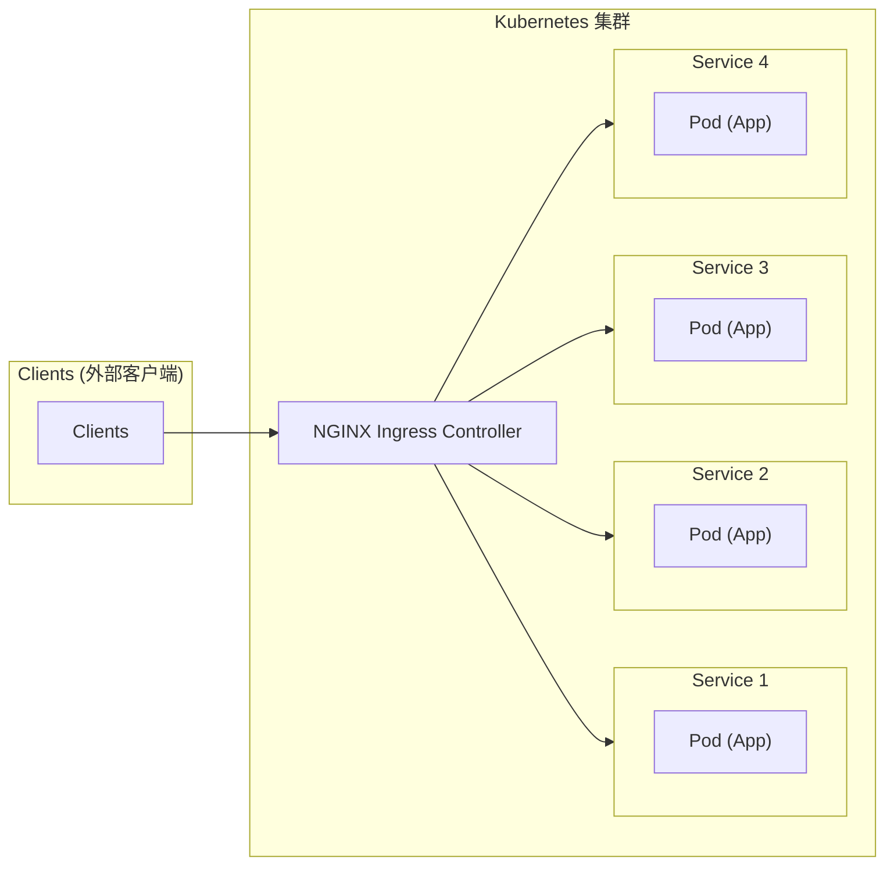
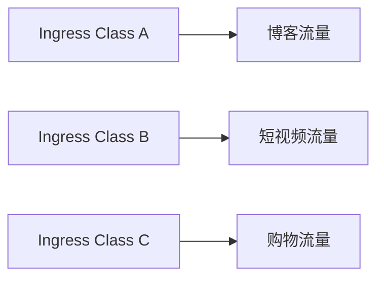

---

# 管理集群出入流量的 Ingress

Service 对象是 Kubernetes 内置的负载均衡机制，它使用静态 IP 地址代理动态变化的 Pod，支持以域名的方式访问和服务发现，是微服务架构必需的基础设施。

但 Service 也只是基础设施，它对网络流量的管理方案还是太简单，与复杂的现代应用架构的需求还有很大的差距，所以 Kubernetes 在 Service 之上又提出了一个新的概念：Ingress。

比起 Service，Ingress 更接近实际业务，对它的开发、应用和讨论在 kubernetes 社区里非常多，本节介绍 Ingress，以及 Ingress Controller、Ingress Class 等对象。

# 为什么要有 Ingress

Service 对象本质上是一个由 kube-proxy 控制的四层负载均衡，负责在 TCP/IP 协议线上转发流量。但四层的负载均衡功能有限，只能依据 IP 地址和端口号做一些简单的判断和组合，而现在的绝大多数应用都是运行在七层的 HTTP 和 HTTPS 协议上，有更多的高级路由条件，例如主机名、URI、请求头、证书等，而这些在 TCP/IP 网络栈里根本看不见。[^1]

另外，Service 比较适合代理集群内部的服务，只能使用 NodePort 或者 LoadBalancer 等方式，把服务暴露到集群外部，而这些方式缺乏足够的灵活性，难以管控。

为了解决这个问题，Kubernetes 沿用 Service 的思路，引入了一个新的 API 对象做七层负载均衡。不过除了七层负载均衡，这个对象还应该承担更多的职责，也就是作为流量的总入口，统管进、出集群的流量，让集群的外部用户能够安全、顺畅、便捷地访问内部服务。这个 API 对象被命名为 Ingress，意思是集群内外边界上的入口。[^2]

# 为什么要有 Ingress Controller

与 Service 相比，Ingress 同样会代理后端的 Pod，也有路由规则来定义流量如何分配、转发，只不过这些规则使用的是 HTTP、HTTPS 协议（而不是 IP 地址和端口号）。

Service 本身没有服务能力，只是一些 iptables 规则，真正配置、应用这些规则的是节点里的 kube-proxy 组件。同样的，Ingress 也只是一些 HTTP、HTTPS 路由规则的集合，相当于一份静态的描述文件，真正在集群里实施运行这些规则，还需要另外一个对象 Ingress Controller，它的作用相当于 Service 的 kube-proxy，能够读取、应用 Ingress 规则，处理、调度流量。

因为 Ingress Controller 要做的事情太多，与上层业务联系密切，所以 Kubernetes 没有实现 Ingress Controller，而是把它的实现交给社区，只要遵守 Ingress 规则任何人都可以开发 Ingress Controller。

由于 Ingress Controller 把守了集群流量的关键入口，掌握了它就拥有了控制集群应用的话语权，因此众多公司纷纷精心实现自己的 Ingress Controller，意图在 Kubernetes 流量进出管理这个领域占有一席之地。

这些实现中比较著名的是反向代理和负载均衡软件 Nginx。从 Ingress Controller 的描述中可以看到，HTTP 层面的流量管理、安全控制等功能其实就是经典的反向代理，而 Nginx 是其中在稳定性、性能等方面都领先的产品，所以理所当然地成为了应用广泛的 Ingress Controller。

不过，因为 Nginx 是开源的，任何人都可以基于源码进行二次开发，所以有很多变种，例如社区的 Kubernetes Ingress Controller、Nginx 公司自己的 Nginx Ingress Controller、基于 OpenResty 的 Kong Ingress Controller 等。

图 5-6 比较清楚地展示了 Ingress Controller 在 Kubernetes 集群里的地位（来自 Nginx 官网）。

<div align=center>Ingress Controller 在 Kubernetes 集群里的地位</div>



# 为什么要有 Ingress Class

Ingress 和 Ingress Controller 还不能完美地管理进出集群的流量。

最初，一个 Kubernetes 集群里有一个 Ingress Controller，再配上不同的 Ingress 规则，应该就可以解决请求的路由和分发问题了。不过随着 Ingress 在实践中的大量应用，很多用户发现这种用法会带来如下一些问题：

- 项目组想引入不同的 Ingress Controller，但 Kubernetes 不允许这样做；
- Ingress 的规则太多，无法全部交给一个 Ingress Controller 处理；
- 多个 Ingress 对象没有很好的逻辑分组方式，管理和维护成本很高；
- 集群里有不同的租户，他们对 Ingress 的需求差异很大甚至有冲突，无法部署在同一个 Ingress Controller 上。

所以，Kubernetes 又提出了一个新概念 Ingress Class，它位于 Ingress 和 Ingress Controller 之间，作为流量规则和 Ingress Controller 的“协调人”，解除 Ingress 和 Ingress Controller 的强绑定关系。

现在，Kubernetes 用户可以通过管理 Ingress Class 来定义不同的业务逻辑分组，简化 Ingress 规则的复杂度。例如，可以用 Ingress Class A 处理博客流量、Ingress Class B 处理短视频流量、Ingress Class C 处理购物流量，如图 5-7 所示。

<div align=center>Ingress Class 应用示意</div>



这些 Ingress 和 Ingress Controller 彼此独立，不会发生冲突，上面列举的 Ingress 在实践应用中的问题也就随着引入 Ingress Class 而解决了。

# 用 YAML 描述 Ingress 和 Ingress Class

理解了 Ingress、Ingress Controller 和 Ingress Class 后，下面为它们编写 YAML 文件。

和 Deployment、Service 对象一样，可以用命令“kubectl api-resources”查看 Ingress、Ingress Controller 和 Ingress Class 的基本信息，输出如下：

```text
[K8S ~]$ kubectl api-resources
NAME             SHORTNAMES   APIVERSION         KIND
ingressclasses                networking.k8s.io/v1   IngressClass
ingresses        ing          networking.k8s.io/v1   Ingress
```

可以看到，Ingress 和 Ingress Class 的“apiVersion”都是“networking.k8s.io/v1”，而且 Ingress 的简写是“ing”，但没有显示 Ingress Controller 对象。

这是因为和其他两个对象不同，Ingress Controller 不是描述文件，而是一个要实际干活、处理流量的应用程序，而在 Kubernetes 里管理应用程序的对象是 Deployment 和 DaemonSet。

创建 Ingress 对象也可以使用“kubectl create”来创建 YAML 模板文件，和创建 Service 对象类似，需要以下两个附加参数：

- `--class`，指定 Ingress 从属的 Ingress Class 对象；
- `--rule`，指定路由规则，基本形式是“URI=Service”，也就是说访问 HTTP 路径就转发到对应的 Service 对象，再由 Service 对象转发给后端的 Pod。

执行命令“kubectl create”后，Ingress 的 YAML 文件如下：[^3]

```bash
[K8S ~]$ kubectl create ing ngx-ing \
    --rule="ngx.test/=ngx-svc:80" --class=ngx-ink $out
```

```yaml
apiVersion: networking.k8s.io/v1
kind: Ingress
metadata:
  name: ngx-ing

spec:
  ingressClassName: ngx-ink
  rules:
  - host: ngx.test
    http:
      paths:
      - backend:
          service:
            name: ngx-svc
            port:
              number: 80
        path: /
        pathType: Exact
```

在这段 YAML 文件里有两个关键字眼：“ingressClassName”和“rules”，分别对应了命令行参数“--class”和“--rule”。

“ingressClassName”是 Ingress Class 的名字。“rules”的嵌套层次很深、格式比较复杂。仔细看可以发现它将路由规则拆分为 host 和 http path 两部分，其中在 path 里又指定了路径的匹配方式，可以是精确匹配（Exact）或者前缀匹配（Prefix），再用 backend 来指定转发的目标 Service 对象。

但 Ingress YAML 文件的描述不如“kubectl create”命令行里的“--rule”参数直观易懂，而且 YAML 里的字段太多也很容易弄错，因此建议避免直接手写 YAML 定义，更好的方式是让 kubectl 自动生成规则然后再略作修改。

与 Ingress 关联的 Ingress Class 本身没有什么实际的功能，只是起到联系 Ingress 和 Ingress Controller 的作用，所以它的定义非常简单，在“spec”字段里只有一个必需的字段“controller”，表示要使用哪个 Ingress Controller，必须查阅每个 Ingress Controller 的说明文档才能知道其具体的名字。

例如，如果要用 Nginx 开发的 Ingress Controller，就要在 YAML 文件中使用名字“nginx.org/ingress-controller”；而如果要使用 Kong 开发的 Kong Ingress Controller，就要在 YAML 文件中使用名字“ingress-controllers.konghq.com/kong”。以使用 Nginx 开发的 Ingress Controller 为例，“spec”字段如下：

```yaml
apiVersion: networking.k8s.io/v1
kind: IngressClass
metadata:
  name: ngx-ink

spec:
  controller: nginx.org/ingress-controller    # Nginx Ingress Controller
```

# 用 kubectl 操作 Ingress 和 Ingress Class

Ingress Class 的定义很简单，可以把它与 Ingress 的定义合并为一个 YAML 文件。运行“kubectl apply”命令一次性创建 Ingress 和 Ingress Class 两个对象：

```bash
kubectl apply -f ingress.yml
```

再运行“kubectl get”命令查看这两个对象的状态：

```text
[K8S ~]$ kubectl get ingressclass
NAME      CONTROLLER
ngx-ink   nginx.org/ingress-controller

[K8S ~]$ kubectl get ing
NAME      CLASS     HOSTS      ADDRESS   PORTS
ngx-ing   ngx-ink   ngx.test             80
```

运行“kubectl describe”命令可以显示 Ingress 的详细信息：

```text
[K8S ~]$ kubectl describe ing ngx-ing
Name:             ngx-ing
Address:          
Ingress Class:    ngx-ink
Default backend:  <default>
Rules:
  Host        Path  Backends
  ----        ----  --------
  ngx.test    
              /     ngx-svc:80 (10.10.0.12:80,10.10.1.11:80)
Annotations:  nginx.org/lb-method: round_robin
```

可以看到，Ingress 对象的路由规则 Host/Path 就是在它的 YAML 文件里设置的域名“ngx.test”，且关联了 5.3 节创建的 Service 对象，以及 Service 管理的两个 Pod。[^4]

# 使用 Nginx Ingress Controller

准备好了 Ingress 和 Ingress Class，本节部署真正处理路由规则的 Ingress Controller。[^5]

在 GitHub 上找到 Nginx Ingress Controller 项目，它以 Pod 的形式运行在 Kubernetes 里，所以同时支持 Deployment 和 DaemonSet 两种部署方式。这里选择的部署方式是 Deployment，相关的 YAML 文件也复制到了本书的 GitHub 项目。

Nginx Ingress Controller 对象包含的多个 YAML 放在“deployments/common”“deployments/rbac”里，需要执行以下“kubectl apply”命令：

```bash
kubectl apply -f common/ns-and-sa.yaml
kubectl apply -f rbac
kubectl apply -f common
kubectl apply -f common/crds
```

这些 YAML 为 Ingress Controller 创建了独立的名字空间“nginx-ingress”、相应的账号和权限（访问 apiserver 获取 Service、Endpoint 信息），以及 ConfigMap 和 Secret，用来配置 HTTP/HTTPS 服务。

部署 Ingress Controller 不需要完全从头编写 Deployment 的 YAML 文件，因为 Nginx 提供了示例 YAML，只需要在创建之前做好如下修改以适配自己的应用：

- “metadata”字段的 name 要改成应用的名字，如 `ngx-kic-dep`；
- “spec.selector”和“template.metadata.labels”字段也要修改为应用的名字，如 `ngx-kic-dep`；
- 可以改用 `containers.image` 的 alpine 版本，加快下载速度，如 `nginx/nginx-ingress:3.2-alpine`；
- “args”字段要加上`-ingress-class=ngx-ink`，也就是 5.4.4 节创建的 Ingress Class 的名字，这是让 Ingress Controller 处理 Ingress 的关键。

修改之后，Nginx Ingress Controller 的 YAML 文件如下：

```yaml
apiVersion: apps/v1
kind: Deployment
metadata:
  name: ngx-kic-dep
  namespace: nginx-ingress

spec:
  replicas: 1
  selector:
    matchLabels:
      app: ngx-kic-dep

  template:
    metadata:
      labels:
        app: ngx-kic-dep
    ...
    spec:
      containers:
      - image: nginx/nginx-ingress:3.2-alpine
        ...
        args:
        - -ingress-class=ngx-ink
```

有了 Ingress Controller，Ingress Controller、Ingress Class、Ingress 和 Service 对象的关联就更复杂了。[^6]

确认 Ingress Controller 的 YAML 修改完毕，可以用“kubectl apply”创建对象。

Nginx Ingress Controller 默认位于名字空间“nginx-ingress”中，查看其状态需要用“-n”参数显式指定（否则只能查看“default”名字空间里的 Pod 的状态）：

```text
[K8S ~]$ kubectl get deploy -n nginx-ingress
NAME          READY   UP-TO-DATE   AVAILABLE
ngx-kic-dep   1/1     1            1

[K8S ~]$ kubectl get pod -n nginx-ingress
NAME                           READY   STATUS
ngx-kic-dep-5b9475f74d-s72rp   1/1     Running
```

虽然 Ingress Controller 运行起来了，但还缺一道工序。Ingress Controller 本身也是一个 Pod，想要向外提供服务至少还要再为它定义一个 Service 对象，使用 NodePort 或者 LoadBalancer 暴露端口，才能真正把集群的内外流量打通。

这里用 4.6 节提到的“kubectl port-forward”，直接把本地的端口映射到 Kubernetes 集群的某个 Pod 里。下面做简单的测试验证。

把本地的 8080 端口映射到 Ingress Controller Pod 的 80 端口：

```bash
kubectl port-forward -n nginx-ingress \
    ngx-kic-dep-5b9475f74d-s72rp 8080:80 &
```

在 curl 测试请求的时候需要注意，因为 Ingress 的路由规则是 HTTP 协议，不能直接用 IP 地址的方式访问，必须用域名。可以使用以下 3 种方式：

- 修改“/etc/hosts”，手工添加对测试域名“ngx.test”的解析；
- 使用“--resolve”参数，指定 curl 对域名的解析规则，例如把“ngx.test”强制解析到“127.0.0.1”（即“kubectl port-forward”转发的本地地址）；
- 使用 HTTP 的“Host”头字段，明确指定测试域名“ngx.test”。

```text
[K8S ~]$ curl --resolve ngx.test:8080:127.0.0.1 http://ngx.test:8080
srv : 10.10.1.11:80
host: ngx-dep-9bf586b97-6g27k
uri : GET ngx.test /

[K8S ~]$ curl --resolve ngx.test:8080:127.0.0.1 http://ngx.test:8080
srv : 10.10.0.12:80
host: ngx-dep-9bf586b97-tlqb9
uri : GET ngx.test /

[K8S ~]$ curl 127.1:8080 -H 'Host: ngx.test'
srv : 10.10.1.11:80
host: ngx-dep-9bf586b97-6g27k
uri : GET ngx.test /
```

把访问结果对比 5.3 节的 Service 对象，会发现最终效果一样，都把请求转发到了集群内部的 Pod，但 Ingress 的路由规则不再是 IP 地址，而是 HTTP 协议里的域名。

# 使用 Kong Ingress Controller

Nginx Ingress Controller 非常流行，但由于 Nginx 自身的限制，在 Ingress、Service 等对象更新时必须修改静态的配置文件，并重启进程（reload），这在变动频繁的微服务系统里会引发一些问题。

而 Kong Ingress Controller 在 Nginx Ingress Controller 的基础上，基于 OpenResty 和内嵌的 LuaJIT 环境，实现了完全动态的路由变更，消除了重启的成本、运行更加平稳，而且还有很多额外的增强功能，非常适合那些对 Kubernetes 集群流量有更高、更细致管理需求的用户。[^7]

本书使用的是 Kong Ingress Controller 2.10，读者可以从 GitHub 上直接获取它的源码。

Kong Ingress Controller 安装所需的 YAML 文件都存在解压缩后的“deploy”目录下，提供“有数据库”和“无数据库”等多种部署方式，本书选择的是“无数据库”方式，只需要一个“all-in-one-dbless.yaml”就可以完成部署工作，也就是执行命令：

```bash
kubectl apply -f all-in-one-dbless.yaml
```

安装完成之后，Kong Ingress Controller 会创建一个新的名字空间“kong”，里面有默认的 Ingress Controller，以及对应的 Service：

```text
[K8S ~]$ kubectl get pod -n kong
NAME                         READY   STATUS
ingress-kong-7985c8bcd-jlnzd 1/1     Running
proxy-kong-547bf4c85-qbjrd   1/1     Running
proxy-kong-547bf4c85-w9258   1/1     Running

[K8S ~]$ kubectl get svc -n kong
NAME         TYPE           CLUSTER-IP    PORT(S)
kong-admin   ClusterIP      None          8444/TCP
kong-proxy   LoadBalancer   10.106.4.90   80:32301/TCP
```

要注意，运行命令“kubectl get pod”可以显示有 3 个 Pod 在运行，其中 1 个 Pod 是“ingress-kong”，还有 2 个 Pod 是“proxy-kong”。

这是 Kong Ingress Controller 与 Nginx Ingress Controller 在实现架构方面的一个明显不同点。

Kong Ingress Controller 使用了多个 Pod，分别运行管理进程 Controller 和代理进程 Proxy，两者之间使用管理接口“kong-admin”通信。而 Nginx Ingress Controller 则因为要修改静态的 Nginx 配置文件，所以管理进程和代理进程必须在一个容器里。[^8]

两种方式并没有绝对的优劣之分，但 Kong Ingress Controller 分离的好处是 Pod 彼此独立，可以各自升级维护，对运维更友好。

注意转发流量的服务“kong-proxy”被定义为“LoadBalancer”类型，显然是为了在生产环境里对外暴露服务，不过在本书的实验环境（无论是 Minikube 还是 kubeadm）中只能使用 NodePort 的形式，可以看到 80 端口被映射到了节点的 32301。[^9]

使用 curl 命令访问服务 kong-proxy 的 NodePort（使用集群里任意节点的 IP 地址），可以验证 Kong Ingress Controller 是否工作正常：

```text
[K8S ~]$ curl 192.168.26.210:32301 -i
HTTP/1.1 404 Not Found
Content-Type: application/json; charset=utf-8
Connection: keep-alive
Content-Length: 52
X-Kong-Response-Latency: 0
Server: kong/3.3.1

{
  "message":"no Route matched with those values"
}
```

curl 获取的响应结果显示，Kong Ingress Controller 2.10 内部使用的是 Kong 版本是 3.3.1，因为现在还没有为它配置任何 Ingress 资源，所以返回了状态码 404，这是正常的。

还可以用“kubectl exec”命令进入 Pod，查看它的内部信息：

```text
[K8S ~]$ kubectl exec -it -n kong proxy-kong-547bf4c85-qbjrd -- sh

$ kong version
3.3.1

$ kong health
nginx.......running
Kong is healthy at /usr/local/kong
```

为了更好地掌握 Kong Ingress Controller 的用法，不使用默认的 Ingress Controller，而是利用 Ingress Class 创建一个新的实例，创建流程如下。

（1）定义 Ingress Class，“spec.controller”字段的值是 Kong Ingress Controller 的名字“ingress-controllers.konghq.com/kong”，API 对象名字是“kong-ink”：

```yaml
apiVersion: networking.k8s.io/v1
kind: IngressClass
metadata:
  name: kong-ink

spec:
  controller: ingress-controllers.konghq.com/kong
```

（2）定义 Ingress 对象，用“kubectl create”生成 YAML 模板文件，使用“--rule”指定路由规则、使用“--class”指定 Ingress Class：

```bash
kubectl create ing kong-ing \
    --rule="kong.test/=ngx-svc:80" --class=kong-ink $out
```

生成的 Ingress 对象如下，可以看到域名是“kong.test”，流量会转发到后端的 ngx-svc 服务：

```yaml
apiVersion: networking.k8s.io/v1
kind: Ingress
metadata:
  name: kong-ing

spec:
  ingressClassName: kong-ink

  rules:
  - host: kong.test
    http:
      paths:
      - path: /
        pathType: Prefix
        backend:
          service:
            name: ngx-svc
            port:
              number: 80
```

（3）从“all-in-one-dbless.yaml”这个文件中分离出 Ingress Controller 的定义。其实也很简单，只要充分运用 5.1 节和 5.3 节的知识，查找 Deployment 对象，把它及相关的 Service 代码复制一份，并另存为“kong-kic.yml”。对比发现复制的代码和默认的 Kong Ingress Controller 完全相同。

（4）参考帮助文档对“kong-kic.yml”做如下修改：[^10]

- Deployment、Service 对象的 name 都要重命名，如重命名为 `ingress-kong-dep`、`proxy-kong-dep`、`kong-admin-svc`、`kong-proxy-svc`。
- “spec.selector”和“template.metadata.labels”字段也要对应修改为应用的名字，一般来说和 Deployment 的名字一样，也就是 `ingress-kong-dep`、`proxy-kong-dep`。
- “ingress-kong”要用环境变量“CONTROLLER_INGRESS_CLASS”指定新的 Ingress Class 名字为“kong-ink”，同时用“CONTROLLER_KONG_ADMIN_SVC”“CONTROLLER_PUBLISH_SERVICE”指定 Service 的新名字为“kong/kong-admin-svc”“kong/kong-proxy-svc”。
- 可以根据需要将“ingress-kong”里的镜像改成任意支持的版本，如较旧的版本 Kong:3.0 或者较新的版本 Kong:3.5。
- 可以将“kong-proxy”Service 对象的类型改成 NodePort，方便后续测试。

读者可以在本书配套 GitHub 项目里直接找到改好的 YAML 文件。

这些资源都创建好后，“kubectl get”的输出如下，注意 Service 对象的 NodePort 端口是 30105：

```text
[K8S ~]$ kubectl get ing
NAME       CLASS      HOSTS       ADDRESS          PORTS
kong-ing   kong-ink   kong.test   10.110.115.250   80

[K8S ~]$ kubectl get pod -n kong
NAME                                READY   STATUS
ingress-kong-dep-78c48dd6c8-bmpfw   1/1     Running
proxy-kong-dep-5d6cf4c7f7-bs8rn     1/1     Running
proxy-kong-dep-5d6cf4c7f7-vp29r     1/1     Running

[K8S ~]$ kubectl get svc -n kong
NAME             TYPE        CLUSTER-IP       PORT(S)
kong-admin-svc   ClusterIP   None             8444/TCP
kong-proxy-svc   NodePort    10.110.115.250   80:30105/TCP
```

和 5.4.6 节一样，使用 curl 命令测试时应该用“--resolve”或者“-H”参数指定 Ingress 定义的域名“kong.test”，否则 Kong Ingress Controller 会找不到路由：

```text
[K8S ~]$ curl 192.168.26.210:30105 -H 'Host: kong.test' -v
> GET / HTTP/1.1
> Host: kong.test
> User-Agent: curl/7.80.0
> Accept: */*
> 
< HTTP/1.1 200 OK
< Server: nginx/1.25.1
< X-Kong-Upstream-Latency: 1
< X-Kong-Proxy-Latency: 1
< Via: kong/3.5.0
< 
srv : 10.10.0.12:80
host: ngx-dep-9bf586b97-tlqb9
uri : GET kong.test /
```

可以看到，Kong Ingress Controller 正确应用了 Ingress 路由规则，返回了后端 Nginx 应用的响应数据，而且通过响应头“Via”还可以发现现在用的是 Kong 3.5.0。

# 扩展 Kong Ingress Controller

只使用 Kubernetes 标准的 Ingress 来管理流量，无法发挥 Kong Ingress Controller 的真正实力，它还有很多实用的增强功能，但需要用到 Kubernetes 的另一个特性 annotation。

annotation 是 Kubernetes 为资源对象提供的一个方便扩展功能的手段，可以在不修改 Ingress 定义的前提下，让 Kong Ingress Controller 更好地利用内部的 Kong 来管理流量。

annotation 的含义是注解、注释，它对应的字段是“annotations”，其形式和“labels”一样是键值对，其目的也和“labels”一样是给 API 对象附加一些额外信息，但其用途和“labels”区别很大。

- “annotations”添加的信息一般是给 Kubernetes 内部的各种对象使用的，有点像扩展属性。
- “labels”主要面对的是 Kubernetes 外部的用户，用来筛选、过滤对象。

如果用一个简单的比喻，那么“annotations”就是包装盒里的产品说明书，而“labels”是包装盒外的标签纸。

借助“annotations”字段，Kubernetes 既不用破坏对象的结构，也不用新增字段，就能够给 API 对象添加任意的附加信息，这就是面向对象设计中经典的“开闭原则”，让对象更具扩展性和灵活性。

目前 Kong Ingress Controller 支持在 Ingress 和 Service 这两个对象上添加 annotation，相关的详细文档可以参考官网。下面介绍两个常用的 annotation。

（1）`konghq.com/host-aliases`，可以为 Ingress 规则添加额外的域名。

Ingress 的域名允许使用通配符“\*”，如“\*.abc.com”，但问题在于“\*”只能是前缀而不能是后缀，也就是说无法使用“abc.\*”这样的域名，使得在管理多个域名时有些麻烦。

而有了“konghq.com/host-aliases”这个 annotation 就可以绕过这个限制，让 Ingress 轻松匹配不同后缀的域名。例如修改 Ingress 定义，在“metadata”字段里添加一个 annotation，可以让它除了支持“kong.test”还能够支持“kong.dev”“kong.ops”等域名：

```yaml
apiVersion: networking.k8s.io/v1
kind: Ingress
metadata:
  name: kong-ing
  annotations:
    konghq.com/host-aliases: "kong.dev, kong.ops"  # 注意这里
spec:
  ...
```

使用“kubectl apply”更新 Ingress，再用 curl 测试，就会发现 Ingress 已经支持了这几个新域名：

```text
[K8S ~]$ curl 192.168.26.210:30105 -H 'Host: kong.dev'
srv : 10.10.1.11:80
host: ngx-dep-9bf586b97-6g27k
uri : GET kong.dev /

[K8S ~]$ curl 192.168.26.210:30105 -H 'Host: kong.ops'
srv : 10.10.0.12:80
host: ngx-dep-9bf586b97-tlqb9
uri : GET kong.ops /
```

（2）`konghq.com/plugins`，可以启用 Kong Ingress Controller 内置的各种插件。

插件是 Kong Ingress Controller 的特色功能，能够附加在流量转发的过程中，实现各种数据处理。并且这个插件机制是开放的，既可以使用官方插件，也可以使用第三方插件，还可以使用 Lua、Go、Rust 等语言编写符合自己特定需求的插件。

Kong 公司维护了一个经过认证的插件中心，包含了认证、安全、流控、分析、日志等领域的 100 多个插件，下面介绍两个常用的插件：Response Transformer 和 Rate Limiting。[^11]

Response Transformer 插件实现了对响应数据的修改，能够添加、替换、删除响应头或者响应体；Rate Limiting 插件实现了限速功能，能够以时、分、秒等单位任意限制客户端访问的次数。

定义插件需要使用 Kubernetes 的 CRD（CustomResourceDefinition）资源，名字是“KongPlugin”，同样可以用“kubectl api-resources”“kubectl explain”等命令来查看“apiVersion”“kind”等信息。下面是这两个插件对象的定义示例：[^12]

```yaml
apiVersion: configuration.konghq.com/v1
kind: KongPlugin
metadata:
  name: kong-add-resp-header-plugin

plugin: response-transformer
config:
  add:
    headers:
    - Resp-New-Header:kong-kic

---

apiVersion: configuration.konghq.com/v1
kind: KongPlugin
metadata:
  name: kong-rate-limiting-plugin

plugin: rate-limiting
config:
  minute: 2
```

因为是自定义资源，所以 KongPlugin 对象和标准的 Kubernetes 对象不一样，不使用“spec”字段，而是用“plugin”字段来指定插件名，用“config”字段来指定插件的配置参数。

以上定义是让 Response Transformer 插件添加一个新的响应头字段，让 Rate Limiting 插件限制客户端每分钟只能发送两个请求。

定义好这两个插件之后，就可以在 Ingress 对象里用“annotations”来启用插件功能：

```yaml
apiVersion: networking.k8s.io/v1
kind: Ingress
metadata:
  name: kong-ing
  annotations:
    konghq.com/plugins: |
      kong-add-resp-header-plugin,
      kong-rate-limiting-plugin
```

用“kubectl apply”更新 Ingress 后再发送 curl 请求：

```text
[K8S ~]$ curl 192.168.26.210:30105 -H 'Host: kong.test' -i
HTTP/1.1 200 OK
X-RateLimit-Remaining-Minute: 1
RateLimit-Limit: 2
RateLimit-Remaining: 1
RateLimit-Reset: 32
X-RateLimit-Limit-Minute: 2
Resp-New-Header: kong-kic
X-Kong-Upstream-Latency: 3
X-Kong-Proxy-Latency: 2
Via: kong/3.3.1

srv : 10.10.1.11:80
host: ngx-dep-9bf586b97-6g27k
uri : GET kong.test /
```

可以看到，响应头里多出了几个字段，其中“RateLimit-Limit”“RateLimit-Remaining”“RateLimit-Reset”字段是限速信息，而“Resp-New-Header”是新添加的响应头字段。

连续多次执行 curl 命令，就能够看到限速插件的效果：

```text
[K8S ~]$ curl 192.168.26.210:31503 -H 'Host: kong.test' -i
HTTP/1.1 429 Too Many Requests
X-RateLimit-Limit-Minute: 2
RateLimit-Remaining: 0
RateLimit-Reset: 54
Retry-After: 54
RateLimit-Limit: 2
X-RateLimit-Remaining-Minute: 0

{
  "message":"API rate limit exceeded"
}
```

Kong Ingress Controller 返回 429 错误，说明访问受限；“Retry-After”字段表示多少秒后才能重新发送请求。

# 小结

本节介绍了 Kubernetes 的七层反向代理和负载均衡对象，包括 Ingress、Ingress Controller、Ingress Class，它们联合起来管理了进、出集群的流量，是集群入口的总管。

本节的内容要点如下：

- Service 是四层负载均衡，能力有限，所以出现了 Ingress，它基于 HTTP、HTTPS 协议定义路由规则；
- Ingress 只是规则的集合，并不具备流量管理能力，需要 Ingress Controller 应用 Ingress 规则才能真正发挥作用；
- Ingress Class 解耦了 Ingress 和 Ingress Controller，应当使用 Ingress Class 来管理 Ingress 资源；
- Nginx Ingress Controller 是一个流行的 Ingress Controller，它基于经典反向代理软件 Nginx；
- Kong Ingress Controller 是另一个流行的 Ingress Controller，底层内核仍然是 Nginx，但基于 OpenResty 和 LuaJIT，实现了对路由的完全动态管理，不需要重启进程；
- Kong Ingress Controller 支持标准的 Ingress 资源，并使用 annotation 和 CRD 提供更多扩展增强功能，可以灵活地加载或者拆卸，实现复杂的流量管理策略。

目前的 Kubernetes 流量管理功能主要集中在 Ingress Controller 上，但它已经远远不只管理入口流量了，还能管理出口流量，也就是“egress”，甚至还可以管理集群内部服务之间的流量。

此外，Ingress Controller 还有很多其他功能，例如 TLS 终止、网络应用防火墙、限流限速、流量拆分、身份认证、访问控制等，完全可以认为是一个全功能的反向代理或者网关，感兴趣读者可以自行查找这方面的资料。[^13]

---

[^1]: 所谓的“四层”“七层”指的是 OSI 七层网络参考模型里的第四层传输层和第七层应用层，简单来说，“四层”就是 TCP/IP 协议，“七层”就是 HTTP、HTTPS 等应用协议。
[^2]: Ingress 出现得非常早，在 2015 年就有了 beta 版本，当时还是在“extensions”里，但因为功能复杂，定义也不断变化，直到 2020 年的 Kubernetes 1.19 才被正式发布（GA）。
[^3]: 在 kubernetes 1.18 之前，Ingress 会在“metadata.annotations”里引用 Ingress Class 对象，“spec”字段里还可能有“serviceName”“servicePort”等字段，Kubernetes 1.18 已经废弃了这些，不建议再使用。
[^4]: 在找不到路由时，Ingress 的“Default backend”被用来提供一个默认的后端服务，但不设置也不会有什么问题，所以大多数时候都可以忽略它。
[^5]: Ingress Controller 的名字比较长，可以缩写为 IC 或者 KIC。
[^6]: 为了提高路由效率、降低网络成本，Ingress Controller 通常不会走 Service 转发，而是通过访问 apiserver 直接获得 Service 代理的 Pod 地址，从而绕过 Service 的 iptables 规则。
[^7]: Kong 由于是目前最成功的 OpenResty/Lua 项目之一，因此很自然地汇集了一批优秀的开发者，其中包括 htop 和 LuaRocks 的作者 Hisham Muhammad，还有 awesome-resty 的作者 Aapo Talvensaari。
[^8]: Kong Ingress Controller 2.9 之前是在同一个 Pod 里同时运行两个容器：管理进程 Controller 和代理进程 Proxy，两个容器之间使用环回（Loopback）地址通信，以这种方式部署可以使用“all-in-one-dbless-legacy.yaml”。
[^9]: Kong Ingress Controller 还会创建一个服务“kong-validation-webhook”，它仅在集群内部用来校验 Kubernetes 资源，一般不用特别关注。
[^10]: Kong Ingress Controller 里的 Pod 大量使用了环境变量来调整应用的行为，proxy-kong 中比较有用的一个环境变量是“KONG_ROUTER_FLAVOR”，用来切换内置路由器引擎。
[^11]: “Kong”这个命名源自公司最初的名字“Mashape”，后来的一些项目也以大型动物命名，如“Pongo”“Gojira”“Kuma”等。
[^12]: 除了 KongPlugin，Kong Ingress Controller 还有其他 CRD 资源，如 KongIngress、KongConsumer 等。
[^13]: 为了提高路由效率、降低网络成本，Ingress Controller 通常不会走 Service 转发，而是通过访问 apiserver 直接获得 Service 代理的 Pod 地址，从而绕过 Service 的 iptables 规则。
