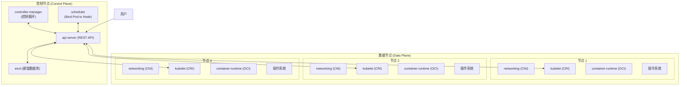

---

# 要点回顾

下面会首先对第 4 章的内容做一个全面回顾，毕竟 Kubernetes 里有很多新名词、新术语、新架构，知识点多且杂。然后再综合运用这些知识，演示一个实战项目——搭建 WordPress 网站，不过这个实战项目不是在 Docker 里，而是在 Kubernetes (Minikube) 集群里。

容器技术开启了云原生的大潮，但将成熟的容器技术运用到生产环境的应用部署时，却有些步履维艰。因为容器只是针对单个进程的隔离和封装，而实际的应用场景中需要许多的应用进程互相协同工作，其中的协作关系和需求非常复杂，在容器技术的层级很难掌控。

为了解决这个问题，容器编排就出现了。它可以说是传统运维工作在云原生世界的落地实践，本质上还是在集群里调度管理应用程序，只不过管理的主体由人变成了计算机，管理的目标由原生进程变成了容器和镜像。

而现在，容器编排领域的王者就是 Kubernetes。

Kubernetes 源自 Borg 系统，它凝聚了 Google 的内部经验和 CNCF 的社区智慧，战胜了竞争对手 Apache Mesos 和 Docker Swarm，成为容器编排事实标准和云原生时代的基础操作系统。目前，学习云原生就必须掌握 Kubernetes。

控制面/数据面架构是 Kubernetes 具有自动化运维能力的关键，对学习掌握 Kubernetes 至关重要。

这里用下图所示的参考架构图简略说明 Kubernetes 的运行机制：

Kubernetes 架构图

Kubernetes 把集群里的计算资源定义为节点，并将这些节点划分成控制面和数据面两类。

- **控制面节点**负责管理集群和运维监控应用，核心组件是 `apiserver`、`etcd`、`scheduler`、`controller-manager`。
- **数据面节点**受控制面节点的管控，核心组件是 `kubelet`、`kube-proxy`、`container-runtime`。

Kubernetes 支持插件机制，能够灵活扩展各项功能，常用的插件有 DNS 和 Dashboard。

为了更好地管理集群和业务应用，Kubernetes 从现实世界中抽象出了许多概念，称为 API 对象，描述这些对象需要使用 YAML 语言。

YAML 是 JSON 的超集，但语法更简洁，表现能力更强，更重要的是它以声明式的方式来描述对象的状态，不涉及具体的操作细节，这样 Kubernetes 就能依靠存储在 etcd 里集群的状态信息，不断地“调控”对象，直至实际状态与期望状态相同。这个过程就是 Kubernetes 的自动化运维管理。

Kubernetes 里有很多 API 对象，其中最核心的对象是 Pod，它捆绑了一组存在密切协作关系的容器，容器之间共享网络和存储，在集群里必须一起调度一起运行。通过 Pod 这个概念，Kubernetes 简化了对容器的管理工作，其他所有任务都是通过对 Pod 这个最小单位的再包装来实现的。

除了核心的 Pod 对象，基于单一职责和组合优于继承这两个基本原则，还设计有  4 个比较简单的 API 对象，分别是 Job、CronJob、ConfigMap 和 Secret。

- **Job** 和 **CronJob** 对应的是离线作业，它们逐层包装了 Pod，添加了作业控制和定时规则。
- **ConfigMap** 和 **Secret** 对应的是配置信息，需要以加载为环境变量或者挂载存储卷的形式注入 Pod，然后进程才能在运行时使用。

和 Docker 类似，Kubernetes 也提供了一个客户端工具，名字叫“`kubectl`”。它直接与控制面节点的 `apiserver` 通信，把 YAML 文件发送给 RESTful 接口，从而触发 Kubernetes 的对象管理工作流程。

`kubectl` 的命令很多，可以用 `api-resources`、`explain` 查看自带文档，可以用 `get`、`describe`、`logs` 查看对象状态，可以用 `run`、`apply`、`exec`、`delete` 操作对象等。

使用 YAML 描述 API 对象也有固定的格式，必须包含的头字段是 `apiVersion`、`kind`、`metadata`，分别表示对象的版本、种类和名字等元信息。实体对象（如 Pod、Job、CronJob）使用 `spec` 字段描述对象的期望状态，最基本的就是容器信息；非实体对象（如 ConfigMap、Secret）使用 `data` 字段，记录一些静态的字符串信息。

小结

和 2.7 节在 Docker 中搭建的网站相比，本节在 Kubernetes 集群里搭建了 WordPress 网站应用了容器编排技术，以声明式的 YAML 来描述应用的状态和它们之间的关系，而没有列出详细的操作步骤，这就降低了用户的心智负担——将调度、创建、监控等烦琐的工作都交给 Kubernetes 处理。

虽然我们朝着云原生的方向迈出了一大步，不过现在的容器编排还不够完善，还必须手动查找填写 Pod 的 IP 地址，缺少自动的服务发现机制，对外暴露服务还必须依赖集群外部力量（Docker 和 Nginx 等）。

所以，Kubernetes 的学习之旅还将继续，之后会介绍更多的 API 对象来解决这里遇到的问题。

---