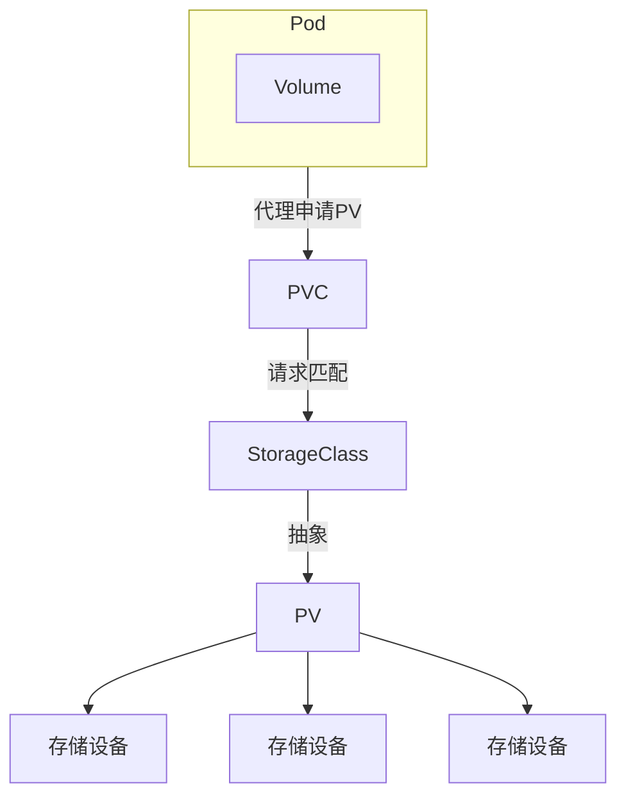

---

*之前介绍过存储卷的概念，它使用字段 “`volumes`” 和 “`volumeMounts`”，相当于给 Pod 挂载了一个“虚拟盘”，能够把配置信息以文件的形式注入 Pod 供进程使用。*

*由于 ConfigMap 和 Secret 对象的限制，那时的存储卷只能存放较少的数据，离真正的“虚拟盘”还差得比较远。*

*本节会深入介绍存储卷的高级用法，学习 Kubernetes 管理存储资源的 API 对象 PersistentVolume、PersistentVolumeClaim 和 StorageClass，然后使用本地磁盘创建实际可用的存储卷。*

---

# 概念介绍

## 什么是 PersistentVolume

Deployment、DaemonSet 虽然可以很好地管理 Pod，但存在一个很严重的缺陷：没有持久化功能。

因为 Pod 里的容器是由镜像产生的，而镜像文件本身是只读的，进程要读写磁盘只能用一个临时的存储空间，一旦 Pod 销毁，临时的存储空间就会被立即回收，其中的数据也就丢失了，导致无法永久存储数据。

为了保证 Pod 销毁后重建时数据依然存在，就需要找到一个解决方案，让 Pod 用上真正的“虚拟盘”。

其实，Kubernetes 的存储卷已经对数据存储给出了一个很好的抽象，它只是定义了一个存储卷，而这个存储卷是什么类型、有多大容量、怎么存储，都可以根据需求来自定义。Pod 不需要关心那些专业、复杂的细节，只要设置好“`volumeMounts`”，就可以把存储卷加载进容器里使用。

所以，顺着存储卷的概念，Kubernetes 延伸出了 PersistentVolume（简称 PV）对象，专门用来表示持久存储设备，但隐藏了存储的底层实现，我们只需要知道它能安全、可靠地保管数据就可以了。

作为存储的抽象，PV 实际上是一些存储设备、文件系统（如 Ceph、GlusterFS、NFS 等），甚至是本地磁盘，因此管理它们已经超出了 Kubernetes 的能力范围。所以，存储设备一般会由系统管理员单独维护，然后再在 Kubernetes 里创建对应的 PV。

要注意的是，PV 属于集群的系统资源，是和 Node 平级的一个对象，Pod 对它没有管理权，只有使用权。

---

## 什么是 PersistentVolumeClaim 和 StorageClass

有了 PV，但还不能够直接在 Pod 里挂载使用。因为不同存储设备的差异很大：有的读写速度快，有的读写速度慢；有的可以共享读写，有的只能独占读写；有的容量只有几百 MB，有的容量大到 TB、PB 级别……

这么多种存储设备，只用一个 PV 对象来管理不符合单一职责的原则，并且让 Pod 直接选择 PV 也很不灵活。于是 Kubernetes 又增加了两个新对象，PersistentVolumeClaim 和 StorageClass，用到的还是“中间层”的思想，把存储卷的分配管理过程再次细化。

PersistentVolumeClaim（简称 PVC），从名字上看比较好理解，就是用来向 Kubernetes 申请存储资源。PVC 是给 Pod 使用的对象，它相当于 Pod 的代理，代表 Pod 向系统申请 PV。一旦资源申请成功，Kubernetes 就会把 PV 和 PVC 关联在一起，这个动作叫作绑定（bind）。但是，系统里的存储资源非常多，如果要 PVC 直接遍历查找合适的 PV 也很麻烦，所以用到了 StorageClass。

StorageClass 的作用类似 IngressClass，它抽象了特定类型的存储系统（如 Ceph、NFS 等），在 PVC 和 PV 之间充当“协调人”的角色，帮助 PVC 找到合适的 PV，如下图所示。也就是说，PVC 可以简化 Pod 挂载“虚拟盘”的过程，让 Pod 看不到 PV 的实现细节。


<center>PV、PVC、StorageClass 与 Pod 的关系</center>

与 CPU、内存相比，大多数人对存储系统的认识还比较少，所以 Kubernetes 里的 PV、PVC 和 StorageClass 这 3 个新概念也不是特别好掌握。下面用生活中的例子做个类比，假设需要 10 张 A4 纸，就要给前台打电话讲清楚需求：

* “打电话”这个动作，就相当于 PVC 向 Kubernetes（前台）申请存储资源；
* 前台有各种品牌的办公用纸，大小、规格都不一样，这些品牌就相当于 StorageClass；
* 前台根据需要，挑选了一个品牌，再从库房里拿出一包 A4 纸，可能不止 10 张，但也能够满足要求，就在登记表上新增了一条记录，写上在某天申领了办公用品，这个过程就相当于 PVC 到 PV 的绑定；
* 最后拿到手里的 A4 纸，就是 PV。

---

# 用 YAML 描述 PersistentVolume

PV 有很多种类型，下面介绍本书用到的 HostPath，它和 Docker 里挂载本地目录的 “`-v`” 参数类似，可以用它来学习 PV 的初级用法。[^1]

简单起见，本书使用名为 “`/tmp/host-10m-pv`” 的目录，表示一个只有 10 MB 容量的存储设备，它将作为本地存储卷挂载到 Pod 里。

有了存储卷就可以使用 YAML 来描述这个 PV 对象。不过很遗憾，我们不能用 “`kubectl create`” 直接创建 PV 对象，只能用 “`kubectl api-resources`” “`kubectl explain`” 查看 PV 的字段说明，手动编写 PV 的 YAML 描述文件。[^2]

下面给出一个 PV YAML 示例，可以把它作为模板文件，创建自己的 PV：

```yaml
apiVersion: v1
kind: PersistentVolume
metadata:
  name: host-10m-pv

spec:
  storageClassName: host-test
  accessModes:
  - ReadWriteOnce
  capacity:
    storage: 10Mi
  hostPath:
    path: /tmp/host-10m-pv
```

PV 对象的文件头部分很简单，和前面讲到的 API 对象的文件头类似。下面重点看它的 “`spec`” 字段，其中的每个字段都很重要，描述了存储的详细信息。

（1）“`storageClassName`” 就是对存储类型的抽象 StorageClass。这个 PV 由我们手动管理，名字可以自由定义，这里定义的是 “`host-test`”，也可以把它改为 “`manual`” “`hand-work`” 等类似的名字。

（2）“`accessModes`” 定义了存储设备的访问模式，简单来说就是虚拟盘的读写权限。和 Linux 的文件访问模式差不多，目前 Kubernetes 支持如下 3 种模式。

* `ReadOnlyMany`：存储卷只读不可写，可以被任意节点上的 Pod 多次挂载。
* `ReadWriteOnce`：存储卷可读可写，但只能被一个节点上的 Pod 挂载。
* `ReadWriteMany`：存储卷可读可写，可以被任意节点上的 Pod 多次挂载。

要注意，这 3 种访问模式限制的对象是节点而不是 Pod，因为存储是系统级别的概念，不属于 Pod 里的进程。[^3]显然，本地目录只能在本机使用，所以这个 PV 使用了 “`ReadWriteOnce`” 的访问模式。

（3）“`capacity`” 表示存储设备的容量，这里设置为 10 MB。

再次提醒，Kubernetes 定义存储容量使用的是国际标准，以 1000 为基数，而日常习惯使用的 KB、MB、GB 的基数是 1024，要写成 Ki、Mi、Gi，一定不要写错，否则单位不一致会导致实际容量对不上。[^4]

（4）“`hostPath`” 指定了存储卷的本地路径，也就是在节点上创建的目录。

用以上 4 个字段把 PV 的类型、访问模式、容量、存储位置都描述清楚，一个存储设备就创建好了。

---

# 用 YAML 描述 PersistentVolumeClaim

有了 PV，就表示集群里有持久化存储可供 Pod 使用，需要再定义 PVC 对象，向 Kubernetes 申请存储资源。

下面这份 YAML 文件描述了一个 PVC，要求使用一个 5 MB 的存储设备，访问模式是 “`ReadWriteOnce`”：

```yaml
apiVersion: v1
kind: PersistentVolumeClaim
metadata:
  name: host-5m-pvc

spec:
  storageClassName: host-test
  accessModes:
  - ReadWriteOnce
  resources:
    requests:
      storage: 5Mi
```

PVC 与 PV 的 YAML 文件很像，但 PVC 不表示实际的存储，而是一个“申请”或者“声明”，“`spec`” 字段描述的是对存储的期望状态。

所以 PVC 的 “`storageClassName`” “`accessModes`” 字段和 PV 一样，但没有 “`capacity`” 字段，而是要用 “`resources.requests`” 字段表示希望有多大的容量。

这样，Kubernetes 就会根据 PVC 的描述，去找能够匹配 StorageClass 和容量的 PV，然后把 PV 和 PVC 绑定在一起，实现存储的分配，这个过程跟 5.5.2 节给前台打电话申请 A4 纸的过程差不多。

---

# 在 Pod 里使用 PersistentVolume

准备好 PV 和 PVC，就可以让 Pod 实现持久化存储了。

首先用 “`kubectl apply`” 创建 PV 对象，然后用 “`kubectl get`” 查看它的状态：

```bash
[K8S ~]$ kubectl get pv
NAME           CAPACITY   ACCESS MODES   STATUS      CLAIM   STORAGECLASS
host-10m-pv    10Mi       RWO            Available           host-test
```

可以看到，这个 PV 的容量是 10 MB，访问模式是 RWO（ReadWriteOnce 的简写），StorageClass 是我们自己定义的 “`host-test`”，状态是 “`Available`”，也就是处于可用状态，可以随时分配给 Pod 使用。

接下来创建 PVC 对象申请存储资源，再用 “`kubectl get`” 查看 PV 和 PVC 对象的状态：

```bash
[K8S ~]$ kubectl get pv
NAME           CAPACITY   ACCESS MODES   STATUS   CLAIM
host-10m-pv    10Mi       RWO            Bound    default/host-5m-pvc

[K8S ~]$ kubectl get pvc
NAME          STATUS   VOLUME        CAPACITY   ACCESS MODES
host-5m-pvc   Bound    host-10m-pv   10Mi       RWO
```

一旦 PVC 对象创建成功，Kubernetes 就会立即通过 StorageClass、resources 等条件在集群里查找符合要求的 PV 对象，如果找到合适的存储对象就会把它和 PVC 对象绑定在一起。

PVC 对象申请存储容量的是 5 MB，但现在系统里只有一个 10 MB 的 PV，没有更合适的对象，所以 Kubernetes 只能分配这个 PV。

这两个对象的状态都是 “`Bound`”，也就是说存储资源申请成功，PVC 对象的实际容量就是 PV 对象的容量 10 MB，而不是最初申请的容量 5 MB。

如果把 PVC 的申请容量改大一些（如 100 MB），那么 PVC 对象就会一直处于 “`Pending`” 状态，这意味着 Kubernetes 在系统里没有找到符合要求的存储资源，无法分配，只能等待存在满足要求的 PV 对象时才能完成绑定。

有了持久化存储，现在就可以为 Pod 挂载存储卷，用法和 4.5.4 节类似，先在 “`spec.volumes`” 里定义存储卷，然后通过 “`containers.volumeMounts`” 挂载进容器。

不过因为这里用的是 PVC 对象，所以要在 “`volumes`” 里用字段 “`persistentVolumeClaim`” 指定 PVC 的名字。

下面就是 Pod 的 YAML 文件，把存储卷挂载到了 Nginx 容器的 “`/tmp`” 目录下：

```yaml
apiVersion: v1
kind: Pod
metadata:
  name: host-pvc-pod

spec:
  volumes:
  - name: host-pvc-vol
    persistentVolumeClaim:
      claimName: host-5m-pvc

  containers:
  - name: ngx-pvc-pod
    image: nginx:alpine
    ports:
    - containerPort: 80
    volumeMounts:
    - name: host-pvc-vol
      mountPath: /tmp
```

创建 Pod 后，可以用 “`kubectl exec`” 进入容器执行一些命令，验证 PV 是否挂载成功：

```bash
[K8S ~]$ kubectl exec -it host-pvc-pod -- sh
/ # echo 'aaa' > /tmp/a.txt
/ # exit
```

容器在 “`/tmp`” 目录下生成了一个名为 “`a.txt`” 的文件，根据 PV 对象的定义，它应该落在 Pod 所在节点的磁盘上，登录数据节点就可以检查：

```bash
[K8S-DP ~]$ cat /tmp/host-10m-pv/a.txt
aaa
```

可以看到，数据节点的本地目录确实有一个 “`a.txt`” 的文件，再对比时间就可以确认是刚才在 Pod 里生成的文件。

因为 Pod 产生的数据已经通过 PV 对象存储在了磁盘上，所以 Pod 删除后再重建，挂载存储卷时依然会使用这个目录、数据保持不变，也就实现了持久化存储。

不过还有一点小问题，因为这个 PV 对象是 HostPath 类型，只在本节点存储，如果 Pod 重建时被调度到了其他节点，那么即使加载了本地目录，也不会是之前的存储位置，持久化功能也就失效了。

所以，HostPath 类型的 PV 对象一般只能用来做测试，或者用于 DaemonSet 这样与节点关系比较密切的应用。

---

# 在 Pod 里使用静态网络存储

PersistentVolumeClaim 和 StorageClass 联合起来可以为 Pod 挂载一块虚拟盘，让 Pod 在其中任意读写数据。不过 HostPath 类型的存储卷只能在本机使用，而 Kubernetes 里的 Pod 经常会在集群里漂移，所以这种方式不够实用。

要想让存储卷真正能被 Pod 任意挂载就需要变更存储方式，不能限定在本地磁盘，而是要改成网络存储，这样 Pod 无论在哪里运行，只要知道 IP 地址或者域名，就可以通过网络通信访问存储卷。

网络存储是一个非常热门的应用领域，有很多知名产品（如 AWS、Azure、Ceph、SeaweedFS 等），Kubernetes 还专门定义了 CSI 规范。不过这些存储类型的安装、使用都比较复杂，在实验环境里部署的难度比较高。

因此本书选择了相对简单的 NFS（参考附录 D），以它为例讲解如何在 Kubernetes 里使用网络存储，以及静态存储卷和动态存储卷的概念。

首先手动分配一个存储卷，指定 “`storageClassName`” 是 “`nfs`”，而 “`accessModes`” 可以设置为 “`ReadWriteMany`” ——这是由 NFS 的特性决定的，它支持多个节点同时访问一个共享目录。

因为这个存储卷是 NFS 类型，所以还需要在 YAML 文件里添加 “`nfs`” 字段，指定 NFS 服务器的 IP 地址和共享目录名。这里在 NFS 服务器的存储目录下创建了一个新目录 “`1g-pv`”，表示分配了 1 GB 的可用存储空间，相应的，PV 里的 “`capacity`” 字段也要设置成数值相同的 “`1Gi`”。

整理好这些字段后，就得到了使用 NFS 系统网络存储的 YAML 文件：

```yaml
apiVersion: v1
kind: PersistentVolume
metadata:
  name: nfs-1g-pv

spec:
  storageClassName: nfs
  accessModes:
  - ReadWriteMany
  capacity:
    storage: 1Gi

  nfs:
    path: /tmp/nfs/1g-pv
    server: 192.168.26.208
```

现在可以运行命令 “`kubectl apply`” 创建 PV 对象，再运行 “`kubectl get pv`” 命令查看它的状态：

```bash
[K8S ~]$ kubectl get pv
NAME        CAPACITY   ACCESS MODES   STATUS      STORAGECLASS
nfs-1g-pv   1Gi        RWX            Available   nfs
```

需要注意，“`spec.nfs`” 的 IP 地址一定要正确，路径一定要存在（由管理员事先创建好），否则 Pod 按照 PV 对象的描述会无法挂载 NFS 共享目录，无法正常运行。

有了 PV 对象就可以定义申请存储资源的 PVC 对象，它和 PV 的 YAML 文件差不多，但不涉及 NFS 存储的细节，只需要用 “`resources.requests`” 字段来表示希望有多大的容量，这里写为 1 GB，和 PV 的容量相同：

```yaml
apiVersion: v1
kind: PersistentVolumeClaim
metadata:
  name: nfs-static-pvc

spec:
  storageClassName: nfs
  accessModes:
  - ReadWriteMany

  resources:
    requests:
      storage: 1Gi
```

创建 PVC 对象之后，Kubernetes 会根据 PVC 对象的描述，找到最合适的 PV 对象，把它们绑定在一起，也就是分配存储资源成功：

```bash
[K8S ~]$ kubectl get pv
NAME        CAPACITY   ACCESS MODES   STATUS   STORAGECLASS
nfs-1g-pv   1Gi        RWX            Bound    nfs

[K8S ~]$ kubectl get pvc
NAME             STATUS   VOLUME      CAPACITY   STORAGECLASS
nfs-static-pvc   Bound    nfs-1g-pv   1Gi        nfs
```

下面再创建一个 Pod，把 PVC 对象挂载成一个存储卷，具体做法是用 “`persistentVolumeClaim`” 指定 PVC 对象的名字：

```yaml
apiVersion: v1
kind: Pod
metadata:
  name: nfs-static-pod

spec:
  volumes:
  - name: nfs-pvc-vol
    persistentVolumeClaim:
      claimName: nfs-static-pvc

  containers:
  - name: nfs-pvc-test
    image: nginx:alpine
    ports:
    - containerPort: 80

    volumeMounts:
    - name: nfs-pvc-vol
      mountPath: /tmp
```

Pod 和 PVC、PV、NFS 存储的关系如图 5-12 所示，可以对比一下 HostPath 类型的 PV 的用法，看看有哪些不同。

因为在 PV、PVC 里指定了 “`storageClassName`” 是 “`nfs`”，节点上也安装了 NFS 客户端，所以 Kubernetes 会自动执行 NFS 挂载动作，把 NFS 的共享目录 “`/tmp/nfs/1g-pv`” 挂载到 Pod 的 “`/tmp`”，完全不需要手动管理。

用 “`kubectl apply`” 创建 Pod 之后，用 “`kubectl exec`” 进入 Pod，再试着操作 NFS 共享目录测试一下：

```bash
[K8S ~]$ kubectl exec -it nfs-static-pod -- sh
/ # echo '1234' > /tmp/n.txt
/ # exit
```

退出 Pod，查看 NFS 服务器的 “`/tmp/nfs/1g-pv`” 目录，会发现 Pod 创建的文件确实写入了共享目录。而且，因为 NFS 是一个网络服务，不受 Pod 调度位置的影响，所以只要网络通畅，这个 PV 对象一直可用，也就真正实现了数据的持久化存储。

---

# 在 Pod 里使用动态网络存储

虽然有了 NFS 这样的网络存储系统，但 Kubernetes 里的数据持久化问题只能说是部分解决，还没有完全解决。

“部分解决”是因为集群里的 Pod 可以任意访问网络存储系统，Pod 销毁后数据依然存在，新创建的 Pod 可以再次挂载，然后读取之前写入的数据，整个过程完全是自动化的。“没有完全解决”，是因为 PV 对象还是要需要人工管理，必须由系统管理员手动维护各种存储设备，再根据应用需求逐个创建 PV 对象，而且 PV 对象的大小也很难精确控制，容易出现空间不足或者空间浪费的情况。

在本书的实验环境里，只有很少的 PV 对象需求，管理员可以很快分配存储卷，但在一个大集群里，每天可能会有几百、上千个应用需要 PV 对象，如果仍然手动管理、分配存储，管理员很可能会焦头烂额，导致管理、分配存储的工作大量积压。

Kubernetes 为此提出了动态存储卷的概念，它可以用 StorageClass 绑定一个 Provisioner 对象，而这个 Provisioner 对象就是一个能够自动管理存储、创建 PV 对象的应用，从而消除了原来系统管理员的手动工作，让创建 PV 对象的工作也实现了自动化。

目前，在 Kubernetes 里每类存储设备都有相应的 Provisioner 对象，对于 NFS 来说，它的 Provisioner 对象就是 NFS subdir external provisioner。

比起来静态存储卷，动态存储卷的用法简单了很多。有了 Provisioner 对象，用户就不再需要手动定义 PV 对象了，只需要在 PVC 对象里指定 StorageClass 对象，再关联到 Provisioner 对象。

NFS 默认的 StorageClass 定义如下：

```yaml
apiVersion: storage.k8s.io/v1
kind: StorageClass
metadata:
  name: nfs-client

provisioner: k8s-sigs.io/nfs-subdir-external-provisioner
parameters:
  archiveOnDelete: "false"
```

YAML 文件的一个关键字眼是 “`provisioner`”，指定了应该使用哪个 Provisioner 对象。另一个关键字眼 “`parameters`” 是调节 Provisioner 运行的参数，需要参考文档来确定其具体值，这里 “`archiveOnDelete: "false"`” 就是自动回收存储空间。[^5]

理解了 StorageClass 的 YAML 文件之后，也可以不使用默认的 StorageClass，而是根据自己的需求定制具有不同存储特性 StorageClass，例如添加字段 “`onDelete: "retain"`” 暂时保留分配的存储，之后再手动删除。[^6]

```yaml
apiVersion: storage.k8s.io/v1
kind: StorageClass
metadata:
  name: nfs-client-retained

provisioner: k8s-sigs.io/nfs-subdir-external-provisioner
parameters:
  onDelete: "retain"
```

下面定义一个 PVC 对象，向系统申请 10 MB 的存储空间，使用的 StorageClass 是默认的 “`nfs-client`”：

```yaml
apiVersion: v1
kind: PersistentVolumeClaim
metadata:
  name: nfs-dyn-10m-pvc

spec:
  storageClassName: nfs-client
  accessModes:
  - ReadWriteMany

  resources:
    requests:
      storage: 10Mi
```

定义好 PVC 对象，在 Pod 里用 “`volumes`” 和 “`volumeMounts`” 挂载 PVC 对象，使用 “`kubectl apply`” 创建 PVC 和 Pod 之后， Kubernetes 就会自动找到 NFS Provisioner。

例如，NFS 服务端地址为 192.168.26.208、导出的共享目录为 /tmp/nfs，可部署如下资源：

```yaml
apiVersion: v1
kind: Namespace
metadata:
  name: storage
---
apiVersion: v1
kind: ServiceAccount
metadata:
  name: nfs-subdir-external-provisioner
  namespace: storage
---
apiVersion: rbac.authorization.k8s.io/v1
kind: ClusterRole
metadata:
  name: nfs-subdir-external-provisioner-runner
rules:
- apiGroups: [""]
  resources:
  - persistentvolumes
  verbs:
  - get
  - list
  - watch
  - create
  - delete

- apiGroups: [""]
  resources:
  - persistentvolumeclaims
  verbs:
  - get
  - list
  - watch
  - update

- apiGroups: [""]
  resources:
  - events
  verbs:
  - create
  - update
  - patch

- apiGroups: [""]
  resources:
  - nodes
  verbs:
  - get
  - list
  - watch

- apiGroups: ["storage.k8s.io"]
  resources:
  - storageclasses
  verbs:
  - get
  - list
  - watch
---
apiVersion: rbac.authorization.k8s.io/v1
kind: ClusterRoleBinding
metadata:
  name: nfs-subdir-external-provisioner-runner
roleRef:
  apiGroup: rbac.authorization.k8s.io
  kind: ClusterRole
  name: nfs-subdir-external-provisioner-runner
subjects:
- kind: ServiceAccount
  name: nfs-subdir-external-provisioner
  namespace: storage
---
apiVersion: rbac.authorization.k8s.io/v1
kind: Role
metadata:
  name: nfs-subdir-external-provisioner-leader-locking
  namespace: storage
rules:
- apiGroups: [""]
  resources:
  - configmaps
  verbs:
  - get
  - list
  - watch
  - create
  - update
  - patch
---
apiVersion: rbac.authorization.k8s.io/v1
kind: RoleBinding
metadata:
  name: nfs-subdir-external-provisioner-leader-locking
  namespace: storage
roleRef:
  apiGroup: rbac.authorization.k8s.io
  kind: Role
  name: nfs-subdir-external-provisioner-leader-locking
subjects:
- kind: ServiceAccount
  name: nfs-subdir-external-provisioner
  namespace: storage
---
apiVersion: apps/v1
kind: Deployment
metadata:
  name: nfs-subdir-external-provisioner
  namespace: storage
spec:
  replicas: 1
  selector:
    matchLabels:
      app: nfs-subdir-external-provisioner

  template:
    metadata:
      labels:
        app: nfs-subdir-external-provisioner

    spec:
      serviceAccountName: nfs-subdir-external-provisioner

      containers:
      - name: nfs-subdir-external-provisioner
        image: registry.k8s.io/sig-storage/nfs-subdir-external-provisioner:v4.0.2

        env:
        - name: PROVISIONER_NAME
          value: k8s-sigs.io/nfs-subdir-external-provisioner

        - name: NFS_SERVER
          value: 192.168.26.208

        - name: NFS_PATH
          value: /tmp/nfs

        volumeMounts:
        - name: nfs-client-root
          mountPath: /persistentvolumes

      volumes:
      - name: nfs-client-root
        nfs:
          server: 192.168.26.208
          path: /tmp/nfs
```

其中最关键的是这三个环境变量：

| 环境变量               | 含义                                                      |
| ------------------ | ------------------------------------------------------- |
| `PROVISIONER_NAME` | Provisioner 的唯一名称，必须与 StorageClass 的 `provisioner` 完全一致 |
| `NFS_SERVER`       | NFS 服务端 IP 或域名                                          |
| `NFS_PATH`         | NFS 服务端已导出的共享根目录                                        |

随后会在 NFS 的共享目录下创建子目录，并自动创建 PV 对象：

```yaml
apiVersion: v1
kind: Pod
metadata:
  name: nfs-dyn-pod

spec:
  volumes:
  - name: nfs-dyn-10m-vol
    persistentVolumeClaim:
      claimName: nfs-dyn-10m-pvc

  containers:
  - name: nfs-dyn-test
    image: nginx:alpine
    ports:
    - containerPort: 80

    volumeMounts:
    - name: nfs-dyn-10m-vol
      mountPath: /tmp
```

同时，此自动创建的 PV 对象与该 PVC 绑定：

```bash
[K8S ~]$ kubectl get pv
NAME        CAPACITY   ACCESS MODES   STATUS   STORAGECLASS
pvc-20a5    10Mi       RWX            Bound    nfs-client

[K8S ~]$ kubectl get pvc
NAME               STATUS   VOLUME     CAPACITY   STORAGECLASS
nfs-dyn-10m-pvc    Bound    pvc-20a5   10Mi       nfs-client
```

可见，虽然没有直接定义 PV 对象，但 NFS Provisioner 会自动创建一个 PV 对象，大小刚好是 PVC 对象申请的 10 MB。

如果这个时候再去 NFS 服务器上查看共享目录，也会发现多出了一个目录，名字与这个自动创建的 PV 一样，但加上了名字空间和 PVC 的前缀：

```text
default-nfs-dyn-10m-pvc-pvc-xxxxxxxx-xxxx-xxxx-xxxx-xxxxxxxxxxxx
```

另外，前提条件是：

- NFS 服务端已经安装并启动 NFS 服务。
- `/tmp/nfs` 已在 NFS 服务端通过 `/etc/exports` 导出。
- 所有 Kubernetes Node 已安装 NFS 客户端工具，例如 Ubuntu/Debian 上的 `nfs-common`、CentOS/RHEL 上的 `nfs-utils`。
- Kubernetes Node 能访问 `192.168.26.208` 的 NFS 服务端口。

---

# 小结

本节介绍了 Kubernetes 持久化存储的解决方案，一共包含 3 个 API 对象，分别是 PersistentVolume、PersistentVolumeClaim、StorageClass。它们管理的是集群的存储资源，简单来说就是磁盘，Pod 必须通过它们能够实现数据持久化。

本节的内容要点如下：

* **PersistentVolume** 简称 PV，是 Kubernetes 对存储设备的抽象，由系统管理员维护，需要搞清楚存储设备的类型、访问模式、容量等信息；
* **PersistentVolumeClaim** 简称 PVC，代表 Pod 向系统申请存储资源，它声明对存储资源的要求，Kubernetes 会查找最合适的 PV 然后绑定；
* **StorageClass** 抽象特定类型的存储系统，归类分组 PV 对象，用来简化 PV 和 PVC 的绑定过程；
* **HostPath** 是一种简单的 PV，数据存储在节点本地，速度快但不能跟随 Pod 迁移；
* 可以编写 PV 手动定义 **NFS 静态存储卷**，要指定 NFS 服务器的 IP 地址和共享目录名；
* 使用 **NFS 动态存储卷**必须部署相应的 Provisioner，在 YAML 文件里正确配置 NFS 服务器。
* 动态存储卷不需要手动定义 PV，而是要定义 StorageClass，由关联的 Provisioner 自动创建 PV 并完成绑定。

---

[^1]: Kubernetes 还有一种特殊的存储卷叫 emptyDir，它的生命周期与 Pod 相同、比容器长，但不是持久存储，可以用作暂存或者缓存。
[^2]: 较早版本的 Kubernetes 不能自动创建存储卷的本地目录，需要系统管理员在每个节点上手动创建，比较麻烦。
[^3]: 如果存储系统符合 CSI（Container Storage Interface）规范，那么 “accessModes” 里还可以使用 “ReadWriteOncePod” 属性，只允许单个 Pod 读写，控制的粒度更精细。
[^4]: KB、MB、GB 与 KiB、MiB、GiB 的混用由来已久，大概是由早期 Windows 误用引起的，而 Mac 一直使用的是 1000 作为基数的 MB、GB，各种磁盘厂商的标称容量也用的是 MB、GB。
[^5]: NFS Provisioner 的名字其实是由它的 YAML 文件的环境变量 “`PROVISIONER_NAME`” 指定的，如果觉得名字太长也可以修改，但必须同步修改关联的 StorageClass。
[^6]: StorageClass 里的 “`onDelete`” “`archiveOnDelete`” 源自 PV 对象的存储回收策略，指定 PV 对象被销毁时数据是保留（Retain）还是删除（Delete）。
