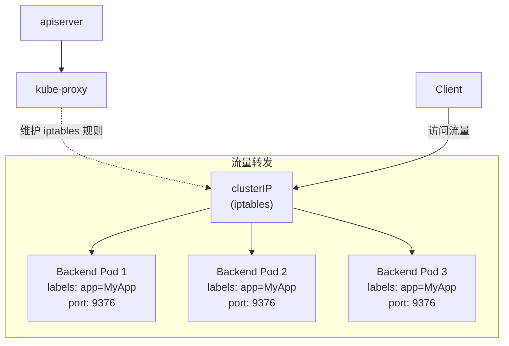

---

# 微服务必需的 Service

Deployment 和 DaemonSet 管理的都是在线业务，只是以不同的策略部署应用，其中 Deployment 可以创建任意多个实例，DaemonSet 为每个节点创建一个实例。

这两个 API 对象可以部署多种形式的应用，而在云原生时代，微服务无疑是主流。为了更好地支持微服务及服务网格这样的应用架构，Kubernetes 定义了一个对象：`Service`，它是集群内部的负载均衡机制，用来解决关键的服务发现问题。

本节就来讲讲解为什么要有 Service，如何使用 YAML 描述 Service，以及如何在 Kubernetes 里用好 Service。

---

# 为什么要有 Service

有了 Deployment 和 DaemonSet，在集群里发布应用程序的工作变得轻松了很多。借助 Kubernetes 强大的自动化运维能力，应用上线的频率可以由以前的月、周级别提高到天、小时级别，而且服务质量更高。

不过，在快速迭代应用程序版本的同时，服务发现的问题也逐渐显现出来了。

在 Kubernetes 集群里 Pod 的生命周期比较短，虽然 Deployment 和 DaemonSet 可以维持 Pod 的总数量稳定，但在运行过程中难免会有 Pod 销毁又重建，这就会导致 Pod 集合处于持续的变化之中。

这种动态稳定对于微服务架构来说是致命的。试想，后台 Pod 的 IP 地址变来变去，客户端该如何访问？如果处理不好这个问题，Deployment 和 DaemonSet 把 Pod 调度得再好也没有价值。

其实，这个问题也并不难解决，业内早就针对这种不稳定的后端服务的解决方案，那就是负载均衡，典型的应用有 LVS、Nginx 等。它们通过前端与后端之间加入一个中间层来屏蔽后端的变化，为前端提供稳定的服务。[^1]

Kubernetes 按照这个思路，定义了新的 API 对象：Service。Service 的工作原理和 LVS、Nginx 差不多，Kubernetes 会为 Service 分配一个静态 IP 地址，Service 再去自动管理、维护动态变化的 Pod 集合，当客户端访问 Service 时，Service 根据某种策略，把流量转发给某个 Pod。

下图所示为 Service 的工作原理（来自 Kubernetes 官方文档）。



<center><b>图 5-3 Service 的工作原理（基于 iptables）</b></center>

可以看到，Service 使用了 iptables 技术，每个节点上的 kube-proxy 组件自动维护 iptables 规则，不再需要关心 Pod 的具体地址，只要访问 Service 的静态 IP 地址，Service 就会根据 iptables 规则转发请求给它管理的多个 Pod，是典型的负载均衡架构。[^2]

不过 Service 并不是只能使用 iptables 来实现负载均衡，还有另外两种实现技术：性能更差的 `userspace` 和性能更好的 `IPVS`，但这些都属于底层细节，读者不需要刻意关注。

---

# 用 YAML 描述 Service

下面为 Service 编写 YAML 描述文件。

可以使用命令“`kubectl api-resources`”查看 Service 的基本信息，它的简称是 svc，apiVersion 是 v1。注意，这表示它与 Pod 一样，都属于 Kubernetes 的核心对象，不关联业务应用，与 Job、Deployment 不同。

Service 的 YAML 文件头如下：

```yaml
apiVersion: v1
kind: Service
metadata:
  name: xxx-svc
```

使用命令“`kubectl create`”，可以让 Kubernetes 自动创建 Service 的 YAML 模板文件，但使用另一条命令“`kubectl expose`”更好，因为“expose”更能清晰地表达 Service“暴露服务地址”的意思。

因为在 Kubernetes 里提供服务的是 Pod，而 Pod 又可以通过 Deployment、DaemonSet 对象来部署，所以“`kubectl expose`”支持为多种对象（如 Pod、Deployment、DaemonSet 等）创建服务。

使用“`kubectl expose`”命令时还需要通过参数 `--port` 和 `--target-port` 来分别指定映射端口和目标端口，而 Service 的 IP 地址和后端 Pod 的 IP 地址会自动生成。这两个参数的用法和 Docker 的命令行参数 `-p` 相似，只是稍微麻烦一点。[^3]

例如，为 ngx-dep 对象生成 Service 对象，命令如下：

```bash
export out="--dry-run=client -o yaml"
kubectl expose deploy ngx-dep --port=80 --target-port=80 $out
```

生成的 Service YAML 模板文件如下：

```yaml
apiVersion: v1
kind: Service
metadata:
  name: ngx-svc

spec:
  selector:
    app: ngx-dep

  ports:
  - port: 80
    targetPort: 80
    protocol: TCP
```

Service 的定义非常简单，在“spec”里只有 selector 和 ports 两个关键字段。

“selector”和 Deployment、DaemonSet 对象的“selector”字段的作用一样，用来筛选要代理的那些 Pod。因为指定要代理 Deployment，所以 Kubernetes 自动添加了“ngx-dep”标签，选择这个 Deployment 对象部署的所有 Pod。[^4]

从这里也可以看到，Kubernetes 的标签机制虽然简单却非常强大，可以帮助 Service 对象很轻松地关联上 Deployment 对象的 Pod。

“ports”比较好理解，其中的 3 个字段“port”“targetPort”和“protocol”分别表示映射端口、目标端口和使用的协议，在这里映射端口和目标端口都是 80，使用的协议是 TCP。

当然这里也可以把“port”改成 8080 等其他端口，这样外部看到的就是 Service 给出的端口，而不会知道 Pod 的真正服务端口。

---

# 用 kubectl 操作 Service

在使用 YAML 文件创建 Service 对象之前，需要先对 5.1 节的 Deployment 做一些修改（本节修改将用到 4.5 节的知识），方便观察 Service 的效果。

首先创建一个 ConfigMap，定义一个 Nginx 的配置片段，输出服务器的地址、主机名、请求的 URI 等基本信息：

```yaml
apiVersion: v1
kind: ConfigMap
metadata:
  name: ngx-conf

data:
  default.conf: |
    server {
        listen 80;
        location / {
            default_type text/plain;
            return 200
            'srv : $server_addr:$server_port\n'
            'host: $hostname\nuri : $request_method $host $request_uri\n'
            'date: $time_iso8601\n';
        }
    }
```

然后在 Deployment 的“template.volumes”里定义存储卷，再用“volumeMounts”将配置文件加载进 Nginx 容器：

```yaml
apiVersion: apps/v1
kind: Deployment
metadata:
  name: ngx-dep

spec:
  replicas: 2
  selector:
    matchLabels:
      app: ngx-dep

  template:
    metadata:
      labels:
        app: ngx-dep
    spec:
      volumes:
      - name: ngx-conf-vol
        configMap:
          name: ngx-conf

      containers:
      - image: nginx:alpine
        name: nginx
        ports:
        - containerPort: 80

        volumeMounts:
        - mountPath: /etc/nginx/conf.d
          name: ngx-conf-vol
```

部署这个 Deployment 对象之后就可以创建 Service 对象，用到的命令是“`kubectl apply`”。
创建之后，运行命令“`kubectl get`”可以查看它的状态：

```bash
[K8S ~]$kubectl apply -f svc.yml
service/ngx-svc created

[K8S ~]$kubectl get svc
NAME      TYPE        CLUSTER-IP      EXTERNAL-IP   PORT(S)
ngx-svc   NodePort    10.99.157.102   <none>        80:32111/TCP
```

可以看到，Kubernetes 为 Service 对象自动分配了一个独立于 Pod 地址段的 IP 地址“10.99.157.102”。Service 对象的 IP 地址还有一个特点，它是一个虚拟 IP，只能用来转发流量。

运行“`kubectl describe`”命令可以查看 Service 代理的后端 Pod，运行“`kubectl get pod`”命令可以查看 Pod 列表：

```bash
[K8S ~]$kubectl describe svc ngx-svc
Name:              ngx-svc
Namespace:         default
Selector:          app=ngx-dep
Type:              ClusterIP
IP Families:       IPv4
IP:                10.99.157.102
IPs:               10.99.157.102
Port:              <unset>  80/TCP
TargetPort:        80/TCP
Endpoints:         10.10.0.11:80,10.10.1.10:80

[K8S ~]$kubectl get pod -o wide
NAME                      READY   STATUS    AGE   IP
ngx-dep-9bf586b97-7mqbg   1/1     Running   13m   10.10.0.11
ngx-dep-9bf586b97-tt9lw   1/1     Running   13m   10.10.1.10
```

可以看到，Service 对象管理了两个“Endpoints”，分别是“10.10.0.11:80”和“10.10.1.10:80”，与 Deployment 里的 Pod 一致，用一个静态 IP 地址代理了两个 Pod 的动态 IP 地址。

测试 Service 的负载均衡效果很简单，因为 Service、Pod 的 IP 地址都是 Kubernetes 集群的内部网段，可以使用命令“`kubectl exec`”进入 Pod 内部（或者 ssh 登录集群节点），再用 curl 等工具访问 Service：

```bash
[K8S ~]$kubectl exec -it ngx-dep-9bf586b97-7mqbg -- sh

/ # curl 10.99.157.102
srv : 10.10.0.11:80
host: ngx-dep-9bf586b97-7mqbg
```

```bash
[K8S ~]$kubectl exec -it ngx-dep-9bf586b97-tt9lw -- sh

/ # curl 10.99.157.102
srv : 10.10.1.10:80
host: ngx-dep-9bf586b97-tt9lw
```

在 Pod 里，使用 curl 访问 Service 的 IP 地址（“10.99.157.102”），就会看到它把数据转发给后端的 Pod，输出信息会显示具体哪个 Pod 响应了请求，表明 Service 确实完成了对 Pod 的负载均衡任务。

如果尝试使用“ping”来测试 Service 的 IP 地址，会发现根本 ping 不通。因为 Service 的 IP 地址是虚拟 IP，只用于转发流量，ping 无法得到回应数据包，所以失败。

```bash
/ # ping 10.99.157.102
PING 10.99.157.102 (10.99.157.102): 56 data bytes
^C
--- 10.99.157.102 ping statistics ---
5 packets transmitted, 0 packets received, 100% packet loss
```

由于 Pod 被 Deployment 对象管理，任意一个 Pod 被删除时，该 Pod 销毁后会有新的 Pod 被自动重建，而 Service 又会通过 controller-manager 实时监控 Pod 的变化情况，因此会立即更新它代理的 IP 地址，实现自动化的服务发现。

---

# 以域名的方式访问 Service

Service 对象的 IP 地址是静态的，对微服务来说确实很重要，不过数字形式的 IP 地址用起来还是不太方便。这时候 Kubernetes 的域名系统（domain name system，DNS）插件就派上了用场，它可以为 Service 创建易写易记的域名，让 Service 更易用。

学习 DNS 域名之前要先了解一个新的概念：名字空间（namespace）。[^5]

需要注意的是，**Kubernetes namespace 与用于资源隔离的 Linux namespace 技术完全不同**，不要弄混。Kubernetes 的名字空间用来在集群里实现 API 对象的隔离和分组。

namespace 的简写是“ns”，可以使用命令“`kubectl get ns`”来查看当前集群里的所有名字空间，即 API 对象的分组：

```bash
[K8S ~]$kubectl get ns
NAME              STATUS   AGE
default           Active   3d
kube-flannel       Active   24h
kube-node-lease   Active   3d
kube-public       Active   3d
kube-system       Active   3d
```

Kubernetes 有一个默认的名字空间“default”，如果不显式指定，API 对象都会在“default”里。而其他名字空间各有用途，例如“kube-system”包含了 apiserver、etcd 等核心组件的 Pod。

因为 DNS 是一种组织成层次结构的网络服务命名系统，为了避免太多的域名导致冲突，Kubernetes 把名字空间作为域名的一部分，以减少重复的可能性。

Service 对象域名的完整形式是“`对象.名字空间.svc.cluster.local`”，通常可以简写为“`对象.名字空间`”，甚至是“`对象名`”（默认使用对象所在的名字空间，这个案例中使用的是“default”）。[^6]

试验 DNS 域名的用法很简单，先运行命令“`kubectl exec`”进入 Pod，然后通过 curl 访问“ngx-svc”“ngx-svc.default”等域名：

```bash
[K8S ~]$kubectl exec -it ngx-dep-9bf586b97-7mqbg -- sh

/ # curl ngx-svc
srv : 10.10.0.11:80
host: ngx-dep-9bf586b97-7mqbg
uri : GET ngx-svc /

/ # curl ngx-svc.default
srv : 10.10.0.11:80
host: ngx-dep-9bf586b97-7mqbg
uri : GET ngx-svc.default /

/ # curl ngx-svc.default.svc
srv : 10.10.1.10:80
host: ngx-dep-9bf586b97-tt9lw
uri : GET ngx-svc.default.svc /
```

现在无需关心 Service 对象的 IP 地址，只要知道它的名字就可以用 DNS 的方式访问后端服务。比起 Docker，这无疑是一个巨大的进步；对比其他微服务框架（如 Dubbo、Spring Cloud 等），由于服务发现机制被集成在了基础设施里，因此应用的开发更加便捷。

---

# 在集群外暴露 Service

Service 是一种负载均衡技术，它不仅能够管理 Kubernetes 集群内部的服务，还能够向集群外部暴露服务。

Service 对象有一个关键字段“type”，表示 Service 是哪种类型的负载均衡。前面的用法是对集群内部 Pod 的负载均衡，“type”字段的值是默认的“ClusterIP”，Service 的静态 IP 地址只能在集群内访问。

除了“`ClusterIP`”，Service 还支持“`ExternalName`”“`LoadBalancer`”“`NodePort`”，其中“`ExternalName`”和“`LoadBalancer`”一般由云服务商提供，本书实验环境用的是“`NodePort`”。下面重点讲解“`NodePort`”这种方式。

如果在命令“`kubectl expose`”的时候加上参数 `--type=NodePort`，或者在 YAML 文件里添加字段 `type: NodePort`，那么 Service 不仅会对后端的 Pod 做负载均衡，还会在集群中的每个节点上创建一个独立的端口来对外提供服务，这正是“NodePort”这个名字的由来。

首先修改 Service 的 YAML 文件，添加字段 `type: NodePort`：

```yaml
apiVersion: v1
kind: Service
...
spec:
  ...
  type: NodePort
```

然后创建对象，并查看它的状态：

```bash
[K8S ~]$kubectl get svc
NAME      TYPE        CLUSTER-IP      PORT(S)
ngx-svc   NodePort    10.99.157.102   80:32111/TCP
```

可以看到“TYPE”的值是“NodePort”，而“PORT(S)”列的信息，除了集群内部使用的“80”端口，还多出了一个“32111”端口，这就是 Kubernetes 在节点上为 Service 随机创建的专用映射端口。

因为这个端口属于节点，外部能够直接访问，所以现在外部用户无需登录集群节点或者进入 Pod 内部，可以直接在集群外使用任意一个节点的 IP 地址访问 Service 和它代理的后端服务。

`NodePort` 类型的 Service 很方便，但也有如下缺点：

- 它的端口数量有限。为了避免端口冲突，Kubernetes 默认只在“30000~32767”这个范围内随机分配端口号。只有不到 3000 个端口，而且都不是标准端口号，对具有大量业务应用的系统来说根本不够用。[^7]
- 它会在每个节点上都创建端口，再使用 kube-proxy 路由到真正的后端 Service，这对于有很多计算节点的大集群来说增加了网络通信成本。
- 它要求向外界暴露节点的 IP 地址，从安全角度考虑还需要在集群外再搭建一个反向代理，增加了方案的复杂度。

NodePort 虽然有这些缺点，但仍然是 Kubernetes 对外提供服务的一种简单易行的方式，目前还没有更好的方式。

---

# 小结

Service 对象实现了负载均衡和服务发现，是 Kubernetes 应对微服务、服务网格等现代流行应用架构的解决方案。

本节的内容要点如下：

- Pod 的生命周期很短，会不停地销毁、创建，所以需要用 Service 来实现负载均衡。Service 对象由 Kubernetes 分配固定的 IP 地址，能够屏蔽后端的 Pod 变化。
- 与 Deployment、DaemonSet 相同，Service 对象使用“selector”字段，选择要代理的后端 Pod，是松耦合关系。
- 基于 DNS 插件，客户端能够以域名的方式访问 Service，比使用静态 IP 地址的方式更方便。
- 名字空间是 Kubernetes 用来隔离对象的一种方式，实现了逻辑上的对象分组，Service 的域名里就包含了名字空间。
- Service 的默认类型是“ClusterIP”，只能在集群内部访问，如果改成“NodePort”，就会在集群节点上开启一个随机端口号，让外界用户也能够方便地访问内部服务。

---

[^1]: LVS（Linux Virtual Server）即 Linux 虚拟服务器，是由章文嵩发起的一个开源项目，已经被集成进 Linux 内核。
[^2]: iptables 基于 Linux 内核的 netfilter 模块，用来处理网络数据包，实现修改、过滤、地址转换等功能。
[^3]: 如果 Service 对象的映射端口和目标端口相同，例如都是 80，那么在使用命令“`kubectl expose`”的时候也可以省略“`--target-port`”参数只用“`--port`”参数，这样在创建 YAML 模板文件的时候更方便。
[^4]: 实际上 Service 并不直接管理 Pod，而是使用代表 IP 地址的 Endpoint 对象来管理 Pod，但一般不会直接使用 Endpoint（除非是检查错误）。
[^5]: namespace 的中文翻译有多种，例如“名字空间”“命名空间”“名称空间”，目前没有完全统一，本书统一使用“名字空间”。
[^6]: Kubernetes 为每个 Pod 也分配了域名，形式是“IP地址.名字空间.pod.cluster.local”，但需要把 IP 地址里的“.”改成“-”，例如地址“10.10.0.11”对应的域名是“10-10-0-11.default.pod”。
[^7]: 可以通过配置 apiserver 修改 NodePort 的默认端口范围，但会增加节点上端口冲突的风险。
